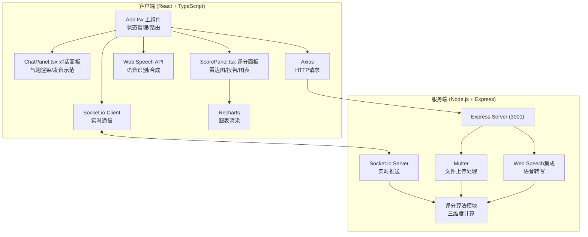
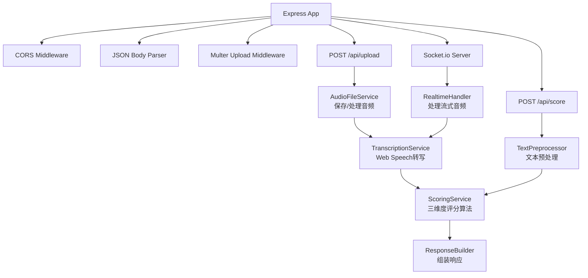
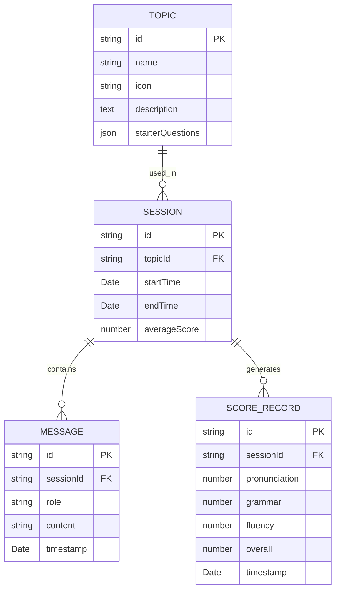

## 1. 架构设计



## 2. 技术描述

- **前端框架**：React 18 + TypeScript
- **构建工具**：Vite 5
- **状态管理**：React Hooks (useState, useEffect, useRef)
- **图表库**：Recharts 2
- **HTTP客户端**：Axios 1
- **实时通信**：Socket.io Client
- **语音处理**：Web Speech API (SpeechRecognition + SpeechSynthesis)
- **样式方案**：CSS Modules + 内联样式（Tailwind CSS可选，用户未指定则使用纯CSS）
- **后端框架**：Express 4 + TypeScript
- **实时通信**：Socket.io
- **文件上传**：Multer
- **唯一ID**：uuid
- **跨域处理**：cors

## 3. 路由定义

| 路由 | 类型 | 目的 |
|------|------|------|
| / | 前端 | 主应用页面，包含所有功能模块 |
| /api/upload | POST | 上传录音文件进行转写和评分 |
| /api/transcribe | POST | 语音转文字接口 |
| /api/score | POST | 评分计算接口 |
| /socket.io | WS | Socket.io 实时通信端点 |

## 4. API 定义

### 4.1 类型定义

```typescript
// 消息类型
interface ChatMessage {
  id: string;
  role: 'user' | 'system';
  content: string;
  timestamp: number;
  isPlaying?: boolean;
  currentWordIndex?: number;
}

// 对话主题
interface Topic {
  id: string;
  name: string;
  icon: string;
  description: string;
  starterQuestions: string[];
}

// 三维评分
interface ScoreResult {
  pronunciation: number;    // 发音准确度 0-100
  grammar: number;          // 语法正确性 0-100
  fluency: number;          // 流利度 0-100
  suggestions: {
    pronunciation: string;
    grammar: string;
    fluency: string;
  };
  overallScore: number;
}

// 单词统计
interface WordStat {
  word: string;
  count: number;
}

// 常见错误
interface CommonError {
  type: 'pronunciation' | 'grammar' | 'vocabulary';
  original: string;
  correction: string;
  suggestion: string;
}

// 总结报告
interface SummaryReport {
  errors: CommonError[];
  wordStats: WordStat[];
  scoreHistory: ScoreResult[];
  overallAverage: number;
}

// 上传响应
interface UploadResponse {
  transcript: string;
  score: ScoreResult;
  nextQuestion: string;
}
```

### 4.2 请求/响应Schema

**POST /api/upload**
- Request: `multipart/form-data` - audio file + topicId + conversationHistory
- Response: `UploadResponse`

**POST /api/score**
- Request: `{ text: string; topicId: string; context: string[] }`
- Response: `ScoreResult`

**Socket.io Events**
- `client` → `server`: `start_recording`, `stop_recording`, `audio_chunk`
- `server` → `client`: `transcript_update`, `score_result`, `next_question`

## 5. 服务端架构图



## 6. 数据模型

### 6.1 数据模型定义



### 6.2 内存数据结构（无数据库版本）

由于用户未指定数据库，使用内存存储 + Mock数据：

```typescript
// 内存中的会话存储
interface SessionStore {
  [sessionId: string]: {
    topicId: string;
    messages: ChatMessage[];
    scores: ScoreResult[];
    startTime: number;
  };
}

// Mock主题数据
const TOPICS: Topic[] = [
  {
    id: 'restaurant',
    name: '餐厅点餐',
    icon: 'utensils',
    description: '练习在餐厅点餐、询问菜单、特殊要求等场景',
    starterQuestions: [
      "Good evening! Welcome to our restaurant. Do you have a reservation?",
      "Welcome! Have you had a chance to look at our menu?"
    ]
  },
  // ...更多主题
];
```

## 7. 评分算法说明

### 7.1 发音准确度 (Pronunciation)
- 基于关键词匹配度、常见发音错误模式检测
- 参考Web Speech API识别置信度
- 评分公式：基础分(60) + 匹配度奖励(0-25) + 流畅停顿(0-15)

### 7.2 语法正确性 (Grammar)
- 检测常见语法错误（时态、单复数、冠词、介词）
- 句子结构完整性检查
- 评分公式：基础分(60) + 语法正确率(0-30) + 句式多样性(0-10)

### 7.3 流利度 (Fluency)
- 基于语速（词/分钟）、停顿频率、重复次数
- 填充词（um, uh, like）计数
- 评分公式：基础分(50) + 语速评分(0-25) + 流畅度(0-25)

## 8. 文件结构

```
auto10/
├── package.json                    # 根目录，统一脚本
├── README.md
├── frontend/
│   ├── package.json
│   ├── vite.config.js
│   ├── tsconfig.json
│   ├── index.html
│   └── src/
│       ├── App.tsx                 # 主组件
│       ├── main.tsx                # 入口
│       ├── index.css               # 全局样式
│       ├── types/
│       │   └── index.ts            # 类型定义
│       ├── components/
│       │   ├── ChatPanel.tsx       # 对话面板
│       │   ├── ScorePanel.tsx      # 评分面板
│       │   ├── TopicSelector.tsx   # 主题选择器
│       │   ├── RecordingButton.tsx # 录音按钮
│       │   ├── ChatBubble.tsx      # 对话气泡
│       │   ├── RadarScore.tsx      # 雷达评分图
│       │   └── SummaryReport.tsx   # 总结报告
│       ├── hooks/
│       │   ├── useSpeechRecognition.ts
│       │   └── useSpeechSynthesis.ts
│       └── utils/
│           ├── api.ts              # API封装
│           └── scoring.ts          # 前端评分辅助
└── server/
    ├── package.json
    ├── tsconfig.json
    └── index.ts                    # Express服务器
```
