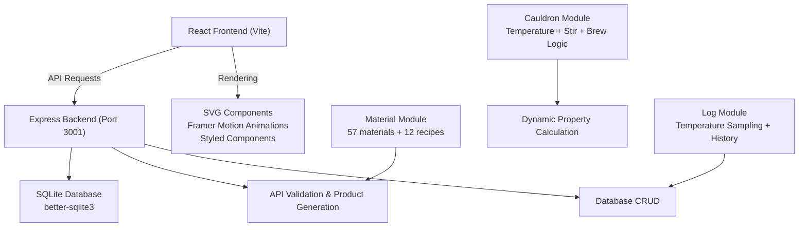
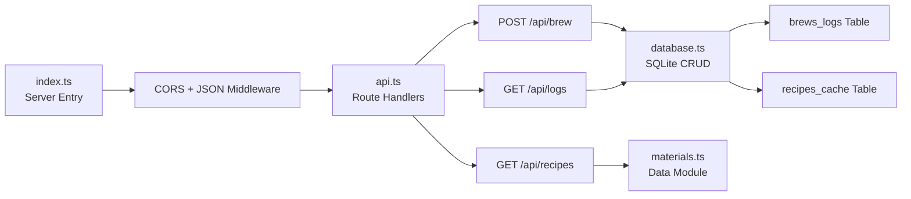
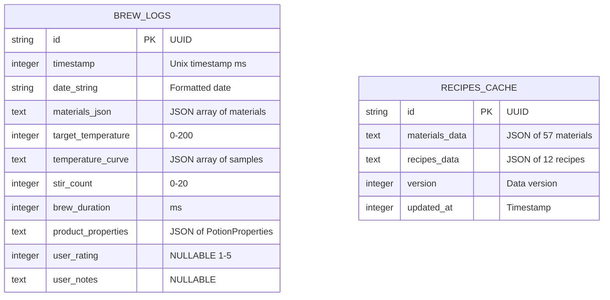

## 1. 架构设计



## 2. 技术描述

- **Frontend**: React 18 + TypeScript + Vite
- **Styling**: styled-components + CSS Custom Properties
- **Animations**: framer-motion + SVG + Canvas Particle System
- **State Management**: React hooks + Context API
- **Routing**: react-router-dom v6
- **HTTP Client**: axios
- **Backend**: Express 4 + TypeScript (ts-node)
- **Database**: SQLite (better-sqlite3)
- **Utilities**: uuid for ID generation, cors for cross-origin requests
- **Build Tool**: concurrently for parallel dev server startup

## 3. 路由定义

| Route | Purpose |
|-------|---------|
| `/` | 炼金工坊主页 - Cauldron operation interface |
| `/recipes` | 配方库页面 - Materials and recipes display |
| `/logs` | 炼金日志页面 - Timeline view with lazy loading |
| `/logs/:id` | 日志详情页 - Single log detail with static cauldron replay |

## 4. API Definitions

```typescript
// Types shared between frontend and backend

interface Material {
  id: string;
  name: string;
  nameCN: string;
  type: 'elemental' | 'organic' | 'mineral' | 'magical' | 'essence' | 'rare';
  rarity: 'common' | 'uncommon' | 'rare' | 'epic' | 'legendary';
  color: string;
  colorRGB: [number, number, number];
  acquisition: string;
  description: string;
  icon: string;
}

interface Recipe {
  id: string;
  name: string;
  nameCN: string;
  materials: { materialId: string; weight: number }[];
  optimalTemperature: { min: number; max: number };
  optimalStirCount: { min: number; max: number };
  productTemplate: {
    baseColor: string;
    glowIntensity: number;
    bubbleDensity: number;
    viscosity: number;
    effect: string;
  };
}

interface PotionProperties {
  color: string;
  colorRGB: [number, number, number];
  glossiness: number;     // 0-100
  bubbleDensity: number;  // 0-100
  glowIntensity: number;  // 0-100
  viscosity: number;      // 0-100
  clarity: number;        // 0-100
  effect: string;
  quality: 'poor' | 'common' | 'uncommon' | 'rare' | 'epic' | 'legendary';
}

interface BrewLog {
  id: string;
  timestamp: number;
  dateString: string;
  materials: { materialId: string; count: number }[];
  targetTemperature: number;
  temperatureCurve: number[];  // Sampled every 5s after first material drop
  stirCount: number;
  brewDuration: number;       // ms
  productProperties: PotionProperties;
  userRating?: number;        // 1-5 optional
  userNotes?: string;
}

// API Request/Response Types
interface BrewSubmitRequest {
  materials: { materialId: string; count: number }[];
  targetTemperature: number;
  temperatureCurve: number[];
  stirCount: number;
  brewDuration: number;
  productProperties: PotionProperties;
  userRating?: number;
  userNotes?: string;
}

interface BrewSubmitResponse {
  success: boolean;
  logId: string;
  log: BrewLog;
}

interface LogsQueryParams {
  page?: number;
  limit?: number;
  dateFrom?: number;
  dateTo?: number;
  materialIds?: string[];
  minQuality?: string;
}

interface LogsResponse {
  logs: BrewLog[];
  total: number;
  page: number;
  limit: number;
  hasMore: boolean;
}

interface RecipesResponse {
  materials: Material[];
  recipes: Recipe[];
}
```

## 5. 服务器架构图



## 6. 数据模型

### 6.1 数据模型定义



### 6.2 数据定义语言

```sql
-- Brew Logs Table - stores all brewing history
CREATE TABLE IF NOT EXISTS brew_logs (
  id TEXT PRIMARY KEY,
  timestamp INTEGER NOT NULL,
  date_string TEXT NOT NULL,
  materials_json TEXT NOT NULL,
  target_temperature INTEGER NOT NULL,
  temperature_curve TEXT NOT NULL,
  stir_count INTEGER NOT NULL,
  brew_duration INTEGER NOT NULL,
  product_properties TEXT NOT NULL,
  user_rating INTEGER,
  user_notes TEXT
);

CREATE INDEX IF NOT EXISTS idx_brew_logs_timestamp ON brew_logs(timestamp);
CREATE INDEX IF NOT EXISTS idx_brew_logs_date ON brew_logs(date_string);

-- Recipes Cache Table - caches material and recipe data
CREATE TABLE IF NOT EXISTS recipes_cache (
  id TEXT PRIMARY KEY,
  materials_data TEXT NOT NULL,
  recipes_data TEXT NOT NULL,
  version INTEGER NOT NULL,
  updated_at INTEGER NOT NULL
);

-- Insert initial cache data
INSERT OR REPLACE INTO recipes_cache 
  (id, materials_data, recipes_data, version, updated_at)
VALUES 
  ('main', ?, ?, 1, ?);
```

### 6.3 核心算法定义

#### 颜色混合算法 (Color Blending)
```typescript
// 每次投放材料时，新材料颜色占20%权重逐步叠加
function blendColor(
  currentRGB: [number, number, number],
  materialRGB: [number, number, number],
  materialWeight: number = 0.2
): [number, number, number] {
  return [
    Math.round(currentRGB[0] * (1 - materialWeight) + materialRGB[0] * materialWeight),
    Math.round(currentRGB[1] * (1 - materialWeight) + materialRGB[1] * materialWeight),
    Math.round(currentRGB[2] * (1 - materialWeight) + materialRGB[2] * materialWeight),
  ];
}
```

#### 产物属性动态计算算法 (Dynamic Property Calculation)
```typescript
function calculatePotionProperties(
  materials: { materialId: string; count: number }[],
  temperatureCurve: number[],
  stirCount: number,
  recipes: Recipe[],
  materialData: Material[]
): PotionProperties {
  // 1. 计算平均温度与配方最佳温度匹配度
  const avgTemp = temperatureCurve.reduce((a, b) => a + b, 0) / temperatureCurve.length;
  const tempVariance = Math.max(...temperatureCurve) - Math.min(...temperatureCurve);
  
  // 2. 匹配配方（如果材料组合符合）
  const matchedRecipe = findMatchingRecipe(materials, recipes);
  
  // 3. 基础属性从材料颜色加权平均
  const baseColor = calculateWeightedColor(materials, materialData);
  
  // 4. 温度影响：
  //    - 温度越高，光泽度越高（最高80度以上达到峰值）
  //    - 温度波动越小，纯净度越高
  const glossiness = Math.min(100, 30 + (avgTemp / 200) * 70 - tempVariance * 0.3);
  
  // 5. 搅拌影响：
  //    - 搅拌次数越多，气泡密度越高，粘度越低
  //    - 最佳搅拌次数 8-12次，超过后纯净度下降
  const bubbleDensity = Math.min(100, stirCount * 5 + (avgTemp / 200) * 30);
  const viscosity = Math.max(0, 100 - stirCount * 4 - (avgTemp / 200) * 20);
  
  // 6. 配方匹配加成
  const qualityMultiplier = matchedRecipe ? 1.5 : 1;
  const clarity = Math.min(100, (100 - tempVariance * 0.5) * qualityMultiplier);
  const glowIntensity = Math.min(100, (matchedRecipe ? 40 : 10) + avgTemp * 0.3);
  
  // 7. 综合品质评分
  const qualityScore = (glossiness + clarity + glowIntensity) / 3 * qualityMultiplier;
  
  return {
    color: rgbToHex(baseColor),
    colorRGB: baseColor,
    glossiness: Math.round(glossiness),
    bubbleDensity: Math.round(bubbleDensity),
    glowIntensity: Math.round(glowIntensity),
    viscosity: Math.round(viscosity),
    clarity: Math.round(clarity),
    effect: matchedRecipe ? matchedRecipe.productTemplate.effect : '未知效果',
    quality: determineQuality(qualityScore),
  };
}
```

#### 温度逼近算法 (Temperature Approximation)
```typescript
// 每3秒更新一次，向目标温度逼近，步长±5度
function updateTemperature(
  currentTemp: number,
  targetTemp: number,
  isIgnited: boolean
): number {
  if (!isIgnited) {
    // 熄火后自然冷却，每3秒降3度，最低室温20度
    return Math.max(20, currentTemp - 3);
  }
  
  const diff = targetTemp - currentTemp;
  if (Math.abs(diff) <= 5) {
    return targetTemp;
  }
  return currentTemp + Math.sign(diff) * 5;
}
```

#### 帧率自适应粒子数量算法 (FPS Adaptive Particle Count)
```typescript
const BASE_BUBBLE_COUNT = 40;
const BASE_FIRE_COUNT = 60;
const FPS_THRESHOLD = 50;
const REDUCTION_FACTOR = 0.6;

class AdaptiveParticleSystem {
  private frameCount = 0;
  private lastTime = performance.now();
  private currentFPS = 60;
  private reductionActive = false;

  update(): { bubbleCount: number; fireCount: number } {
    this.frameCount++;
    const now = performance.now();
    
    if (now - this.lastTime >= 1000) {
      this.currentFPS = this.frameCount;
      this.frameCount = 0;
      this.lastTime = now;
      
      if (this.currentFPS < FPS_THRESHOLD && !this.reductionActive) {
        this.reductionActive = true;
      } else if (this.currentFPS >= FPS_THRESHOLD + 5 && this.reductionActive) {
        this.reductionActive = false;
      }
    }
    
    const factor = this.reductionActive ? REDUCTION_FACTOR : 1;
    return {
      bubbleCount: Math.round(BASE_BUBBLE_COUNT * factor),
      fireCount: Math.round(BASE_FIRE_COUNT * factor),
    };
  }
}
```
