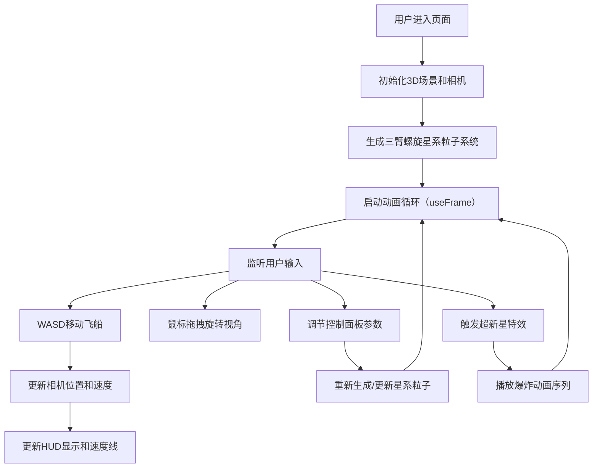

## 1. 产品概述
三维空间星系漫游与星云粒子交互项目，用户可驾驶虚拟飞船在随机生成的螺旋星系中自由飞行，通过控制面板调整星系参数并触发超新星爆炸特效。
- 主要目的：提供沉浸式的3D宇宙探索体验，结合实时粒子特效与交互控制
- 目标用户：对天文、3D可视化、交互式Web应用感兴趣的用户
- 产品价值：展示WebGL实时渲染能力，提供可调节参数的星系模拟器

## 2. 核心功能

### 2.1 功能模块
1. **3D星系场景**：三臂螺旋结构星系、数千颗彩色恒星、半透明星云粒子团、发光核心、远景恒星背景
2. **飞船控制系统**：WASD键盘控制移动、鼠标拖拽旋转视角、速度线特效、坐标与速度HUD显示
3. **参数控制面板**：旋臂数量调节、旋转速度调节、粒子大小缩放、超新星爆炸触发
4. **特效系统**：恒星闪烁、星云脉动、超新星爆炸碎片、强光覆盖、相机震动

### 2.3 页面详情
| 页面名称 | 模块名称 | 功能描述 |
|-----------|-------------|---------------------|
| 主场景页 | 3D星系渲染 | 使用数学公式生成螺旋星系，包含恒星粒子、星云团、核心发光体 |
| 主场景页 | 飞船控制器 | WASD移动、鼠标视角控制、速度计算、碰撞检测（恒星增亮） |
| 主场景页 | 控制面板UI | 三个参数滑块（旋臂数、旋转速度、粒子大小）和超新星触发按钮 |
| 主场景页 | HUD显示 | 左下角实时坐标和速度显示、屏幕边缘速度线特效 |
| 主场景页 | 特效系统 | 恒星闪烁动画、星云脉动自转、超新星爆炸序列动画 |

## 3. 核心流程
用户进入页面后，自动加载初始化的三臂螺旋星系，相机位于45度俯视位置。用户可以：
1. 使用WASD键控制飞船在星系中自由飞行
2. 按住鼠标左键拖拽旋转视角
3. 通过右侧控制面板调整星系参数（旋臂数量、旋转速度、粒子大小）
4. 点击"触发超新星"按钮产生爆炸特效
5. 左下角实时显示当前坐标和速度信息

## 4. 用户界面设计

### 4.1 设计风格
- **主题**：深空暗色调风格
- **主背景**：近乎黑色的深蓝 `#0a0a1a`
- **主色调**：霓虹蓝色 `#4466ff`，悬停时 `#6688ff`
- **文字颜色**：浅灰色 `#ccccdd`
- **控制面板**：半透明毛玻璃效果，背景 `rgba(10,10,30,0.7)`，边框 `rgba(100,150,255,0.3)`，圆角8px，背景模糊10px
- **交互反馈**：按钮悬停0.2秒平滑过渡，点击时scale(0.95)下压效果，扩散蓝光光晕
- **字体**：标题16px带微弱发光效果，正文使用现代无衬线字体

### 4.2 页面设计概述
| 页面名称 | 模块名称 | UI元素 |
|-----------|-------------|-------------|
| 主场景页 | 3D画布 | 全屏Three.js渲染，黑色星空背景 |
| 主场景页 | 右侧控制面板 | 固定宽度280px，毛玻璃效果，包含3个滑块组和1个按钮 |
| 主场景页 | 左下角HUD | 半透明黑色背景，等宽字体显示坐标和速度 |
| 主场景页 | 速度线特效 | 屏幕四周的蓝色放射状线条，随速度变化 |
| 主场景页 | 超新星强光 | 全屏白色叠加层，透明度动画 |

### 4.3 响应性
- Desktop-first设计，全屏3D画布自适应窗口大小
- 控制面板固定在右侧，不随滚动移动
- 移动端优化触摸交互（支持双指缩放、单指拖拽）

### 4.4 3D场景指导
- **环境**：纯深空背景，无HDRI，使用自发光材质
- **光照**：主要依赖粒子自发光，核心区域使用PointLight增强发光效果
- **相机**：初始球坐标计算（r=50, θ=45°, φ=0°），透视相机fov=75
- **构图**：星系居中，三臂螺旋结构完全可见，核心为视觉焦点
- **交互**：第一人称自由飞行模式，鼠标控制视角朝向，WASD控制相对移动
- **后处理**： Bloom效果增强发光感，轻微噪点增加胶片质感
- **性能**：粒子总数上限15000，使用BufferGeometry，帧率目标≥45FPS
