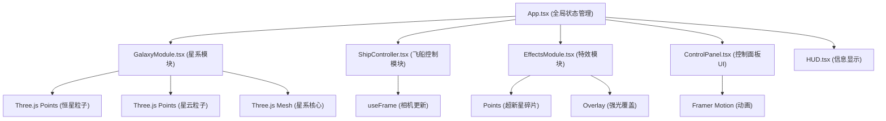

## 1. 架构设计



## 2. 技术描述
- **前端框架**：React@18 + TypeScript@5
- **构建工具**：Vite@5
- **3D渲染**：Three.js@0.160 + @react-three/fiber@8 + @react-three/drei@9 + @react-three/postprocessing@2
- **UI动画**：framer-motion@10
- **状态管理**：React Context + useState/useRef
- **样式方案**：CSS Modules + 内联样式（Framer Motion）

## 3. 目录结构
```
src/
├── main.tsx              # React入口
├── App.tsx               # 主应用组件，Context提供者
├── modules/
│   ├── GalaxyModule.tsx      # 星系生成与动画逻辑
│   ├── ShipController.tsx    # 飞船输入与相机控制
│   └── EffectsModule.tsx     # 超新星等特效系统
└── components/
    ├── ControlPanel.tsx      # 右侧参数控制面板
    └── HUD.tsx               # 坐标速度显示
```

## 4. 核心数据结构

### 4.1 星系参数类型
```typescript
interface GalaxyParams {
  armCount: number;        // 旋臂数量 2-5，默认3
  rotationSpeed: number;   // 旋转速度 0.1-2.0，默认0.5
  particleScale: number;   // 粒子大小缩放 0.5-2.0，默认1.0
}
```

### 4.2 飞船状态类型
```typescript
interface ShipState {
  position: { x: number; y: number; z: number };
  velocity: { x: number; y: number; z: number };
  speed: number;           // 标量速度
  yaw: number;             // 水平旋转角
  pitch: number;           // 垂直旋转角
}
```

### 4.3 恒星粒子数据
```typescript
interface StarParticle {
  position: [number, number, number];
  baseSize: number;        // 基础半径 0.05-0.25
  color: [number, number, number];  // RGB
  twinkleOffset: number;   // 闪烁相位偏移
  twinkleSpeed: number;    // 闪烁频率
  armIndex: number;        // 所属旋臂
  radialDistance: number;  // 到核心的径向距离
}
```

## 5. 关键实现要点

### 5.1 星系生成算法
- 螺旋公式：`x = r * cos(θ + armOffset), z = r * sin(θ + armOffset)`
- 旋臂扭转：`θ = r * twistFactor + armAngle`
- 厚度：`y = random(-thickness, thickness) * (1 - r/maxR)`
- 颜色插值：基于径向距离的HSL插值，从暖色(h=20)到冷色(h=220)

### 5.2 性能优化策略
1. **BufferGeometry**：使用Float32Array存储所有粒子位置、颜色、大小
2. **PointsMaterial**：共享材质，单draw call渲染数千粒子
3. **动画优化**：useFrame中直接修改attribute数组，避免React重渲染
4. **frustumCulled**：关闭视锥体剔除（星空粒子需要全局可见）
5. **尺寸降级**：粒子大小根据距离自动调整

### 5.3 粒子过渡动画
- 旋臂数量改变时，保存旧位置数组
- 使用lerp插值在0.5秒内从旧位置过渡到新位置
- 同时处理颜色和大小的平滑过渡

### 5.4 超新星特效
- 预选半径>0.2的恒星作为候选
- 膨胀阶段：0.3秒内大小x5，颜色变为亮白
- 爆炸阶段：生成100个三角形碎片，带随机旋转和切向速度
- 淡出阶段：2秒内透明度从1渐变到0

## 6. 性能指标
| 指标 | 目标值 | 测试条件 |
|------|--------|----------|
| 帧率 | ≥45FPS | 粒子总数15000，Chrome 120+ |
| 场景切换 | ≤0.8秒 | 旋臂数量从2变到5 |
| 内存占用 | ≤500MB | 满载运行10分钟 |
| GPU占用 | ≤60% | RTX 3060级显卡 |
