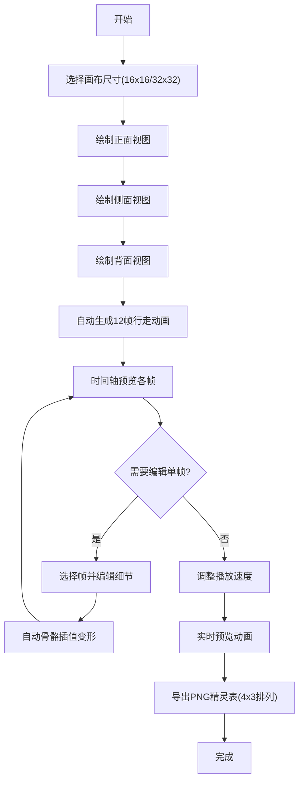

## 1. 产品概述

像素风格角色行走图编辑器，为独立游戏开发者提供便捷的逐帧像素动画创作工具，解决快速预览和导出完整精灵表的痛点。

- 主要用途：在浏览器中创建和编辑像素风格角色行走图，支持三视图绘制、自动生成行走动画、实时预览和PNG精灵表导出
- 目标用户：独立游戏开发者、像素艺术爱好者
- 产品价值：降低像素动画创作门槛，提高精灵表制作效率

## 2. 核心功能

### 2.1 用户角色

| 角色 | 注册方式 | 核心权限 |
|------|----------|----------|
| 普通用户 | 无需注册，直接使用 | 完整的绘制、动画生成、预览和导出功能 |

### 2.2 功能模块

1. **画布编辑器**：像素网格绘制、画笔工具、色板选择、视图切换
2. **动画生成器**：自动生成四帧行走循环、骨骼插值变形
3. **时间轴**：帧缩略图展示、帧选择编辑、高亮指示
4. **预览导出区**：动画循环播放、速度调节、PNG精灵表导出

### 2.3 页面详情

| 页面名称 | 模块名称 | 功能描述 |
|----------|----------|----------|
| 主编辑器页面 | 左侧工具面板 | 画笔大小选择(1px/2px)、16色色板、透明擦除模式 |
| 主编辑器页面 | 中央画布区 | 16x16/32x32网格绘制、三视图切换(正面/侧面/背面)、Shift直线绘制、连续点击填充 |
| 主编辑器页面 | 底部时间轴 | 12帧缩略图平铺、点击选择编辑、当前帧高亮流动边框、平滑滚动 |
| 主编辑器页面 | 右侧预览区 | 实时动画播放(棋盘格背景)、速度滑块(100-500ms)、导出按钮 |

## 3. 核心流程

用户从选择画布尺寸开始，依次绘制角色的正面、侧面、背面三视图，系统自动生成12帧行走动画，用户可在时间轴上调整单帧细节，最后通过预览区调整播放速度并导出PNG精灵表。

## 4. 用户界面设计

### 4.1 设计风格

- 主色调：深色背景#1a1a2e，面板#16213e，强调色#e94560
- 按钮风格：圆角矩形，hover时有发光效果，导出成功时绿色光晕闪烁
- 字体：使用像素风格字体搭配现代无衬线字体，营造复古与现代结合的美感
- 布局风格：CSS Grid实现，桌面端三栏布局，移动端自适应上下布局
- 光标样式：半透明圆形画笔光标，边缘白色描边，大小对应画笔尺寸
- 视觉特效：绘制落点粒子扩散、帧高亮流动虚线边框

### 4.2 页面设计概述

| 页面名称 | 模块名称 | UI元素 |
|----------|----------|--------|
| 主编辑器 | 左侧工具面板 | 60px宽竖条，画笔大小切换按钮，16色网格色板，透明擦除按钮 |
| 主编辑器 | 中央画布区 | 70%宽度，带网格线的像素画布，顶部三视图切换标签 |
| 主编辑器 | 底部时间轴 | 80px高，横向滚动缩略图容器，帧间距8px |
| 主编辑器 | 右侧预览区 | 25%宽度，上部分动画预览(棋盘格背景)，下部分速度滑块和导出按钮 |

### 4.3 响应式设计

- 桌面端(≥768px)：CSS Grid布局，左侧工具栏+中央画布+右侧预览，底部时间轴横跨
- 移动端(<768px)：自动切换上下布局，绘图区在上，时间轴和预览区在下
- 触摸优化：增加按钮可点击区域，支持触摸绘制

### 4.4 交互细节

- 绘制响应延迟低于50ms
- 动画播放稳定60FPS
- 绘制时按住Shift强制水平/垂直直线
- 松开鼠标后连续点击可填充封闭区域
- 编辑单帧后其他帧自动骨骼插值变形
- 播放时当前帧四周流动白色虚线边框
- 导出成功时按钮绿色光晕闪烁0.5秒
