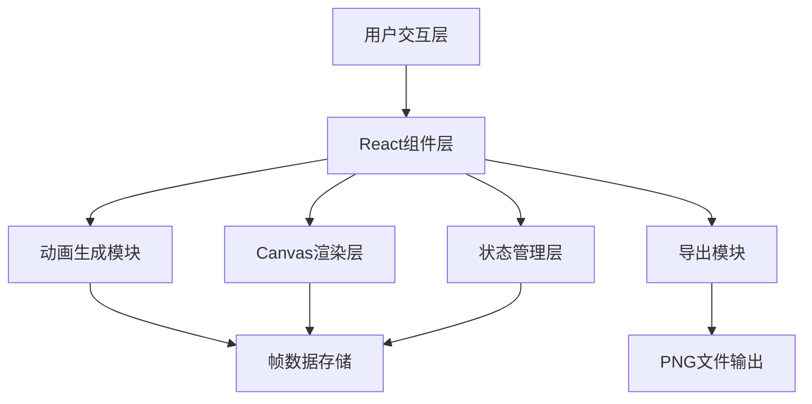
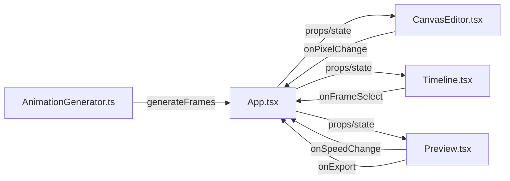

## 1. 架构设计

纯前端应用，所有渲染和交互在浏览器端完成，无需后端服务。



## 2. 技术描述

- 前端框架：React@18 + TypeScript@5
- 构建工具：Vite@5
- 动画库：framer-motion@11
- 状态管理：React useState/useReducer
- 渲染技术：HTML5 Canvas 2D API
- 初始化方式：npm create vite@latest

## 3. 文件结构

| 文件路径 | 职责描述 |
|----------|----------|
| package.json | 项目依赖和脚本配置 |
| vite.config.js | Vite构建配置 |
| tsconfig.json | TypeScript严格模式配置 |
| index.html | 应用入口页面 |
| src/style.ts | 全局样式常量(颜色、尺寸变量) |
| src/CanvasEditor.tsx | 主画布组件，处理鼠标事件和像素绘制 |
| src/AnimationGenerator.ts | 行走循环动画生成算法，骨骼插值变形 |
| src/Timeline.tsx | 底部时间轴组件，帧缩略图展示和交互 |
| src/Preview.tsx | 右侧预览区，动画播放和PNG导出 |
| src/App.tsx | 主应用组件，布局和状态整合 |
| src/main.tsx | React应用入口 |

## 4. 核心数据结构

### 4.1 像素矩阵定义

```typescript
// 单个像素数据，0表示透明，1-16表示色板索引
type PixelValue = number;

// 单帧像素数据，二维数组 [y][x]
type FrameData = PixelValue[][];

// 三视图数据
type ViewType = 'front' | 'side' | 'back';

interface CharacterViews {
  front: FrameData;
  side: FrameData;
  back: FrameData;
}

// 完整12帧动画 (4列 × 3行)
type AnimationFrames = FrameData[]; // 长度12，0-3正面，4-7侧面，8-11背面
```

### 4.2 应用状态定义

```typescript
interface AppState {
  canvasSize: 16 | 32;
  brushSize: 1 | 2;
  currentColor: number; // 0-16，0为透明擦除
  currentView: ViewType;
  currentFrame: number; // 0-11，选中的帧索引
  playbackSpeed: number; // 100-500ms/帧
  isPlaying: boolean;
  characterViews: CharacterViews;
  animationFrames: AnimationFrames;
}
```

## 5. 核心算法

### 5.1 行走循环生成算法

输入：三视图的单帧像素数据  
输出：每个视图4帧行走循环

```typescript
// 帧偏移规则
// 帧0(站立): 原始位置
// 帧1(左脚抬起): 身体上移1px，左腿上移2px，右腿下移1px
// 帧2(中间): 身体下移1px，两腿与站立位置相同但前后交换
// 帧3(右脚抬起): 身体上移1px，右腿上移2px，左腿下移1px
```

### 5.2 骨骼插值变形

当编辑某一帧后，对其他帧进行线性插值：
1. 识别连续移动的像素块（4邻域连通）
2. 计算该像素块在相邻帧之间的位移向量
3. 对其他帧的对应像素块应用插值位移
4. 仅对x或y方向单一方向的连续移动有效

### 5.3 洪水填充算法

松开鼠标连续点击时触发：
```typescript
function floodFill(
  frame: FrameData, 
  x: number, 
  y: number, 
  targetColor: number, 
  fillColor: number
): FrameData {
  // 使用BFS实现4邻域填充
  // 边界检查 + 颜色匹配检查
}
```

## 6. 性能优化

### 6.1 绘制性能
- 使用离屏Canvas进行像素数据缓存
- 只在绘制操作时重绘，避免不必要的渲染
- 使用requestAnimationFrame确保60FPS

### 6.2 内存优化
- 帧数据使用TypedArray存储（Uint8Array）
- 避免不必要的数组复制，使用Immutable模式
- 缩略图使用Canvas缓存，不重复绘制

### 6.3 响应优化
- 鼠标事件使用节流/防抖处理
- 粒子效果使用CSS动画而非Canvas逐帧绘制
- 时间轴使用虚拟滚动（当帧数较多时）

## 7. 组件通信



## 8. 导出功能

### 8.1 PNG精灵表生成
- 创建canvas尺寸：(宽度 × 4列) × (高度 × 3行)
- 按顺序绘制12帧：正面4帧 → 侧面4帧 → 背面4帧
- 保持像素完美缩放，不使用抗锯齿
- 使用toBlob导出PNG，触发浏览器下载

### 8.2 透明处理
- 色板索引0对应完全透明（alpha=0）
- 其他颜色对应完全不透明（alpha=255）
- 导出时保留alpha通道
