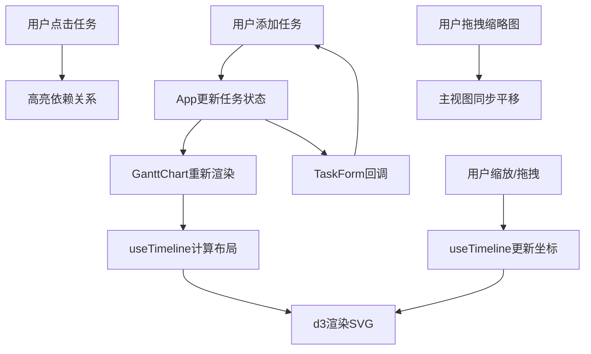

## 1. 产品概述

交互式甘特图项目时间线可视化应用，支持添加任务、设置起止日期、标记依赖关系、拖拽调整时间轴，帮助团队直观展示项目进度与任务依赖。
- 目标用户：项目经理、数据爱好者、团队负责人
- 核心价值：零后端依赖的前端可视化工具，实时交互、动画流畅、响应式设计

## 2. 核心功能

### 2.1 用户角色

| 角色 | 注册方式 | 核心权限 |
|------|----------|----------|
| 普通用户 | 无需注册 | 添加/编辑/查看任务、缩放/拖拽时间轴、高亮依赖关系 |

### 2.2 功能模块

1. **甘特图主视图**：时间轴网格、任务条渲染、依赖连接线、缩放平移
2. **任务管理表单**：添加/编辑任务、设置依赖、类别选择
3. **缩略图概览面板**：全局时间范围缩略图、可拖拽视口矩形框
4. **状态栏**：总任务数、完成比例、进度条

### 2.3 页面详情

| 页面名称 | 模块名称 | 功能描述 |
|----------|----------|----------|
| 甘特图主视图 | 时间轴网格 | 顶部星期/日/月标签行，背景#eee虚线网格，刻度文字12px深灰 |
| 甘特图主视图 | 任务条 | 圆角矩形(28px高)，按类别着色(计划中#98D8C8/进行中#F7DC6F/已完成#BB8FCE)，悬停边框变亮+详情提示框 |
| 甘特图主视图 | 依赖连接线 | 贝塞尔曲线(#ccc, 2px)，点击任务高亮上下游(#4A90D9, 3px) |
| 甘特图主视图 | 缩放控制 | 底部滑块+鼠标滚轮，1-5倍缩放，d3.transition 0.2秒 |
| 任务管理表单 | 表单 | 浮动左上角，任务名/起止日期/依赖下拉/类别选择，淡入动画0.3秒 |
| 缩略图概览面板 | 概览 | 右侧200px宽，浅灰#f5f5f5背景，红色半透明可拖拽矩形框 |
| 状态栏 | 进度统计 | 底部状态栏，总任务数+完成比例进度条(0.5秒线性动画) |

## 3. 核心流程

1. 用户通过表单添加任务（名称、日期、依赖、类别）→ 甘特图即时更新 → 新任务条从左向右展开动画(0.3秒) → 底部自动滚动到最新任务
2. 用户鼠标悬停任务条 → 边框变亮(0.1秒) → 显示详情提示框(跟随鼠标、不超视口)
3. 用户滚动鼠标滚轮或拖拽缩放滑块 → 时间轴缩放(1-5倍, 步长0.5) → 任务条宽度和位置平滑变化(d3.transition 0.2秒) → 刻度标签密度自动调整
4. 用户点击任务条 → 高亮上下游依赖(任务条变亮+连接线变蓝#4A90D9, 3px) → 再次点击取消
5. 用户拖拽缩略图红色矩形框 → 主视图同步平移 → 主视图平移时缩略图框同步移动

## 4. 界面设计

### 4.1 设计风格

- 主色调：浅色主题(背景#fafafa, 卡片白色2px圆角)
- 标题区域：深灰蓝色(#2c3e50)字体
- 任务条颜色：计划中#98D8C8、进行中#F7DC6F、已完成#BB8FCE
- 高亮色：蓝色#4A90D9
- 字体：12px刻度文字，深灰色
- 布局：左侧甘特图主区域 + 右侧200px缩略图面板 + 底部状态栏 + 浮动左上角表单

### 4.2 页面设计概览

| 页面名称 | 模块名称 | UI元素 |
|----------|----------|--------|
| 甘特图主视图 | 时间轴 | 极浅灰#eee虚线网格、12px深灰刻度文字、顶部分类标签 |
| 甘特图主视图 | 任务条 | 圆角矩形28px高、柔和调色板、悬停边框亮+提示框(半透明白色8px圆角4px阴影) |
| 甘特图主视图 | 连接线 | 贝塞尔曲线、浅灰#ccc 2px、高亮蓝#4A90D9 3px |
| 任务表单 | 表单 | 浮动左上角8px圆角、淡入动画(0.3秒上滑20px)、浅灰#ddd边框聚焦蓝#4A90D9 |
| 缩略图面板 | 概览 | 200px宽#f5f5f5背景、红色半透明可拖拽矩形框 |
| 状态栏 | 进度 | 底部固定、总任务数+完成比例进度条(0.5秒线性) |

### 4.3 响应式设计

- 桌面优先设计
- 宽度<768px时：甘特图全宽、侧边缩略图隐藏、表单折叠为图标按钮点击展开
- 触摸优化：支持触摸拖拽和捏合缩放

### 4.4 性能要求

- 支持100个任务条，帧率≥30FPS
- 拖拽和缩放无卡顿
- 动画帧间隔≤16ms
