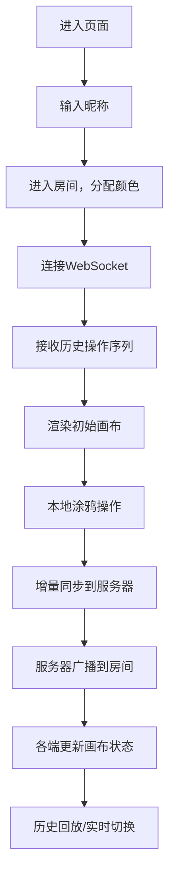

## 1. 产品概述
在线多人实时协作创意涂鸦与表情互动白板应用，支持多用户在共享画布上自由创作与互动。
- 核心目的：提供即时、有趣的多人协作涂鸦体验，通过非语言互动增强团队沟通效率和趣味性
- 目标用户：远程团队、在线教育课堂、朋友聚会等需要实时创意协作的场景
- 市场价值：填补轻量化实时协作涂鸦工具的空白，兼具专业性和娱乐性

## 2. 核心功能

### 2.1 用户角色
| 角色 | 注册方式 | 核心权限 |
|------|----------|----------|
| 参与者 | 输入昵称加入房间 | 自由涂鸦、添加表情和文字、发送反应表情、操作历史回放 |

### 2.2 功能模块
1. **主画布页面**：共享画布、工具栏、在线用户列表、互动元素
2. **昵称输入页面**：用户进入房间前的身份设置
3. **历史回放模块**：基于操作序列的时间点回溯功能

### 2.3 页面详情
| 页面名称 | 模块名称 | 功能描述 |
|----------|----------|----------|
| 昵称输入页 | 昵称表单 | 支持emoji的昵称输入，回车或点击按钮进入房间 |
| 主画布页 | 共享画布 | Canvas 2D渲染，支持画笔、橡皮擦、emoji、文字贴纸 |
| 主画布页 | 左侧工具栏 | 画笔工具（5色+粗细滑块）、橡皮擦、emoji选择器（30+）、文字贴纸 |
| 主画布页 | 右上角用户列表 | 显示在线人数、每位用户昵称与分配的颜色圆点（12色板） |
| 主画布页 | 实时光标层 | 显示其他用户半透明圆形光标（0.4透明度），点击时涟漪动画 |
| 主画布页 | 右下角操作区 | 撤销按钮、清空画布按钮（需二次确认）、反应表情按钮 |
| 主画布页 | 反应表情面板 | 6个预设表情（😊😲😂😍😡👍），点击后中央大字显示1.5秒 |
| 主画布页 | 历史回放滑块 | 左下角拖动滑块回溯，显示"历史回放模式"黄色横幅 |

## 3. 核心流程
用户进入页面 → 输入昵称（支持emoji）→ 进入房间，自动分配颜色 → 加入WebSocket房间 → 接收历史操作序列渲染画布 → 本地涂鸦操作 → 增量同步到服务器 → 服务器广播到房间内所有用户 → 各端更新画布状态 → 可随时使用历史回放功能回溯

## 4. 用户界面设计

### 4.1 设计风格
- **主色调**：深色模式，主背景#121212，画布背景#1e1e1e，强调色#bb86fc，文字#e0e0e0
- **按钮风格**：圆角8px，悬停0.2秒背景渐变（透明→半白），点击0.1秒缩放反馈（scale 0.95）
- **字体**：主要使用现代无衬线字体，画布文字支持多种字体选择
- **布局风格**：画布占满全屏，工具栏左侧垂直排列（桌面）/底部浮动栏（移动）
- **动画风格**：emoji缩放淡入（0.5s）、光标涟漪（0.2s）、清空扇形擦除（0.8s）、对话框淡入（0.3s）

### 4.2 页面设计概述
| 页面名称 | 模块名称 | UI元素 |
|----------|----------|--------|
| 昵称输入页 | 中央表单 | 深色背景、圆角输入框、强调色按钮、居中布局 |
| 主画布页 | 画布区域 | 全屏Canvas，#1e1e1e背景，接收鼠标/触摸输入 |
| 主画布页 | 工具栏 | 圆角按钮组，垂直排列（桌面），图标+工具提示 |
| 主画布页 | 用户列表 | 右上角圆角卡片，彩色圆点+昵称 |
| 主画布页 | 操作按钮 | 右下角分组，撤销/清空/反应按钮 |
| 主画布页 | 回放滑块 | 左下角横向滑块，黄色横幅提示 |

### 4.3 响应式
- **桌面端**（≥768px）：左侧垂直工具栏，右下角操作区，左下角回放滑块
- **移动端**（<768px）：工具栏自动折叠为底部浮动栏，按钮最小44px适配触摸，操作区与工具栏合并
- **触摸优化**：所有交互元素确保足够触摸面积，滑块支持触摸拖动

### 4.4 视觉特效
- **荧光画笔**：线条尾部0.1秒渐变消失，营造荧光涂鸦感
- **光标涟漪**：其他用户点击/拖拽时0.2秒扩散动画
- **扇形擦除**：清空画布时从中心向外0.8秒扇形擦除动画
- **表情动画**：emoji放置时0.5秒缩放淡入，反应表情中央大字1.5秒淡出
