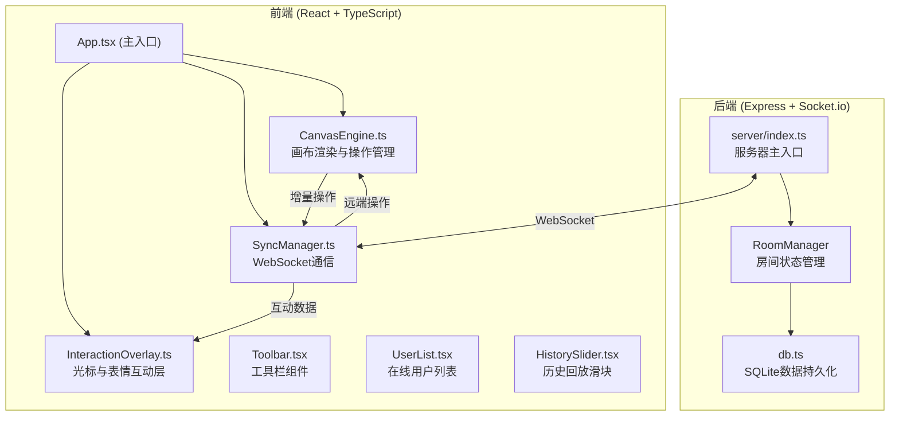
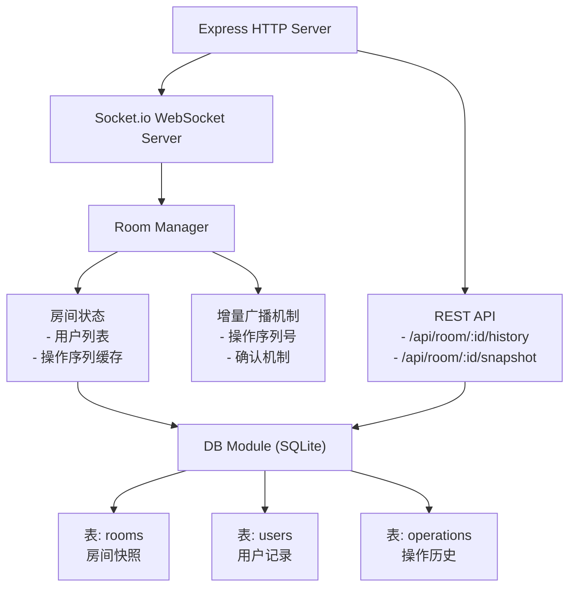
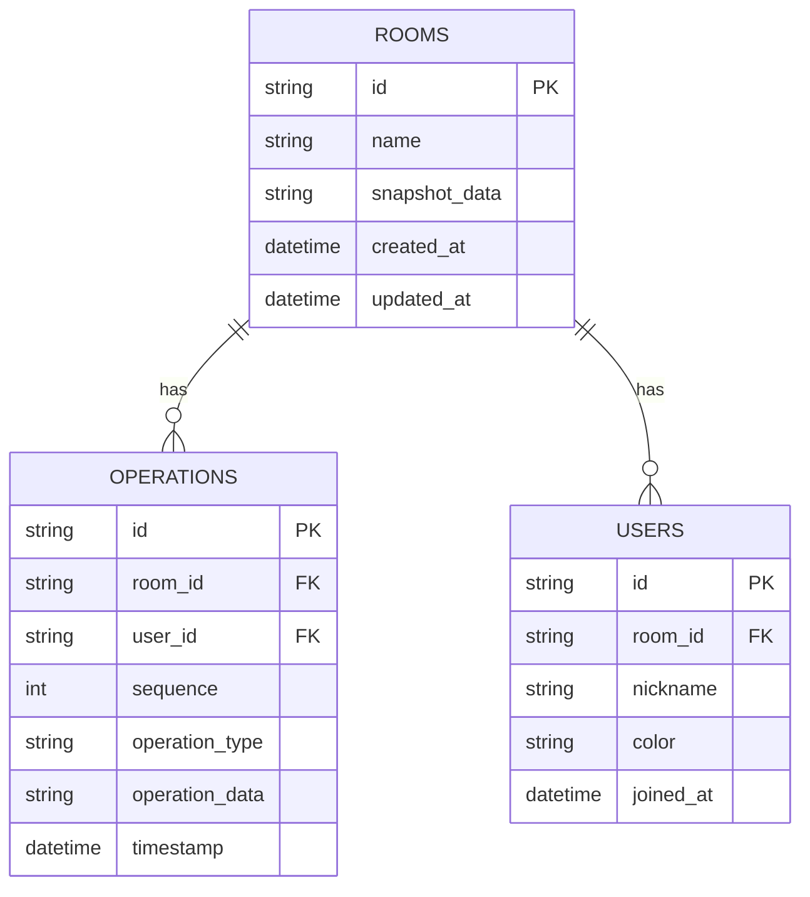

## 1. 架构设计


## 2. 技术描述
- **前端**：React@18 + TypeScript + Vite + socket.io-client
- **后端**：Express@4 + Socket.io + better-sqlite3
- **构建工具**：Vite@5
- **状态管理**：React useState/useRef 局部状态管理
- **数据通信**：WebSocket (socket.io) 实现增量同步
- **数据库**：SQLite (better-sqlite3) 存储房间快照和用户记录

## 3. 路由定义
| 路由 | 用途 |
|------|------|
| / | 主应用入口，根据是否有昵称显示输入页或画布页 |
| /api/room/:id/history | GET 获取房间历史操作序列 |
| /api/room/:id/snapshot | POST 保存房间涂鸦快照 |

## 4. API 定义

### 4.1 WebSocket 事件
```typescript
// 客户端 -> 服务器
interface ClientToServerEvents {
  join: (data: { roomId: string; nickname: string }) => void;
  leave: (data: { roomId: string }) => void;
  operation: (data: { roomId: string; operation: DrawOperation }) => void;
  cursor: (data: { roomId: string; x: number; y: number; isDrawing: boolean }) => void;
  reaction: (data: { roomId: string; emoji: string }) => void;
  undo: (data: { roomId: string }) => void;
  clear: (data: { roomId: string }) => void;
  getHistory: (data: { roomId: string }) => void;
}

// 服务器 -> 客户端
interface ServerToClientEvents {
  userJoined: (data: { userId: string; nickname: string; color: string }) => void;
  userLeft: (data: { userId: string }) => void;
  usersList: (data: User[]) => void;
  operation: (data: { operation: DrawOperation; userId: string }) => void;
  cursor: (data: { userId: string; x: number; y: number; isDrawing: boolean }) => void;
  reaction: (data: { userId: string; emoji: string }) => void;
  undo: (data: { userId: string }) => void;
  clear: (data: { userId: string }) => void;
  history: (data: { operations: DrawOperation[] }) => void;
}
```

### 4.2 数据类型定义
```typescript
interface Point {
  x: number;
  y: number;
  timestamp: number;
}

interface DrawOperation {
  id: string;
  type: 'pen' | 'eraser' | 'emoji' | 'text';
  userId: string;
  timestamp: number;
  points?: Point[];
  color?: string;
  width?: number;
  emoji?: string;
  text?: string;
  fontFamily?: string;
  x?: number;
  y?: number;
}

interface User {
  id: string;
  nickname: string;
  color: string;
  socketId: string;
}

interface CursorPosition {
  userId: string;
  x: number;
  y: number;
  isDrawing: boolean;
  lastUpdate: number;
}
```

## 5. 服务器架构图


## 6. 数据模型

### 6.1 数据模型定义


### 6.2 数据定义语言
```sql
CREATE TABLE IF NOT EXISTS rooms (
  id TEXT PRIMARY KEY,
  name TEXT,
  snapshot_data BLOB,
  created_at DATETIME DEFAULT CURRENT_TIMESTAMP,
  updated_at DATETIME DEFAULT CURRENT_TIMESTAMP
);

CREATE TABLE IF NOT EXISTS users (
  id TEXT PRIMARY KEY,
  room_id TEXT NOT NULL,
  nickname TEXT NOT NULL,
  color TEXT NOT NULL,
  joined_at DATETIME DEFAULT CURRENT_TIMESTAMP,
  FOREIGN KEY (room_id) REFERENCES rooms(id)
);

CREATE TABLE IF NOT EXISTS operations (
  id TEXT PRIMARY KEY,
  room_id TEXT NOT NULL,
  user_id TEXT NOT NULL,
  sequence INTEGER NOT NULL,
  operation_type TEXT NOT NULL,
  operation_data TEXT NOT NULL,
  timestamp DATETIME DEFAULT CURRENT_TIMESTAMP,
  FOREIGN KEY (room_id) REFERENCES rooms(id),
  FOREIGN KEY (user_id) REFERENCES users(id),
  UNIQUE(room_id, sequence)
);

CREATE INDEX IF NOT EXISTS idx_operations_room_sequence ON operations(room_id, sequence);
```
