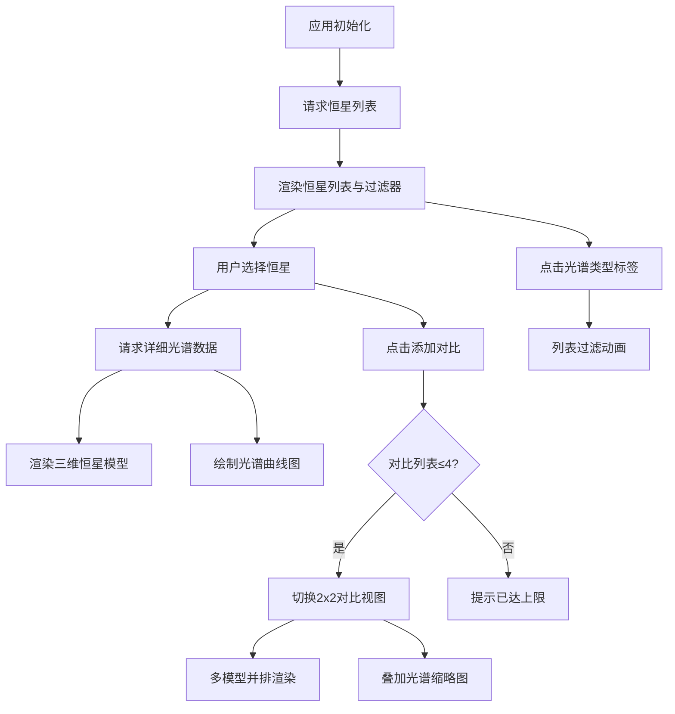

## 1. 产品概述

一个面向天文教育场景的三维恒星光谱分类与比较可视化应用，帮助学生直观理解恒星光谱类型、表面温度与颜色之间的科学关系。用户可在预设恒星列表中选择恒星，通过三维场景观察恒星模型与光谱曲线，并支持多星并排对比。

- **目标用户**：天文教育工作者、高中及大学天文专业学生、天文爱好者
- **核心价值**：将抽象的恒星光谱学知识转化为直观的三维可视化交互体验，提升学习效率和兴趣

## 2. 核心功能

### 2.1 用户角色

| 角色 | 注册方式 | 核心权限 |
|------|----------|----------|
| 访客用户 | 无需注册 | 浏览恒星列表、查看三维模型、对比恒星、过滤光谱类型 |

### 2.2 功能模块

1. **恒星数据模块**：提供恒星列表API、光谱数据服务、颜色-温度转换算法
2. **三维可视化模块**：Three.js场景渲染、恒星球体模型、光谱曲线图、OrbitControls交互
3. **控制面板模块**：恒星选择列表、光谱类型过滤器、添加对比按钮、视角重置
4. **对比模式模块**：2x2网格视图、多星模型并排显示、叠加光谱曲线与图例

### 2.3 页面详情

| 页面名称 | 模块名称 | 功能描述 |
|----------|----------|----------|
| 主页面 | 恒星列表面板 | 左侧280px宽度，15+预设恒星，支持光谱类型过滤，淡入淡出动画 |
| 主页面 | 三维场景视图 | 中央主视图，2000星点背景，恒星球体模型（自转+shader动态条纹+光晕粒子） |
| 主页面 | 光谱曲线图 | 右侧350×220px Canvas绘制，波长-强度曲线，渐变填充，十字准星与数据提示 |
| 主页面 | 控制面板UI | 恒星选择、光谱类型标签（O/B/A/F/G/K/M）、添加对比、视角重置 |
| 对比模式 | 2x2网格视图 | 四个独立透明背景小场景，1px分割线，显示恒星名称和温度标签 |
| 对比模式 | 叠加光谱缩略图 | 250×120px缩略图，四色曲线叠加，图例标识名称和温度 |

## 3. 核心流程

### 3.1 单星查看流程
用户进入应用 → 系统加载恒星列表 → 点击列表项 → 请求恒星详细光谱数据 → 三维场景渲染恒星模型（球体+光晕+自转）→ 右侧绘制光谱曲线 → 用户拖拽旋转视角 → 松开2秒后恢复自动旋转

### 3.2 多星对比流程
用户选中恒星 → 点击"添加对比"按钮（最多4颗）→ 切换至对比模式 → 2x2网格独立渲染 → 缩略图叠加四色光谱曲线 → 点击移除某颗恒星 → 退出对比模式

### 3.3 光谱过滤流程
点击光谱类型标签（O/B/A/F/G/K/M）→ 标签高亮对应特征色 → 列表项0.3秒淡出不符合的 → 0.3秒淡入符合的 → 点击"全部"恢复全列表

## 4. 用户界面设计

### 4.1 设计风格

- **主色调**：深空深蓝到黑紫径向渐变背景 `radial-gradient(ellipse at center, #0a0e27 0%, #1a0a2e 50%, #050510 100%)`
- **光谱类型特征色**：
  - O型：`#9bb0ff`（蓝）
  - B型：`#aabfff`（蓝白）
  - A型：`#cad7ff`（白）
  - F型：`#f8f7ff`（黄白）
  - G型：`#fff4ea`（黄，太阳型）
  - K型：`#ffd2a1`（橙）
  - M型：`#ffcc6f`（红橙）
- **按钮/圆角**：统一6px圆角，0.2秒 ease-in-out 过渡
- **列表项**：8px圆角，悬停 `rgba(255,255,255,0.1)` + 右移2px微动效，选中左侧3px彩色边框
- **字体**：标题使用 `Orbitron`（科技感无衬线），正文使用 `Source Sans Pro`（高可读性）
- **图标风格**：极简线条几何图标，与深空主题一致

### 4.2 页面设计概览

| 页面名称 | 模块名称 | UI 元素 |
|----------|----------|----------|
| 主页面 | 恒星列表面板 | 280px左侧栏、搜索框、7个光谱类型标签、列表项（选中标记）、淡入淡出过渡 |
| 主页面 | 三维场景 | 星点背景（2000点，缓慢闪烁）、恒星球体（标准材质+自发光0.3）、光晕粒子（80颗）、OrbitControls |
| 主页面 | 光谱曲线图 | 350×220 Canvas、深灰网格、波长横轴/强度纵轴、曲线（恒星色）、渐变填充、十字准星+悬浮提示 |
| 主页面 | 控制面板 | 添加对比按钮（右上角）、视角重置按钮、模式切换提示 |
| 对比模式 | 2x2网格 | 1px白色分割线、每个视图独立相机、左上角恒星名称（白色16px+阴影）、右上角温度数值 |
| 对比模式 | 缩略图 | 250×120 Canvas、四色曲线叠加、图例（色块+名称+温度） |

### 4.3 响应式设计

- **桌面优先**：主设计针对 1440×900 及以上分辨率
- **自适应**：最小支持 1280×720，恒星列表最小宽度 240px，光谱图最小 280px
- **触摸优化**：OrbitControls 支持触摸手势拖拽旋转、双指缩放

### 4.4 3D 场景指导

- **环境**：纯深空背景，2000 个随机分布星点（Points，大小 0.5-2，alphaTest 闪烁动画）
- **光照**：单 AmbientLight 强度 0.2 + 每颗恒星 PointLight 自身发光作为主光源（颜色匹配恒星色，强度2）
- **相机**：PerspectiveCamera，初始位置 [0,0,12]，fov 50，近0.1远1000
- **运动**：球体 Y 轴自转 0.5rps，OrbitControls 阻尼启用，松开后 2 秒恢复自转
- **合成**：球体使用自定义 ShaderMaterial，包含动态多普勒条纹（噪声纹理 + 时间偏移 + 略深基色混合）
- **后期**：轻微 Bloom（阈值 0.8，强度 0.6）提升恒星发光氛围
- **性能预算**：单场景 draw call ≤ 10，对比模式 4 视图合计 ≤ 30，稳定 30FPS+
