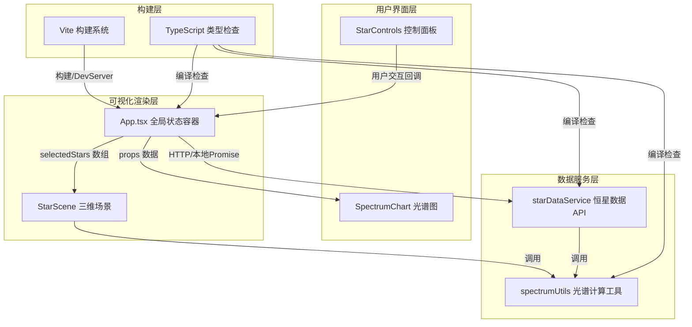
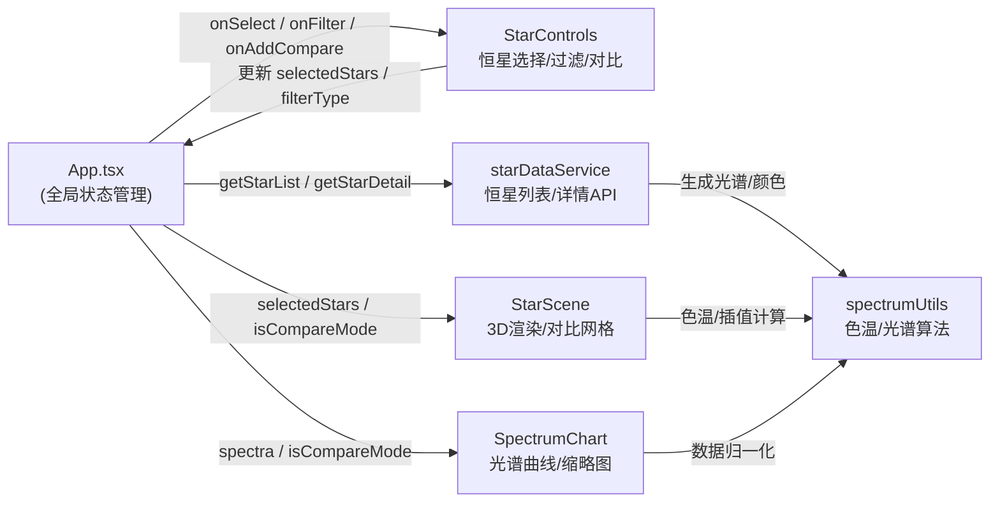

## 1. 架构设计



## 2. 技术栈说明

- **前端框架**：React 18 + TypeScript 5（严格模式）
- **构建工具**：Vite 5（含 `@` → `src` 路径别名）
- **3D 渲染**：three 0.160 + @react-three/fiber 8 + @react-three/drei 9 + @react-three/postprocessing 2 + postprocessing 6
- **样式方案**：内联 styled-jsx + CSS 变量（不引入 tailwindcss，减少依赖体积）
- **后端数据服务**：无独立后端，数据通过 `starDataService.ts` 模拟异步 Promise API 返回，便于后续替换为真实 HTTP 服务
- **图表渲染**：原生 Canvas 2D API 绘制光谱曲线，无需引入 chart 库

## 3. 文件结构与模块职责

```
项目根目录/
├── package.json                 # 依赖声明与启动脚本
├── vite.config.js               # 构建配置、路径别名
├── tsconfig.json                # 严格模式 TS 配置、路径映射
├── index.html                   # Vite 入口页面（含深空背景、字体引入）
└── src/
    ├── App.tsx                  # 应用入口、全局状态、布局组合
    ├── data/                    # ========= 恒星数据模块 =========
    │   ├── starDataService.ts   # 恒星列表+详情API（模拟异步）
    │   └── spectrumUtils.ts     # 色温转换、光谱曲线生成算法
    └── visual/                  # ========= 三维可视化模块 =========
        ├── StarScene.tsx        # Three.js场景、恒星模型、光晕粒子
        ├── StarControls.tsx     # 左侧控制面板、列表、过滤器、对比按钮
        └── SpectrumChart.tsx    # Canvas光谱曲线图、十字准星、缩略图
```

### 模块间调用关系



### 数据流向

1. **初始化**：App → `starDataService.getStarList()` → 恒星元数据数组 → 传入 StarControls 渲染列表
2. **选择恒星**：StarControls → `onSelect(starId)` → App 状态更新 → StarScene 渲染对应三维模型 + SpectrumChart 渲染光谱曲线
3. **获取光谱**：App → `starDataService.getStarDetail(starId)` → 内部调 `spectrumUtils.generateSpectrum(temp)` → 返回 401 个波长-强度点 → 存入 `spectra` map
4. **过滤列表**：StarControls → `onFilter(type)` → App 更新 `filterType` → StarControls 列表按 `opacity: 0→1` 动画过滤
5. **对比模式**：StarControls → `onAddCompare(starId)` → `compareIds` 数组 ≤4 → App 切换 `isCompareMode=true` → StarScene 渲染 2×2 网格小场景 + SpectrumChart 切换缩略图叠加模式

## 4. 核心数据模型与类型定义

```typescript
// spectrumUtils.ts & starDataService.ts 共享类型

export type SpectralType = 'O' | 'B' | 'A' | 'F' | 'G' | 'K' | 'M';

export interface StarSummary {
  id: string;
  name: string;              // 中文名 + 英文名，如 "太阳 (Sun)"
  spectralType: SpectralType;
  temperature: number;       // 开尔文，如 5778
  radiusSolar: number;       // 相对太阳半径，如 1.0
  colorHex: string;          // 十六进制颜色，如 "#fff4ea"
  magnitude: number;         // 视星等
}

export interface StarDetail extends StarSummary {
  spectrum: SpectrumPoint[]; // 长度 401（380-780nm @1nm步长）
}

export interface SpectrumPoint {
  wavelength: number;        // 380 ~ 780 nm
  intensity: number;         // 归一化 0 ~ 1
}
```

## 5. 恒星数据服务 API 定义（模拟 HTTP）

### 5.1 GET /api/stars → `getStarList(): Promise<StarSummary[]>`
- **说明**：返回 15+ 颗预设恒星的列表元数据
- **模拟实现**：setTimeout 50ms 后 resolve 本地硬编码数组

### 5.2 GET /api/stars/:id → `getStarDetail(id: string): Promise<StarDetail>`
- **说明**：按恒星 ID 返回完整数据，含 401 个波长点的光谱曲线
- **模拟实现**：从同一份数据源查找 + 调 `spectrumUtils.generatePlanckSpectrum(temperature)` 实时生成光谱

## 6. 算法说明

### 6.1 色温转 RGB（近似黑体辐射）
使用 `spectrumUtils.temperatureToColor(K: number): string`，基于分段近似公式：
- T ≤ 6600K：R=255，G、B 按对数曲线衰减
- T > 6600K：B=255，R、G 按对数曲线衰减
- 结果 clamp 到 0-255 并转十六进制

### 6.2 黑体光谱曲线生成（普朗克定律）
使用 `spectrumUtils.generatePlanckSpectrum(T: number): SpectrumPoint[]`：
- 波长 λ 遍历 380-780nm
- 强度按 Plank 公式：B(λ,T) = 2hc²/λ⁵ · 1/(exp(hc/λkT) − 1)
- 对曲线在可见光范围内加入轻微高斯噪声（模拟实际恒星吸收线）
- 最大强度归一化到 1.0

### 6.3 恒星半径视觉缩放
使用 `spectrumUtils.scaleRadius(rSolar: number): number`：
- 输入范围：0.15（比邻星）~ 887（参宿四）
- 输出使用 log 映射 clamp 到 [2, 8] 单位区间，便于观察大小相对关系

## 7. 性能策略

| 指标 | 目标 | 策略 |
|------|------|------|
| 单场景帧率 | ≥ 60FPS | 自定义 Shader 合并计算、80 粒子 InstancedMesh、OrbitControls 阻尼 |
| 对比模式帧率 | ≥ 30FPS | 4 个 Canvas 共享 WebGL 上下文？实际使用 4 个独立 Canvas，但共享几何体与材质引用，禁用阴影 |
| 列表过滤响应 | ≤ 100ms | 纯前端数组过滤 + CSS opacity 过渡，无需重排 |
| 光谱图切换渲染 | ≤ 50ms | Canvas 2D 清屏重绘，单次 path + fill，不使用 D3/chart.js |
| 首屏加载 | ≤ 2s | 数据硬编码，无网络请求；Three.js 懒加载初始模型 |

## 8. 路径别名与 TypeScript 配置

```
tsconfig:
  compilerOptions.paths → "@/*": ["src/*"]

vite.config:
  resolve.alias → "@": path.resolve(__dirname, "src")
```

因此文件间 import 统一使用：
```ts
import { getStarList } from '@/data/starDataService';
import { temperatureToColor } from '@/data/spectrumUtils';
```
