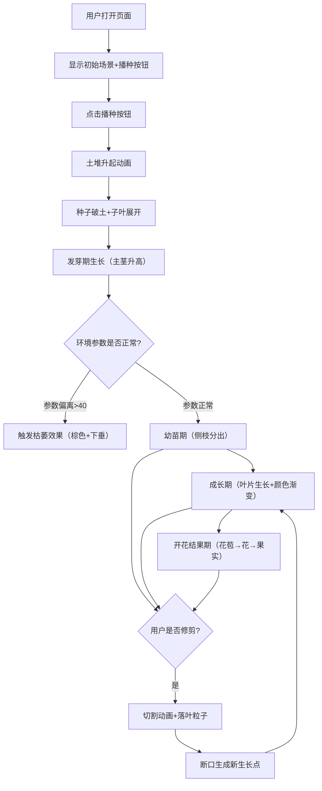

## 1. 产品概述

三维空间植物生长模拟与交互修剪系统，让用户在浏览器中沉浸式体验植物从播种到开花结果的完整生命周期。通过调整光照、水分、温度等环境参数观察生长变化，并可自由旋转视角、用鼠标拖拽模拟剪刀修剪枝叶，修剪后的植物会改变生长方向并触发飘落叶片动画。

- 面向用户：教育工作者、植物爱好者、休闲游戏玩家
- 核心价值：寓教于乐的植物生长知识科普 + 沉浸式3D交互体验

## 2. 核心功能

### 2.1 功能模块清单

1. **植物生长模拟模块**：4个生长阶段（发芽期→幼苗期→成长期→开花结果期），每个阶段有独特的形态变化和动画效果
2. **环境参数控制模块**：光照强度（0-100）、水分（0-100）、温度（15-35℃）三个滑块实时调整，参数偏离最佳值会影响生长速度甚至导致枯萎
3. **3D场景渲染模块**：Three.js渲染地面、背景渐变、植物各部件、粒子效果
4. **交互修剪模块**：鼠标拖拽模拟剪刀，切割枝叶触发掉落粒子动画，断口处产生新生长点
5. **状态统计与UI模块**：植物高度、叶片数、花苞数、果实数实时统计，阶段标签、生长进度条显示

### 2.2 页面详情

| 模块名称 | 功能描述 |
|---------|---------|
| 场景初始化 | 初始视角30度俯视、距离3单位；浅蓝→白色径向渐变背景；绿色半透明网格地面；种子播种动画 |
| 播种动画 | 地面中央升起棕色土堆（高0.3单位半圆球），种子破土冒出两片对称子叶（每片长0.2，0.5秒展开） |
| 发芽期（0-10秒） | 子叶展开后主茎以0.05单位/秒速度升高，持续10秒 |
| 幼苗期 | 主茎长至1单位，分出第一对45度角侧枝（每支长0.3单位） |
| 成长期 | 每个节点长出椭圆叶片（长0.15×宽0.1），颜色嫩绿#8fbc8f→深绿#2e8b57渐变 |
| 开花结果期 | 顶端花苞（粉红球，半径0.08→0.15，0.3秒膨胀）→五瓣半透明花→凋落→红色果实（半径0.1） |
| 阶段过渡UI | 左上角白色宋体18px标签，淡入淡出2秒；底部半透明生长进度条（3×0.04，绿→金渐变） |
| 环境参数滑块 | 光照0-100默认50、水分0-100默认50、温度15-35默认25，气泡显示当前值+趋势箭头 |
| 参数影响系统 | 光照/水分偏离50时生长速度线性下降，偏离>40触发顶部→棕色枯萎弯曲效果 |
| 修剪交互 | 幼苗期后左键拖拽→剪刀光标，经过处切割（0.4秒白光带动画+分离+0.5秒自由落体+3-5片旋转落叶粒子） |
| 修剪后生长 | 断口处产生新生长点，后继生长从该点重新长出新枝 |
| 状态统计 | 高度、叶片数、花苞数、果实数，数字变化时0.2秒跳动动画 |
| 顶部菜单栏 | 可折叠，包含重置、截图、分享按钮，悬停显示半透明提示 |
| 播种按钮 | 底部中央圆角25px，#4caf50背景，悬停深绿上浮，点击缩放回弹动画 |
| 响应式布局 | 桌面：左右布局（控制区30%+场景70%），移动端（<768px）：控制区折叠为底部浮动面板 |

## 3. 核心流程

## 4. 用户界面设计

### 4.1 设计风格
- **主色调**：绿色系（#4caf50 主按钮 / #8fbc8f 嫩绿 / #2e8b57 深绿），粉红（#ffb6c1 花苞），红色（#ff4444 果实），棕色（#8b4513 土堆/枯萎）
- **辅助色**：浅蓝→白色渐变背景，#f5f5f5 页面底色
- **按钮风格**：圆角胶囊形（25px圆角），悬停上浮+变色，点击缩放回弹
- **字体**：无衬线体（UI）+ 宋体（阶段标签18px）
- **布局风格**：卡片式，半透明白色圆角面板，柔和阴影
- **光标**：修剪模式下切换为自定义剪刀图标

### 4.2 页面布局

| 区域 | 位置 | 元素 | 动画/交互 |
|-----|------|-----|----------|
| 顶部菜单栏 | 顶部 | 重置/截图/分享按钮 | 可折叠，悬停半透明提示 |
| 参数面板 | 左侧（桌面）/底部（移动） | 3个滑块+4项状态统计 | 0.3秒滑入，滑块气泡+趋势箭头 |
| 3D场景 | 右侧主体（70%） | 植物+地面+背景+粒子 | 可旋转视角，修剪拖拽交互 |
| 播种按钮 | 底部中央 | 绿色圆角按钮 | 悬停上浮，点击缩放回弹 |
| 阶段标签 | 左上角 | 阶段名称文字 | 淡入淡出2秒 |
| 进度条 | 植物底部 | 3×0.04渐变条 | 随生长阶段填充 |

### 4.3 响应式适配
- **桌面端（≥768px）**：左右布局，左侧参数面板（宽180px+16px内边距），右侧3D场景（70%面积）
- **移动端（<768px）**：底部浮动控制面板，3D场景占满屏幕，可折叠控制区
- **触控优化**：滑块支持触控拖动，修剪用长按+拖动触发

### 4.4 3D场景指导
- **环境**：浅蓝→白色径向渐变天空，方向光+环境光模拟自然光照
- **光照**：AmbientLight(0xffffff, 0.6) + DirectionalLight(0xffffff, 0.8)，方向光与光照参数滑块联动
- **相机**：PerspectiveCamera，初始位置(0, 3*sin(30°), 3*cos(30°))，OrbitControls允许自由旋转缩放
- **构图**：植物位于世界原点，地面Y=0平面，焦点始终在植物生长点
- **后处理**：柔和抗锯齿，轻微Bloom效果增强切割光带视觉
- **性能**：帧率≥45FPS，粒子总数≤200
