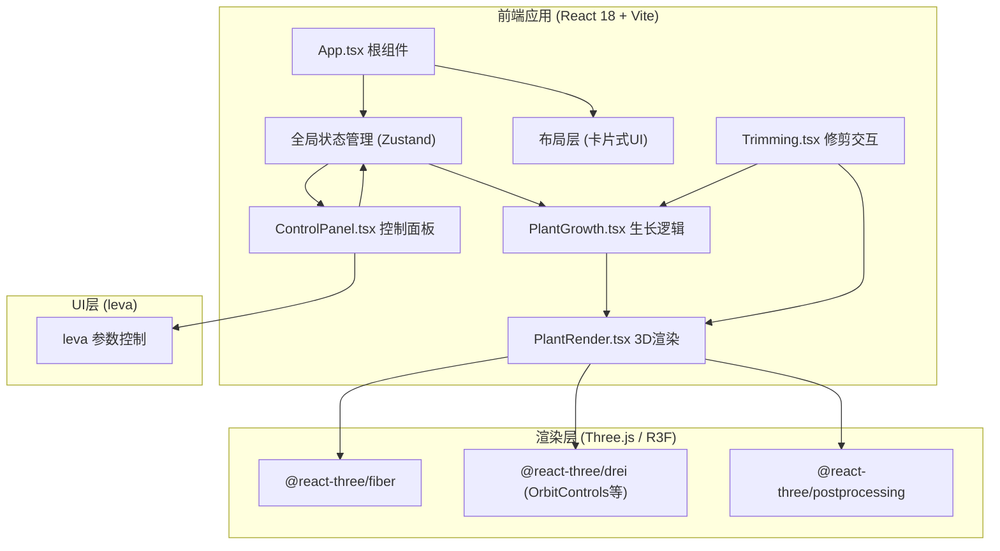

## 1. 架构设计



## 2. 技术栈说明

- **前端框架**：React@18 + TypeScript
- **构建工具**：Vite（开启严格模式）
- **3D引擎**：three@^0.160.0 + @react-three/fiber@^8.15.0 + @react-three/drei@^9.92.0
- **后处理**：@react-three/postprocessing@^2.15.0
- **UI控件**：leva@^0.9.35
- **状态管理**：zustand@^4.4.0
- **样式**：原生CSS（CSS Modules），响应式设计
- **字体**：系统无衬线字体 + 宋体（阶段标签）

## 3. 文件结构定义

```
auto111/
├── index.html
├── package.json
├── vite.config.js
├── tsconfig.json
└── src/
    ├── App.tsx              # 根组件：全局状态+布局+模块组装
    ├── PlantGrowth.tsx      # 生长逻辑：阶段管理、参数映射、动画驱动、状态统计
    ├── PlantRender.tsx      # 3D渲染：植物部件、粒子、地面、背景渲染
    ├── Trimming.tsx         # 修剪交互：鼠标事件、切割计算、粒子生成回调
    ├── ControlPanel.tsx     # 控制面板：环境滑块、状态统计、leva集成
    └── styles/
        └── App.css          # 全局样式、响应式布局、动画定义
```

## 4. 核心数据模型

### 4.1 植物节点数据结构（PlantNode）

```typescript
interface PlantNode {
  id: string;
  type: 'stem' | 'branch' | 'leaf' | 'bud' | 'flower' | 'fruit' | 'cotyledon';
  parentId: string | null;
  position: [number, number, number];  // 相对父节点位置
  rotation: [number, number, number];  // 欧拉角
  scale: [number, number, number];
  length: number;        // 茎/枝长度
  radius: number;        // 半径（茎/果实/花苞）
  color: string;         // 当前颜色
  targetColor: string;   // 目标颜色（用于渐变）
  growthProgress: number; // 0-1 生长完成度
  stage: number;         // 所属生长阶段 0-3
  children: string[];    // 子节点ID
  isCut: boolean;        // 是否已被修剪
  isWilting: boolean;    // 是否枯萎中
  createdAt: number;     // 创建时间戳
}
```

### 4.2 全局状态（Zustand Store）

```typescript
interface PlantState {
  // 环境参数
  light: number;      // 0-100，默认50
  water: number;      // 0-100，默认50
  temperature: number;// 15-35，默认25
  
  // 生长状态
  isPlanted: boolean;
  currentStage: 0 | 1 | 2 | 3;  // 发芽期/幼苗期/成长期/开花结果期
  stageProgress: number;        // 当前阶段进度 0-1
  growthSpeedMultiplier: number;
  isWilting: boolean;
  wiltingProgress: number;      // 枯萎进度 0-1
  
  // 植物节点数据
  plantNodes: Record<string, PlantNode>;
  rootNodeId: string | null;
  
  // 统计数据
  stats: {
    height: number;
    leafCount: number;
    budCount: number;
    fruitCount: number;
  };
  
  // UI状态
  showStageLabel: boolean;
  stageLabelText: string;
  isTrimming: boolean;
  
  // Actions
  setEnvironment: (key: 'light' | 'water' | 'temperature', value: number) => void;
  plantSeed: () => void;
  reset: () => void;
  cutNode: (nodeId: string, cutPosition: [number, number, number]) => void;
  takeScreenshot: () => void;
  share: () => void;
}
```

### 4.3 修剪切割数据

```typescript
interface CutEvent {
  nodeId: string;
  cutPoint: [number, number, number];  // 世界坐标切割点
  cutTime: number;
  detachedParticles: FallingParticle[];
}

interface FallingParticle {
  id: string;
  type: 'leaf' | 'fragment';
  startPosition: [number, number, number];
  velocity: [number, number, number];
  rotation: [number, number, number];
  rotationSpeed: [number, number, number];
  scale: number;
  color: string;
  lifetime: number;  // 剩余寿命（毫秒）
}
```

## 5. 生长阶段映射逻辑

### 5.1 生长速度计算

```typescript
function calculateGrowthMultiplier(light: number, water: number, temp: number): number {
  // 最佳值：light=50, water=50, temp=25
  const lightDeviation = Math.abs(light - 50);
  const waterDeviation = Math.abs(water - 50);
  const tempDeviation = Math.abs(temp - 25);
  
  // 线性衰减：每偏离1单位，速度下降0.02（即偏离50=0速度）
  let multiplier = 1.0;
  multiplier *= Math.max(0, 1 - lightDeviation * 0.02);
  multiplier *= Math.max(0, 1 - waterDeviation * 0.02);
  multiplier *= Math.max(0, 1 - tempDeviation * 0.04); // 温度更敏感
  
  return multiplier;
}

// 枯萎检测：偏离>40触发
function checkWilting(light: number, water: number): boolean {
  return Math.abs(light - 50) > 40 || Math.abs(water - 50) > 40;
}
```

### 5.2 阶段时间线

| 阶段 | 累计时间（理想条件下） | 关键事件 |
|-----|---------------------|---------|
| 0: 发芽期 | 0-10秒 | t=0 土堆升起；t=0.5s 子叶展开；t=0-10s 主茎0→0.5单位（0.05/s） |
| 1: 幼苗期 | 10-20秒 | 主茎0.5→1.0单位；t=10s 第一对侧枝分出 |
| 2: 成长期 | 20-40秒 | 主茎继续增长至2.0单位；每0.5单位高度产生一对侧枝+节点叶片；颜色渐变 |
| 3: 开花结果期 | 40-55秒 | t=40s 花苞出现→膨胀→绽放；t=48s 花朵凋落；t=50s 果实出现并长大 |

## 6. 性能优化策略

1. **实例化渲染**：同类植物部件（叶片、茎段）使用 InstancedMesh 减少draw call
2. **LOD优化**：远距离叶片使用简化几何
3. **粒子池**：落叶/切割粒子采用对象池复用，总数上限200
4. **帧率控制**：requestAnimationFrame + deltaTime，固定逻辑步长
5. **几何复用**：叶片形状、花瓣形状使用共享 BufferGeometry
6. **材质合并**：同色部件共享 Material 实例
7. **剔除优化**：视锥体剔除默认开启，地面和植物单独分组
