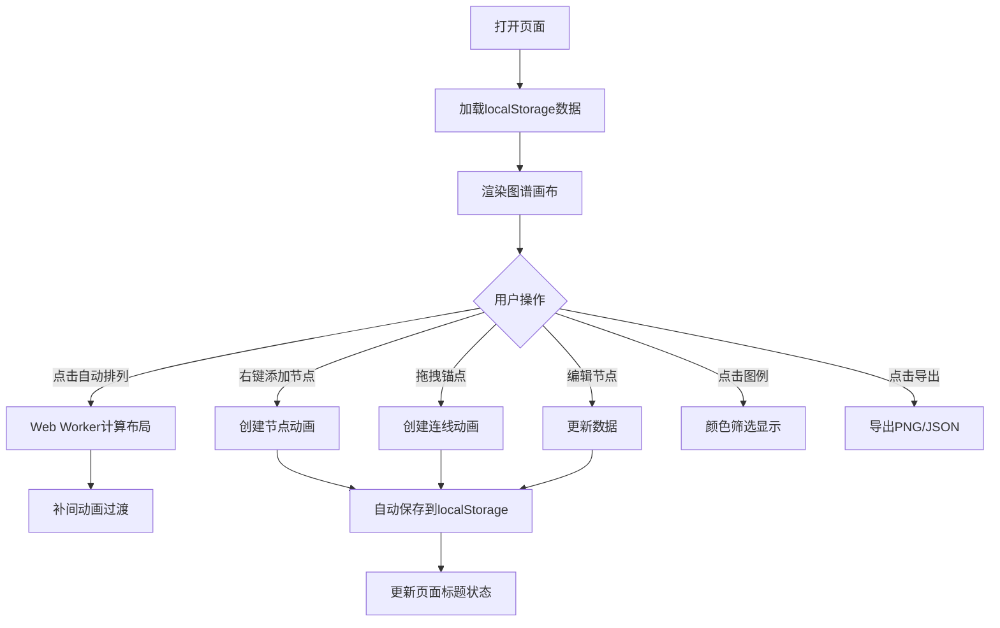

## 1. 产品概述

个人知识图谱应用是一款帮助用户在浏览器中可视化创建和管理知识节点及其关联关系的工具，解决零散知识点难以系统化组织和可视化关联的问题。

- **主要目的**：提供直观的画布式界面，让用户以图形化方式组织和关联知识节点，构建个人知识网络
- **解决的问题**：日常学习或工作中零散知识点难以系统化组织和可视化关联
- **目标用户**：学生、研究者、知识工作者等需要系统化整理知识的人群
- **产品价值**：通过可视化图谱帮助用户发现知识间的关联，提升学习效率和知识留存率

## 2. 核心功能

### 2.1 用户角色

| 角色 | 注册方式 | 核心权限 |
|------|----------|----------|
| 普通用户 | 无需注册，本地存储 | 创建、编辑、删除知识节点和连线，导出图谱数据 |

### 2.2 功能模块

1. **主画布**：节点管理、连线管理、拖拽交互、右键菜单
2. **工具栏**：添加节点、自动排列、筛选图例、导出、清空画布
3. **自动布局**：力导向图布局，支持补间动画
4. **颜色筛选**：按颜色标签筛选显示节点
5. **数据导出**：PNG图片导出、JSON数据导出
6. **自动保存**：localStorage持久化存储，页面状态指示

### 2.3 页面详情

| 页面名称 | 模块名称 | 功能描述 |
|----------|----------|----------|
| 主画布页 | 节点管理 | 创建、拖拽、编辑、删除知识节点，支持颜色标签 |
| 主画布页 | 连线管理 | 从节点锚点拖拽创建有向连线，支持关系标签 |
| 主画布页 | 交互控制 | 缩放、平移画布，节点选中效果 |
| 主画布页 | 自动布局 | 力导向图自动排列，流畅动画过渡 |
| 工具栏 | 快捷操作 | 添加节点、自动排列、筛选图例、导出、清空 |
| 工具栏 | 导出功能 | PNG/JSON导出，加载状态指示 |
| 图例面板 | 颜色筛选 | 8种预设颜色，点击筛选对应主题节点 |

## 3. 核心流程

### 3.1 主要用户流程

用户打开应用后，系统自动加载上次保存的图谱数据（如果有）。用户可以通过右键菜单或工具栏按钮添加新的知识节点，双击节点编辑标题和描述。从节点底部锚点拖拽可以创建与其他节点的关联连线，并设置关系标签。点击自动排列按钮可以让系统以力导向方式重新布局所有节点。通过右上角图例可以按颜色筛选显示不同主题的节点。编辑完成后，系统自动保存到本地存储，用户也可以手动导出为PNG图片或JSON文件。

### 3.2 流程图

## 4. 用户界面设计

### 4.1 设计风格

- **主色调**：蓝色 #1976d2
- **辅助色**：橙色 #ff9800
- **节点颜色**：红、橙、黄、绿、青、蓝、紫、灰共8种预设颜色
- **背景色**：浅灰色 #f5f5f5，带10px间距淡灰色网格线
- **按钮样式**：32x32px圆角6px，半透明背景，hover时背景变实色
- **字体**：系统默认字体，节点标题16px加粗，描述14px常规
- **整体风格**：Material Design风格，简洁现代

### 4.2 页面设计概述

| 页面名称 | 模块名称 | UI元素 |
|----------|----------|--------|
| 主画布页 | 全屏画布 | 浅灰背景 + 网格线，支持平移缩放 |
| 主画布页 | 知识节点 | 圆角矩形（120x60px），可拖拽，选中蓝色虚线框，左上角颜色标签 |
| 主画布页 | 节点锚点 | 底部圆形锚点，拖拽创建连线 |
| 主画布页 | 连线 | 灰色实线2px，中间关系标签，创建中显示红色虚线 |
| 工具栏 | 浮动工具栏 | 右上角5个图标按钮（添加、排列、筛选、导出、清空），带文字提示 |
| 图例面板 | 颜色筛选 | 8个颜色色块，点击切换筛选状态 |
| 页面标题 | 保存状态 | 显示"已保存"或"*未保存"状态 |

### 4.3 响应式设计

- **桌面端**：工具栏右上角浮动，节点默认120x60px
- **移动端**（宽度<768px）：工具栏底部沉底排列，节点最小尺寸增加到150px宽
- **画布**：随窗口大小自动调整，支持触摸操作

### 4.4 动画效果

- **节点/连线创建**：0.3秒弹性动画（framer-motion）
- **自动布局**：1.5秒ease-in-out补间动画
- **导出按钮**：0.5秒加载旋转图标
- **节点拖拽**：半透明阴影跟随效果
- **hover效果**：按钮背景变实色，显示文字提示
