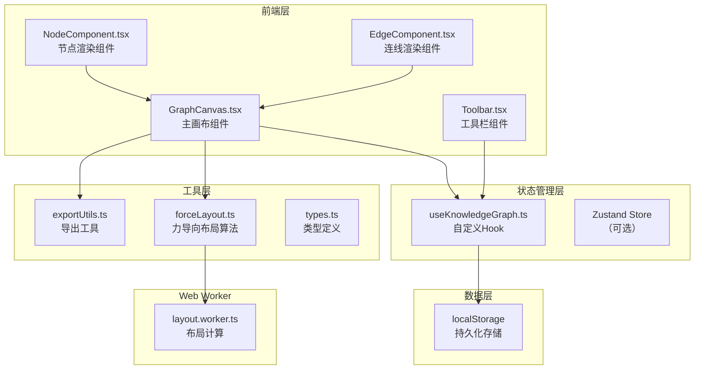
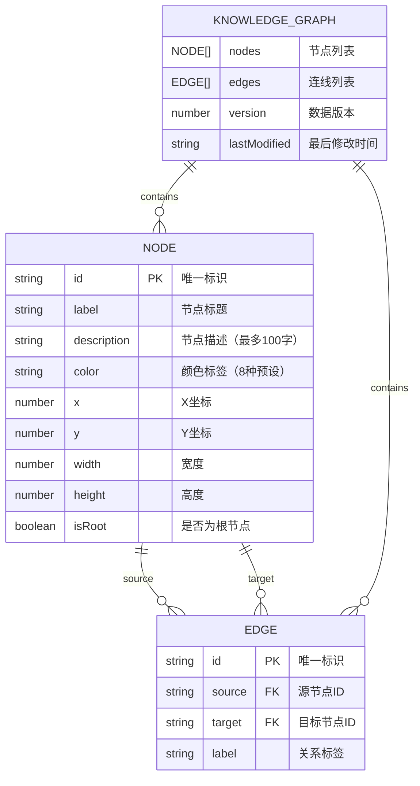

## 1. 架构设计



## 2. 技术描述

- **前端框架**：React 18 + TypeScript
- **构建工具**：Vite
- **动画库**：framer-motion
- **状态管理**：自定义 Hook (useKnowledgeGraph) + React Hooks
- **文件导出**：file-saver
- **性能优化**：Web Worker 进行布局计算
- **响应式**：CSS Media Queries + React Hooks

## 3. 路由定义

| 路由 | 用途 |
|------|------|
| / | 主画布页面（单页应用，无路由跳转） |

## 4. 数据模型

### 4.1 数据模型定义



### 4.2 TypeScript 类型定义

```typescript
// src/types.ts

export type NodeColor = 
  | 'red' 
  | 'orange' 
  | 'yellow' 
  | 'green' 
  | 'cyan' 
  | 'blue' 
  | 'purple' 
  | 'gray';

export interface Node {
  id: string;
  label: string;
  description: string;
  color: NodeColor;
  x: number;
  y: number;
  width: number;
  height: number;
  isRoot?: boolean;
}

export interface Edge {
  id: string;
  source: string;
  target: string;
  label: string;
}

export interface KnowledgeGraph {
  nodes: Node[];
  edges: Edge[];
  version: number;
  lastModified: string;
}

export interface HistoryState {
  nodes: Node[];
  edges: Edge[];
}

export interface LayoutOptions {
  width: number;
  height: number;
  iterations: number;
  nodeDistance: number;
}
```

### 4.3 颜色配置

```typescript
export const COLOR_MAP: Record<NodeColor, string> = {
  red: '#ef5350',
  orange: '#ff9800',
  yellow: '#ffeb3b',
  green: '#4caf50',
  cyan: '#00bcd4',
  blue: '#1976d2',
  purple: '#9c27b0',
  gray: '#9e9e9e',
};

export const COLOR_LABELS: Record<NodeColor, string> = {
  red: '红色',
  orange: '橙色',
  yellow: '黄色',
  green: '绿色',
  cyan: '青色',
  blue: '蓝色',
  purple: '紫色',
  gray: '灰色',
};
```

## 5. 文件结构

```
├── package.json
├── vite.config.js
├── tsconfig.json
├── index.html
└── src/
    ├── main.tsx
    ├── App.tsx
    ├── types.ts
    ├── components/
    │   ├── GraphCanvas.tsx
    │   ├── Toolbar.tsx
    │   ├── NodeComponent.tsx
    │   ├── EdgeComponent.tsx
    │   ├── ColorLegend.tsx
    │   ├── ContextMenu.tsx
    │   └── ExportModal.tsx
    ├── hooks/
    │   └── useKnowledgeGraph.ts
    └── utils/
        ├── forceLayout.ts
        ├── layout.worker.ts
        ├── exportUtils.ts
        └── constants.ts
```

## 6. 性能优化策略

1. **Web Worker 布局计算**：力导向布局算法在 Web Worker 中运行，避免阻塞主线程
2. **React.memo 优化**：节点和连线组件使用 memo 避免不必要的重渲染
3. **requestAnimationFrame**：拖拽和动画使用 rAF 确保 60fps
4. **批量更新**：自动布局过程中批量更新状态减少重渲染
5. **虚拟化渲染**：对于大量节点使用 Canvas 或 SVG 视口优化
6. **防抖节流**：自动保存使用防抖，避免频繁写入 localStorage

## 7. 关键实现要点

1. **useKnowledgeGraph Hook**：管理节点/连线状态、撤销/重做栈（最多50步）、localStorage自动保存
2. **forceLayout 算法**：基于库仑斥力和胡克引力的力导向布局，支持固定根节点
3. **GraphCanvas 交互**：SVG 渲染，支持节点拖拽、连线创建、画布平移缩放
4. **动画系统**：framer-motion 实现弹性动画和补间过渡
5. **导出功能**：html2canvas 或原生 Canvas API 导出 PNG，JSON 序列化导出
