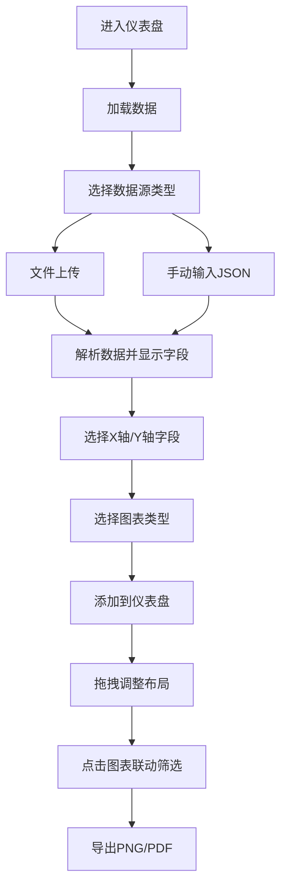

## 1. 产品概述

交互式动态数据仪表盘应用，支持多数据源加载、多类型图表可视化、拖拽布局自定义和图表联动筛选，帮助用户快速进行数据探索和分析。

- **核心价值**：提供一站式数据可视化解决方案，用户无需编写代码即可快速构建专业级数据仪表盘
- **目标用户**：数据分析师、业务运营人员、产品经理等需要快速进行数据可视化的人群
- **核心场景**：快速数据探索、业务数据监控、报表生成与分享

## 2. 核心功能

### 2.1 功能模块

1. **数据加载模块**：支持CSV/JSON文件上传、手动输入JSON数据
2. **图表可视化模块**：折线图、柱状图、饼图、热力图四种图表类型
3. **KPI指标卡模块**：展示关键数值及变化趋势
4. **仪表盘布局模块**：可拖拽调整组件大小和位置，布局自动保存
5. **图表联动模块**：点击图表数据联动筛选其他图表
6. **导出模块**：支持PNG截图和PDF报告导出

### 2.2 功能详情

| 模块名称 | 子功能 | 功能描述 |
|---------|--------|---------|
| 数据加载 | 文件上传 | 支持本地CSV和JSON文件上传，自动解析数据结构 |
| 数据加载 | 手动输入 | 提供文本编辑器，支持JSON格式数据手动输入 |
| 数据加载 | 字段选择 | 解析后显示字段列表，用户选择X轴和Y轴字段生成图表 |
| 图表可视化 | 折线图 | 带趋势线和数据点，支持缩放和悬停提示 |
| 图表可视化 | 柱状图 | 支持堆叠和分组两种展示模式 |
| 图表可视化 | 饼图 | 带百分比标签和扇区动画效果 |
| 图表可视化 | 热力图 | 基于矩阵数据，色块随数值渐变，悬停显示数值 |
| 图表可视化 | 切换动画 | 图表类型切换时0.3秒缩放淡入动画 |
| KPI指标卡 | 数值展示 | 渐变色边框，monospace字体显示关键数值 |
| KPI指标卡 | 趋势动画 | 数值变化时0.5秒向上/向下滚动动画 |
| 仪表盘布局 | 拖拽调整 | 支持组件位置和大小拖拽调整 |
| 仪表盘布局 | 布局保存 | 布局变化自动保存到本地存储，刷新后恢复 |
| 仪表盘布局 | 拖拽反馈 | 拖拽时半透明蓝色边框，放置后弹性回弹动画 |
| 图表联动 | 数据筛选 | 点击图表数据点联动筛选其他图表 |
| 图表联动 | 筛选标签 | 筛选条件以标签形式显示在顶部，支持移除 |
| 图表联动 | 高亮效果 | 非关联数据变为半透明（透明度0.2） |
| 导出功能 | PNG截图 | 使用html2canvas捕获仪表盘区域 |
| 导出功能 | PDF报告 | 将所有图表以固定布局排列生成PDF |

## 3. 核心流程

用户进入应用后，可以加载数据，选择图表类型和字段，将图表添加到仪表盘，通过拖拽调整布局，点击图表数据进行联动筛选，最后导出分析结果。

## 4. 用户界面设计

### 4.1 设计风格

- **主题**：深色科技风格，专业数据仪表盘质感
- **主背景**：#1e1e2e
- **卡片背景**：#2a2a3e
- **主色调**：#3b82f6（蓝色）、#6366f1（靛蓝）、#8b5cf6（紫色）
- **卡片圆角**：12px，带内阴影（inset 0 0 8px rgba(0,0,0,0.3)）
- **按钮风格**：简约圆角设计（8px圆角），悬停背景由#3b82f6转为#2563eb，点击缩放0.95
- **字体**：数字使用monospace风格，正文使用无衬线字体

### 4.2 页面布局

| 区域 | 位置 | 功能 |
|-----|------|------|
| 顶部工具栏 | 页面顶部 | 数据加载、图表添加、导出操作、筛选标签 |
| 仪表盘网格 | 主内容区 | 可拖拽的图表和KPI卡片网格布局 |
| 配置面板 | 侧边/弹窗 | 图表类型选择、字段配置 |

### 4.3 响应式设计

- **1440px以上**：三列布局
- **1024px-1439px**：两列布局
- **768px以下**：单列布局，图表卡片垂直堆叠
- **设计原则**：桌面优先，移动端自适应

### 4.4 动画与交互

- 图表类型切换：0.3秒缩放淡入动画
- 拖拽放置：0.2秒弹性回弹动画
- KPI数值变化：0.5秒滚动动画
- 按钮点击：缩放0.95快速恢复
- 悬停效果：平滑过渡（0.2s）

## 5. 性能要求

- 同时渲染6个以上图表组件时FPS不低于30
- 数据点超过1000时自动启用虚拟化渲染
- 布局保存和恢复操作响应时间<100ms
- 图表切换动画流畅无卡顿
