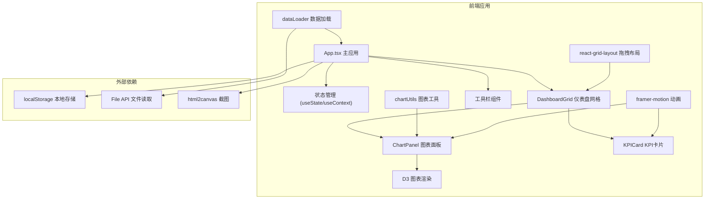

## 1. 架构设计

本项目为纯前端应用，采用React + TypeScript技术栈，使用Vite作为构建工具。



## 2. 技术栈描述

- **前端框架**：React@18 + TypeScript
- **构建工具**：Vite@5
- **图表库**：d3@7
- **动画库**：framer-motion@11
- **拖拽布局**：react-grid-layout@1.3
- **文件保存**：file-saver@2
- **截图导出**：html2canvas@1
- **样式方案**：CSS Modules / 内联样式

## 3. 项目文件结构

```
src/
├── App.tsx              # 主应用组件，全局状态管理
├── components/
│   ├── DashboardGrid.tsx    # 可拖拽网格布局组件
│   ├── ChartPanel.tsx       # 图表容器组件
│   └── KPICard.tsx          # KPI指标卡组件
├── utils/
│   ├── dataLoader.ts        # 数据加载和解析工具
│   └── chartUtils.ts        # 图表绘制工具
└── index.css            # 全局样式
```

## 4. 数据模型

### 4.1 数据记录类型

```typescript
interface DataRecord {
  [key: string]: string | number;
}

interface Dataset {
  id: string;
  name: string;
  fields: FieldInfo[];
  records: DataRecord[];
}

interface FieldInfo {
  name: string;
  type: 'string' | 'number';
}
```

### 4.2 图表配置类型

```typescript
type ChartType = 'line' | 'bar' | 'pie' | 'heatmap';

interface ChartConfig {
  id: string;
  type: ChartType;
  title: string;
  datasetId: string;
  xField: string;
  yField: string;
  yFields?: string[];  // 堆叠/分组柱状图用
}
```

### 4.3 KPI配置类型

```typescript
interface KPIConfig {
  id: string;
  title: string;
  value: number;
  change: number;      // 百分比变化
  format?: string;
}
```

### 4.4 布局配置类型

```typescript
interface LayoutItem {
  i: string;
  x: number;
  y: number;
  w: number;
  h: number;
  type: 'chart' | 'kpi';
  config: ChartConfig | KPIConfig;
}
```

### 4.5 筛选状态类型

```typescript
interface Filter {
  id: string;
  field: string;
  value: string | number;
  sourceChartId: string;
}
```

## 5. 核心模块说明

### 5.1 dataLoader 数据加载模块

**职责**：统一处理不同来源的数据加载和解析

- `loadFromCSV(file: File): Promise<Dataset>` - 解析CSV文件
- `loadFromJSON(file: File): Promise<Dataset>` - 解析JSON文件
- `loadFromText(jsonText: string): Dataset` - 解析手动输入的JSON
- `detectFieldType(records: DataRecord[]): FieldInfo[]` - 自动检测字段类型

### 5.2 chartUtils 图表工具模块

**职责**：封装D3图表生成逻辑

- `createLineChart(svg, data, config)` - 折线图生成
- `createBarChart(svg, data, config)` - 柱状图生成
- `createPieChart(svg, data, config)` - 饼图生成
- `createHeatmap(svg, data, config)` - 热力图生成
- `virtualizeData(data, viewport)` - 大数据虚拟化渲染

### 5.3 DashboardGrid 仪表盘网格

**职责**：基于react-grid-layout实现可拖拽布局

- 支持拖拽调整位置
- 支持调整大小
- 布局自动保存到localStorage
- 响应式断点配置

### 5.4 ChartPanel 图表面板

**职责**：图表容器，处理类型切换动画和交互事件

- 图表类型切换动画
- 数据点点击事件
- 筛选联动高亮
- 悬停提示

### 5.5 KPICard KPI卡片

**职责**：展示关键指标和变化趋势

- 渐变色边框
- 数值滚动动画
- 变化趋势指示

## 6. 状态管理

采用React内置的 useState 和 useContext 进行状态管理，主要状态包括：

- **数据集列表**：已加载的所有数据集
- **仪表盘组件**：所有图表和KPI卡片配置
- **布局配置**：组件的位置和大小
- **筛选状态**：当前激活的筛选条件
- **当前编辑组件**：正在配置的图表/KPI

## 7. 性能优化策略

1. **大数据虚拟化**：数据点>1000时仅渲染可视区域
2. **requestAnimationFrame**：动画和重绘使用RAF
3. **Memo优化**：使用React.memo减少不必要重渲染
4. **按需加载**：图表D3操作按需执行
5. **节流防抖**：拖拽和resize事件防抖处理

## 8. 浏览器兼容性

- Chrome 90+
- Firefox 88+
- Safari 14+
- Edge 90+
