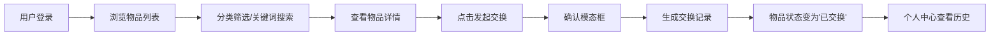

## 1. 产品概述

社区物品交换平台是一个面向本地社区居民的闲置物品交换应用，旨在通过便捷的物品发布、浏览和交换功能，促进邻里资源共享，减少浪费。平台支持用户发布闲置物品、按分类和关键词搜索、发起交换请求，并记录完整的交换历史。

- **目标用户**：本地社区居民，有闲置物品需要交换的普通用户
- **核心价值**：简化邻里物品交换流程，提升闲置物品利用率，增进社区互动

## 2. 核心功能

### 2.1 用户角色

| 角色 | 登录方式 | 核心权限 |
|------|----------|----------|
| 普通用户 | 用户名登录（模拟登录） | 发布物品、浏览搜索、发起交换、查看历史、管理个人物品 |

### 2.2 功能模块

1. **物品列表页（首页）**：物品卡片网格、分类筛选、关键词搜索、分页加载、骨架屏
2. **物品详情页**：物品大图、详细描述、联系人信息、发起交换按钮、交换确认模态框
3. **个人中心页（我的物品）**：已发布物品列表、编辑/删除操作、交换历史记录
4. **发布物品表单**：滑入动画表单、字段校验、提交处理

### 2.3 页面详情

| 页面名称 | 模块名称 | 功能描述 |
|-----------|-------------|---------------------|
| 物品列表页 | 导航栏 | 固定顶部导航，含Logo、搜索框、用户头像、分类下拉筛选 |
| 物品列表页 | 物品卡片网格 | CSS Grid布局，响应式（桌面多列/平板2列/手机1列） |
| 物品列表页 | 无限滚动 | Intersection Observer实现，触底加载下一页（每页12个） |
| 物品列表页 | 搜索功能 | 关键词实时搜索（防抖300ms），结果淡入动画 |
| 物品详情页 | 左右分栏布局 | 左侧物品大图，右侧描述、联系信息、状态标签 |
| 物品详情页 | 发起交换 | 脉冲动画按钮，点击弹出确认模态框 |
| 个人中心页 | 我的物品 | 列表展示，支持编辑（弹窗）和下架操作 |
| 个人中心页 | 交换历史 | 发起/接收的交换记录，时间倒序，状态颜色过渡 |
| 发布表单 | 滑入动画 | 从右侧平滑滑入，含所有必填字段 |

## 3. 核心流程

用户浏览物品列表 → 通过分类筛选或关键词搜索找到目标物品 → 进入物品详情查看完整信息 → 点击"发起交换"按钮 → 确认弹窗确认后提交交换请求 → 双方物品状态更新为"已交换"（交换完成后）→ 在个人中心查看交换历史记录。

## 4. 用户界面设计

### 4.1 设计风格

- **主色调**：大地色系 —— 米白色背景 `#FDF8F3`，暖灰色文字 `#5C5047`，陶土橙强调色 `#D97757`
- **辅助色**：成功绿 `#6B8E6B`，警告黄 `#E8C46A`，错误红 `#C45C5C`
- **按钮风格**：圆角 10px，陶土橙填充，悬停加深，点击涟漪动画
- **字体**：标题使用 'Playfair Display' 衬线字体，正文使用 'Noto Sans SC' 无衬线字体
- **卡片设计**：圆角 16px，轻微阴影 `0 2px 12px rgba(92,80,71,0.08)`，悬停时阴影加深 `0 8px 28px rgba(92,80,71,0.14)` 并上浮 4px
- **布局风格**：顶部固定导航栏，卡片网格布局，详情页左右分栏
- **图标风格**：使用 lucide-react 线性图标

### 4.2 页面设计概述

| 页面名称 | 模块名称 | UI元素描述 |
|-----------|-------------|-------------|
| 物品列表页 | 导航栏 | 固定顶部，高度 72px，米白背景，底部 1px 暖灰边框 |
| 物品列表页 | 物品卡片 | 16px 圆角，图片 4:3 比例，悬停上浮 4px + 阴影加深过渡 |
| 物品列表页 | 筛选栏 | 分类下拉框（陶土橙边框）+ 搜索框（带放大镜图标） |
| 物品详情页 | 左图右文 | 左侧 55% 图片区域，右侧 45% 信息区域，fade-in 入场 |
| 物品详情页 | 状态标签 | "已交换"绿色背景圆角标签，"待交换"橙色标签 |
| 个人中心页 | 标签切换 | 我的物品 / 交换历史 两个 Tab，下划线切换动画 |
| 发布表单 | 侧边抽屉 | 从右侧滑入（transform: translateX），300ms 缓动 |
| 全局 | 骨架屏 | 浅灰渐变脉冲动画，占位布局与实际卡片一致 |

### 4.3 响应式设计

- **桌面端（>1024px）**：物品卡片 4 列网格，详情页 55%/45% 分栏
- **平板端（768px-1024px）**：物品卡片 2 列网格，详情页改为上下布局
- **手机端（<768px）**：物品卡片 1 列，导航栏简化，搜索框移至下方
- **触摸优化**：点击区域 ≥ 44x44px，触摸反馈缩放效果

### 4.4 动画与微交互

- **页面入场**：内容 fade-in 0.4s ease-out，卡片 staggered delay
- **表单滑入**：右侧抽屉 translate(100%) → translate(0)，300ms cubic-bezier
- **搜索结果**：opacity 0→1，0.3s 淡入
- **按钮涟漪**：点击位置扩散圆形波纹，600ms 完成
- **状态标签颜色**：背景色 transition 0.4s ease
- **加载骨架**：背景渐变 translateX 循环动画，1.5s/次
- **确认按钮脉冲**：box-shadow 0 0 0 0 → 0 0 0 12px rgba(217,119,87,0)，1.2s 无限
