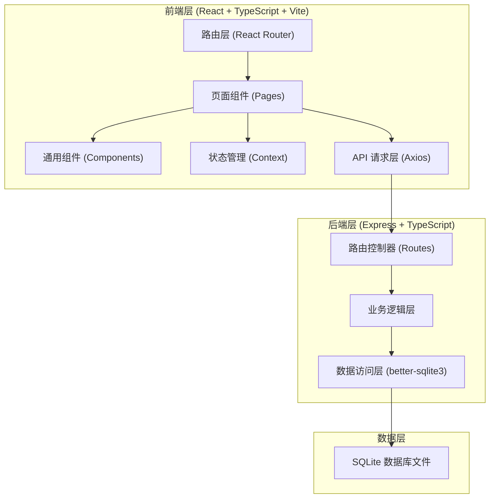
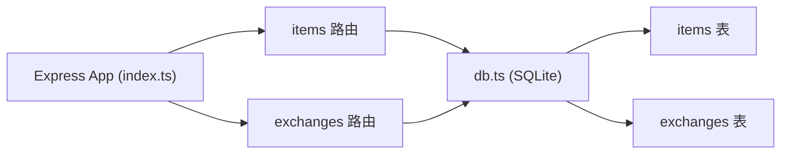
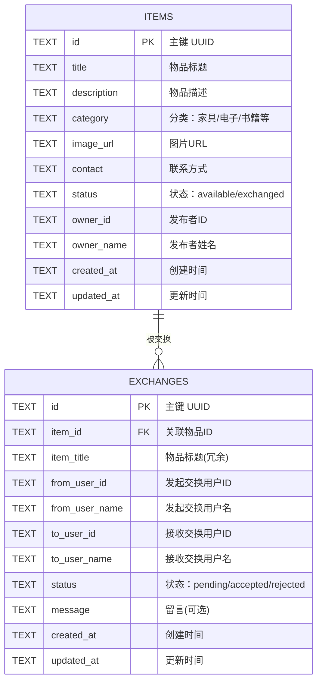

## 1. 架构设计



## 2. 技术描述

- **前端框架**：React@18 + TypeScript@5
- **构建工具**：Vite@5 + @vitejs/plugin-react
- **前端路由**：react-router-dom@6
- **HTTP 客户端**：axios@1
- **状态管理**：React Context API（AuthContext）
- **图标库**：lucide-react
- **后端框架**：Express@4 + TypeScript
- **CORS 中间件**：cors@2
- **请求体解析**：body-parser@1
- **数据库**：SQLite（通过 better-sqlite3）
- **唯一ID**：uuid@9
- **后端运行**：ts-node + tsconfig-paths

## 3. 路由定义（前端）

| 路由路径 | 页面组件 | 用途 |
|----------|----------|------|
| `/` | ItemListPage | 首页 - 物品列表、搜索、筛选 |
| `/items/:id` | ItemDetailPage | 物品详情页 - 查看信息、发起交换 |
| `/me` | MyItemsPage | 个人中心 - 我的物品、交换历史 |

## 4. API 定义（后端）

### 4.1 物品相关接口

| 方法 | 路径 | 描述 | 请求体 | 响应 |
|------|------|------|--------|------|
| GET | `/api/items` | 分页获取物品列表 | query: page, limit, category, keyword | `{ items: Item[], total: number, hasMore: boolean }` |
| GET | `/api/items/:id` | 获取单个物品详情 | - | `Item` |
| POST | `/api/items` | 创建新物品（需登录） | `{ title, description, category, imageUrl, contact, ownerId, ownerName }` | `Item` |
| PUT | `/api/items/:id` | 更新物品（需登录） | `{ title?, description?, category?, imageUrl?, contact?, status? }` | `Item` |
| DELETE | `/api/items/:id` | 删除/下架物品（需登录） | - | `{ success: true }` |
| GET | `/api/users/:userId/items` | 获取用户发布的物品 | - | `Item[]` |

### 4.2 交换相关接口

| 方法 | 路径 | 描述 | 请求体 | 响应 |
|------|------|------|--------|------|
| POST | `/api/exchanges` | 发起交换请求 | `{ itemId, fromUserId, fromUserName, toUserId, toUserName, message? }` | `Exchange` |
| GET | `/api/exchanges` | 查询用户的交换记录 | query: userId | `Exchange[]` |
| PUT | `/api/exchanges/:id` | 更新交换状态 | `{ status: 'accepted' \| 'rejected' }` | `Exchange` |

### 4.3 TypeScript 类型定义

```typescript
interface Item {
  id: string;
  title: string;
  description: string;
  category: string;
  imageUrl: string;
  contact: string;
  status: 'available' | 'exchanged';
  ownerId: string;
  ownerName: string;
  createdAt: string;
  updatedAt: string;
}

interface Exchange {
  id: string;
  itemId: string;
  itemTitle: string;
  fromUserId: string;
  fromUserName: string;
  toUserId: string;
  toUserName: string;
  status: 'pending' | 'accepted' | 'rejected';
  message?: string;
  createdAt: string;
  updatedAt: string;
}

interface User {
  id: string;
  name: string;
  avatar: string;
}
```

## 5. 后端架构图



## 6. 数据模型

### 6.1 数据模型 ER 图



### 6.2 数据定义语言（DDL）

```sql
-- 物品表
CREATE TABLE IF NOT EXISTS items (
  id TEXT PRIMARY KEY,
  title TEXT NOT NULL,
  description TEXT NOT NULL,
  category TEXT NOT NULL,
  image_url TEXT NOT NULL,
  contact TEXT NOT NULL,
  status TEXT NOT NULL DEFAULT 'available',
  owner_id TEXT NOT NULL,
  owner_name TEXT NOT NULL,
  created_at TEXT NOT NULL,
  updated_at TEXT NOT NULL
);

CREATE INDEX IF NOT EXISTS idx_items_category ON items(category);
CREATE INDEX IF NOT EXISTS idx_items_owner ON items(owner_id);
CREATE INDEX IF NOT EXISTS idx_items_status ON items(status);

-- 交换记录表
CREATE TABLE IF NOT EXISTS exchanges (
  id TEXT PRIMARY KEY,
  item_id TEXT NOT NULL,
  item_title TEXT NOT NULL,
  from_user_id TEXT NOT NULL,
  from_user_name TEXT NOT NULL,
  to_user_id TEXT NOT NULL,
  to_user_name TEXT NOT NULL,
  status TEXT NOT NULL DEFAULT 'pending',
  message TEXT,
  created_at TEXT NOT NULL,
  updated_at TEXT NOT NULL,
  FOREIGN KEY (item_id) REFERENCES items(id)
);

CREATE INDEX IF NOT EXISTS idx_exchanges_from_user ON exchanges(from_user_id);
CREATE INDEX IF NOT EXISTS idx_exchanges_to_user ON exchanges(to_user_id);
CREATE INDEX IF NOT EXISTS idx_exchanges_item ON exchanges(item_id);
```

### 6.3 种子数据

初始化以下测试数据，确保至少 20 条物品记录，覆盖分类：家具、电子产品、书籍、衣物、厨具、运动器材。
