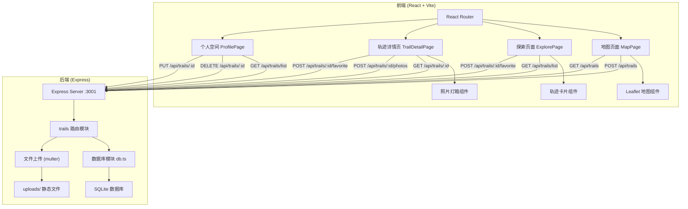
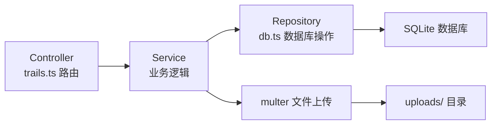
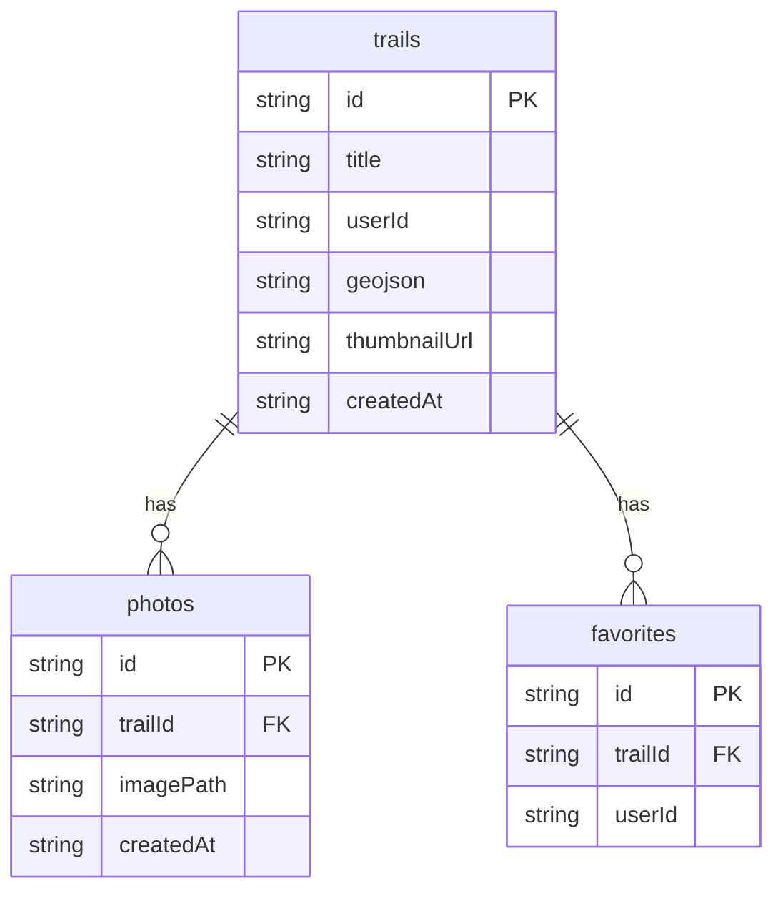

## 1. 架构设计



## 2. 技术说明

- **前端**：React 18 + TypeScript + Vite + Tailwind CSS + Zustand
- **地图库**：Leaflet + react-leaflet
- **状态管理**：Zustand
- **图标库**：lucide-react
- **后端**：Express 4 + TypeScript (ESM)
- **数据库**：better-sqlite3（SQLite）
- **文件上传**：multer
- **跨域**：cors
- **初始化工具**：vite-init (react-express-ts 模板)

## 3. 路由定义

| 路由 | 用途 |
|------|------|
| `/` | 地图主页面，绘制和查看轨迹 |
| `/explore` | 探索页面，浏览所有公开轨迹 |
| `/trail/:id` | 轨迹详情页面 |
| `/profile` | 个人空间，管理我的轨迹和收藏 |

## 4. API 定义

### 4.1 创建轨迹

```
POST /api/trails
Request Body: { title: string; description?: string; geojson: GeoJSON.FeatureCollection }
Response: { id: string; title: string; ... }
```

### 4.2 获取轨迹列表

```
GET /api/trails/list?search=&sort=createdAt&order=desc&userId=
Response: { trails: Trail[] }
```

### 4.3 获取单个轨迹详情

```
GET /api/trails/:id
Response: { trail: Trail; photos: Photo[]; isFavorited: boolean; favoriteCount: number }
```

### 4.4 上传照片

```
POST /api/trails/:id/photos
Content-Type: multipart/form-data
Body: { photos: File[] } (最多5张，每张5MB)
Response: { photos: Photo[] }
```

### 4.5 收藏/取消收藏

```
POST /api/trails/:id/favorite
Request Body: { userId: string }
Response: { isFavorited: boolean; favoriteCount: number }
```

### 4.6 更新轨迹

```
PUT /api/trails/:id
Request Body: { title?: string; description?: string }
Response: { trail: Trail }
```

### 4.7 删除轨迹

```
DELETE /api/trails/:id
Response: { success: boolean }
```

### TypeScript 类型定义

```typescript
interface Trail {
  id: string;
  title: string;
  description?: string;
  userId: string;
  geojson: string;
  thumbnailUrl?: string;
  createdAt: string;
  favoriteCount?: number;
}

interface Photo {
  id: string;
  trailId: string;
  imagePath: string;
  createdAt: string;
}

interface Favorite {
  id: string;
  trailId: string;
  userId: string;
}
```

## 5. 服务器架构图



## 6. 数据模型

### 6.1 数据模型定义



### 6.2 数据定义语言

```sql
CREATE TABLE IF NOT EXISTS trails (
  id TEXT PRIMARY KEY,
  title TEXT NOT NULL,
  description TEXT,
  userId TEXT NOT NULL,
  geojson TEXT NOT NULL,
  thumbnailUrl TEXT,
  createdAt TEXT NOT NULL DEFAULT (datetime('now'))
);

CREATE TABLE IF NOT EXISTS photos (
  id TEXT PRIMARY KEY,
  trailId TEXT NOT NULL,
  imagePath TEXT NOT NULL,
  createdAt TEXT NOT NULL DEFAULT (datetime('now')),
  FOREIGN KEY (trailId) REFERENCES trails(id) ON DELETE CASCADE
);

CREATE TABLE IF NOT EXISTS favorites (
  id TEXT PRIMARY KEY,
  trailId TEXT NOT NULL,
  userId TEXT NOT NULL,
  FOREIGN KEY (trailId) REFERENCES trails(id) ON DELETE CASCADE,
  UNIQUE(trailId, userId)
);

CREATE INDEX IF NOT EXISTS idx_trails_userId ON trails(userId);
CREATE INDEX IF NOT EXISTS idx_trails_createdAt ON trails(createdAt);
CREATE INDEX IF NOT EXISTS idx_photos_trailId ON photos(trailId);
CREATE INDEX IF NOT EXISTS idx_favorites_trailId ON favorites(trailId);
CREATE INDEX IF NOT EXISTS idx_favorites_userId ON favorites(userId);
```
