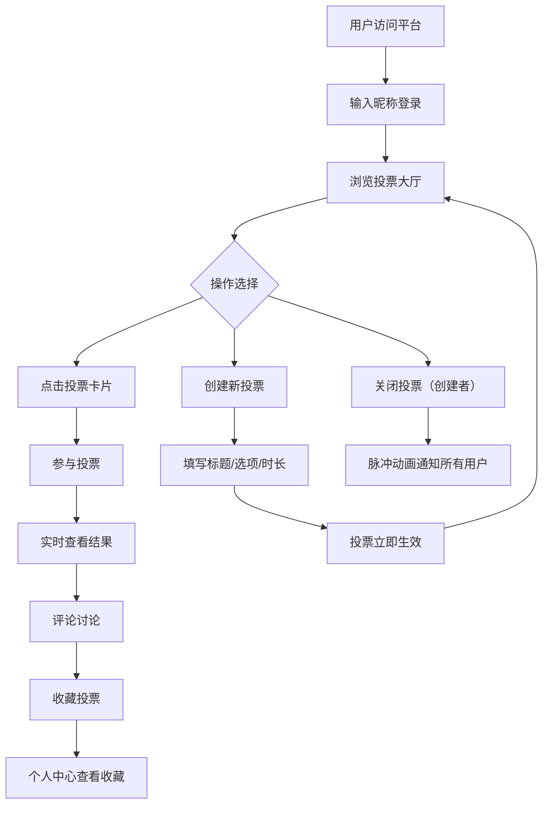

## 1. 产品概述

轻量级实时投票与讨论平台，帮助创业团队快速收集用户反馈。用户可创建投票、参与投票并实时查看结果变化，同时支持对每个投票选项进行评论讨论，所有数据通过WebSocket实时同步。

- 解决现有调查问卷工具无法实时展示结果和互动讨论的痛点
- 目标用户：创业团队、社区运营者、活动组织者等需要快速收集群体意见的场景

## 2. 核心功能

### 2.1 用户角色

| 角色 | 注册方式 | 核心权限 |
|------|----------|----------|
| 访客 | 无需注册 | 浏览投票、查看结果 |
| 普通用户 | 输入昵称即可参与 | 创建投票、参与投票、评论讨论、收藏投票 |
| 投票创建者 | 同普通用户 | 额外可关闭自己创建的投票 |

### 2.2 功能模块

1. **投票大厅页面**: 投票列表展示、创建投票入口、实时数据更新
2. **投票详情页面**: 投票参与、实时结果图表、评论区、倒计时
3. **个人中心页面**: 我的收藏列表

### 2.3 页面详情

| 页面名称 | 模块名称 | 功能描述 |
|----------|----------|----------|
| 投票大厅 | 投票卡片列表 | 展示所有进行中/已关闭的投票，卡片式布局，3列响应式排列 |
| 投票大厅 | 创建投票表单 | 填写标题、描述、选项（2-6个），设定投票时长（1-7天），淡入展开动画 |
| 投票大厅 | 顶部导航栏 | 深蓝渐变导航，用户昵称输入，我的收藏入口 |
| 投票详情 | 投票选项区 | 展示选项列表、投票按钮、实时进度条（CSS transition 1s ease-out）、总投票人数 |
| 投票详情 | 倒计时 | 顶部显示投票剩余时间 |
| 投票详情 | 结果图表 | 使用recharts绘制动态饼图/条形图，数据变化时动画重绘 |
| 投票详情 | 评论区 | 实时评论列表、评论输入框、气泡样式、滑入动画 |
| 投票详情 | 关闭投票按钮 | 创建者可关闭投票，关闭时脉冲动画提示所有在线用户 |
| 个人中心 | 我的收藏列表 | 展示用户收藏的投票，可取消收藏 |

## 3. 核心流程

用户打开平台 → 输入昵称 → 浏览投票大厅 → 点击投票卡片进入详情 → 选择选项投票 → 实时查看结果变化 → 在评论区讨论 → 可收藏投票 → 创建者可关闭投票

## 4. 用户界面设计

### 4.1 设计风格

- 主色：深蓝色 #1a237e（导航栏渐变）
- 辅助色：渐变 #4facfe → #00f2fe（进度条、高亮元素）
- 背景色：#f9f9f9（页面背景）、#ffffff（卡片）
- 评论区背景：#f0f0f0
- 按钮：圆角按钮，悬停放大1.05倍，点击缩放0.95
- 字体：标题使用粗体大字号，正文使用常规字号
- 布局：卡片式布局，圆角12px，阴影 0 2px 8px rgba(0,0,0,0.1)

### 4.2 页面设计概览

| 页面名称 | 模块名称 | UI元素 |
|----------|----------|--------|
| 投票大厅 | 导航栏 | 深蓝渐变背景，白色文字，昵称输入框，收藏入口图标 |
| 投票大厅 | 投票卡片 | 白色圆角卡片，标题加粗，选项进度条渐变色，投票人数，倒计时标签 |
| 投票大厅 | 创建表单 | 淡入展开动画，标题输入（100字限制），描述输入（500字），动态选项添加/删除，时长选择1-7天 |
| 投票详情 | 选项列表 | 选项文字 + 渐变进度条 + 百分比 + 投票人数，高亮选项边框变亮，transition 1s ease-out |
| 投票详情 | 结果图表 | recharts饼图/条形图，数据变化时1s ease动画 |
| 投票详情 | 评论区 | 浅灰背景气泡，昵称+内容+时间，新评论从底部滑入动画，输入框+发送按钮 |
| 投票详情 | 关闭按钮 | 红色按钮，关闭时全屏脉冲动画 |
| 个人中心 | 收藏列表 | 投票卡片缩略，实心收藏图标 |

### 4.3 响应式适配

- 桌面端（≥1024px）：投票卡片3列排列
- 平板端（768px-1023px）：投票卡片2列排列
- 手机端（<768px）：投票卡片1列排列
- 所有交互元素触摸友好，按钮最小44px

### 4.4 动画设计

- 创建表单：淡入展开（opacity 0→1, max-height 0→auto, 0.3s ease）
- 进度条：宽度变化 CSS transition 1s ease-out
- 结果图表：数据变化时 transition 1s ease 重绘
- 新评论：从底部滑入（translateY 20px→0, opacity 0→1, 0.3s ease）
- 收藏按钮：空心→实心切换动画，scale 1→1.2→1
- 关闭投票脉冲：全屏半透明遮罩脉冲闪烁（opacity 0→0.3→0, 0.6s）
- 按钮悬停：scale(1.05)，点击：scale(0.95)
