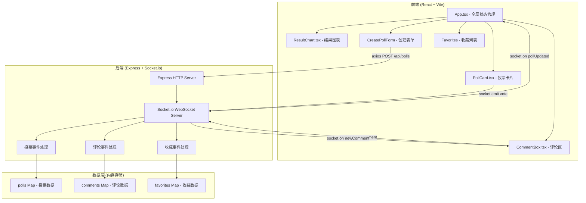
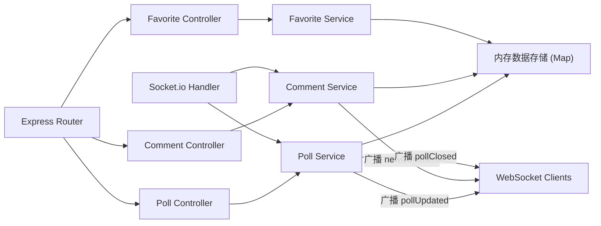
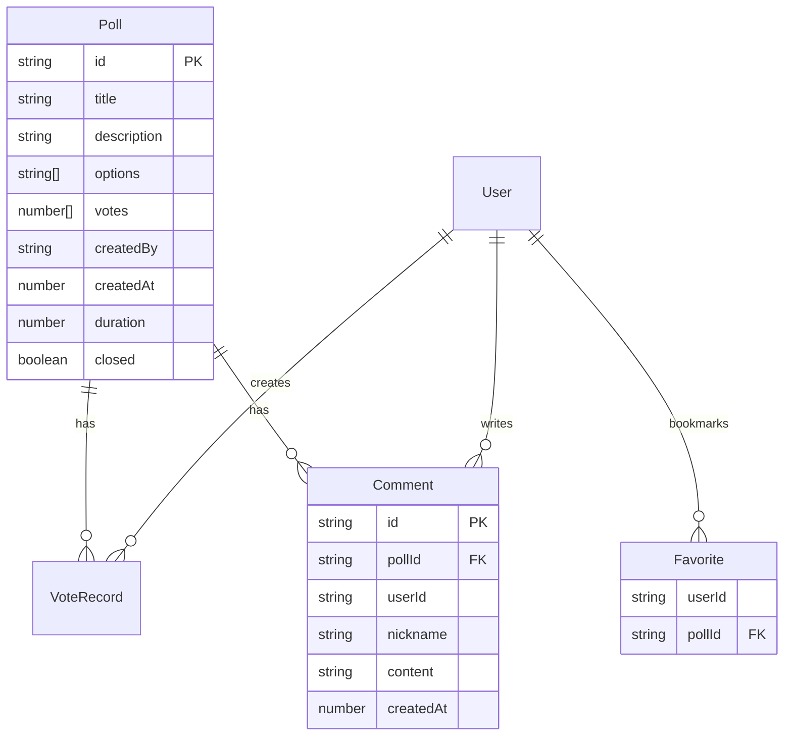

## 1. 架构设计



## 2. 技术说明

- 前端：React@18 + TypeScript + Vite + recharts + socket.io-client + axios
- 初始化工具：Vite
- 后端：Express@4 + Socket.io + cors + uuid
- 数据库：内存存储（Map结构），适用于轻量级场景
- 实时通信：Socket.io WebSocket双向通信

## 3. 路由定义

| 路由 | 用途 |
|------|------|
| / | 投票大厅，展示所有投票列表 |
| /poll/:id | 投票详情页，包含投票、结果、评论 |
| /favorites | 个人中心，我的收藏列表 |

## 4. API 定义

### 4.1 REST API

| 方法 | 路径 | 请求体 | 响应 | 说明 |
|------|------|--------|------|------|
| GET | /api/polls | - | Poll[] | 获取所有投票列表 |
| GET | /api/polls/:id | - | Poll | 获取单个投票详情 |
| POST | /api/polls | CreatePollDTO | Poll | 创建新投票 |
| POST | /api/polls/:id/close | - | Poll | 关闭投票 |
| GET | /api/polls/:id/comments | - | Comment[] | 获取投票评论 |
| GET | /api/favorites/:userId | - | Poll[] | 获取用户收藏列表 |
| POST | /api/favorites | {userId, pollId} | {success} | 添加收藏 |
| DELETE | /api/favorites | {userId, pollId} | {success} | 取消收藏 |

### 4.2 WebSocket 事件

| 事件名 | 方向 | 数据 | 说明 |
|--------|------|------|------|
| vote | Client→Server | {pollId, optionIndex, userId} | 用户投票 |
| pollUpdated | Server→Client | Poll | 投票数据更新广播 |
| comment | Client→Server | {pollId, userId, nickname, content} | 提交评论 |
| newComment | Server→Client | Comment | 新评论广播 |
| pollClosed | Server→Client | {pollId} | 投票关闭通知（触发脉冲动画） |

### 4.3 TypeScript 类型定义

```typescript
interface Poll {
  id: string;
  title: string;
  description: string;
  options: string[];
  votes: number[];
  createdBy: string;
  createdAt: number;
  duration: number;
  closed: boolean;
}

interface Comment {
  id: string;
  pollId: string;
  userId: string;
  nickname: string;
  content: string;
  createdAt: number;
}

interface CreatePollDTO {
  title: string;
  description: string;
  options: string[];
  createdBy: string;
  duration: number;
}
```

## 5. 服务端架构图



## 6. 数据模型

### 6.1 数据模型定义



### 6.2 数据存储方案

采用内存Map结构存储，无需数据库：

- `polls: Map<string, Poll>` - 以pollId为键存储投票数据
- `comments: Map<string, Comment[]>` - 以pollId为键存储评论列表
- `favorites: Map<string, Set<string>>` - 以userId为键存储收藏的pollId集合
