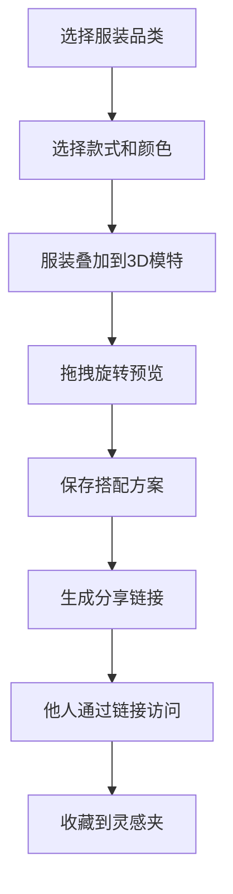

## 1. 产品概述

虚拟服饰搭配与展示平台，解决用户在购买服装前无法直观预览不同款式和颜色搭配效果的问题。用户可以从预设衣柜中选择上衣、下装、鞋子、配饰四种品类，实时叠加显示在3D人体模特上进行360度预览，并保存和分享搭配方案。

- **核心目标**：提供沉浸式的虚拟试衣体验，帮助用户快速找到理想的服装搭配
- **目标用户**：时尚爱好者、网购消费者、服装设计师
- **市场价值**：降低网购服装的退换货率，提升购物决策效率

## 2. 核心功能

### 2.1 用户角色

| 角色 | 注册方式 | 核心权限 |
|------|----------|----------|
| 普通用户 | 无需注册，本地用户标识 | 浏览衣柜、搭配服装、保存方案、分享搭配、收藏灵感 |

### 2.2 功能模块

1. **搭配主页面**：3D模特展示区、服装选择面板、搭配方案列表面板
2. **灵感收藏夹页面**：瀑布流展示收藏的搭配方案
3. **分享链接页面**：通过唯一链接查看他人分享的搭配

### 2.3 页面详情

| 页面名称 | 模块名称 | 功能描述 |
|---------|----------|----------|
| 搭配主页面 | 3D模特展示区 | 展示人体模特，支持鼠标拖拽360度旋转，平滑阻尼效果，服装叠加显示，切换动画 |
| 搭配主页面 | 服装选择面板 | 品类标签页切换（上衣/下装/鞋子/配饰），每类至少5种款式，每种2-3种颜色变体，选中状态霓虹绿呼吸光晕 |
| 搭配主页面 | 搭配方案面板 | 保存当前搭配为方案，展示缩略图卡片，分享按钮，收藏按钮 |
| 灵感收藏夹页面 | 瀑布流网格 | 展示所有收藏的搭配方案，支持点击加载详情 |
| 分享页面 | 搭配展示 | 通过唯一链接查看他人分享的搭配，可收藏到自己的收藏夹 |

## 3. 核心流程

用户从衣柜中选择服装品类 → 选择具体款式和颜色 → 服装实时叠加到3D模特上 → 拖拽模特360度预览 → 保存为搭配方案 → 生成分享链接 → 其他用户通过链接查看并收藏

## 4. 用户界面设计

### 4.1 设计风格

- **主色调**：莫兰迪色系，主背景 `#f0ece3`，卡片背景 `#ffffff`
- **强调色**：霓虹绿 `#39ff14` 用于选中状态的呼吸光晕
- **按钮风格**：圆角设计，点击水波纹扩散效果
- **字体**：使用优雅的无衬线字体，标题使用精致的衬线字体
- **布局风格**：三栏布局（左侧服装选择、中间模特展示、右侧搭配列表），移动端垂直堆叠
- **阴影效果**：卡片带2px圆角和柔和阴影

### 4.2 页面设计概述

| 页面名称 | 模块名称 | UI元素 |
|---------|----------|--------|
| 搭配主页面 | 3D模特展示区 | 居中展示，淡入淡出切换动画，颜色渐变过渡0.5秒 |
| 搭配主页面 | 服装选择面板 | 标签页滑动切换动画，选中卡片霓虹绿呼吸光晕（2秒循环） |
| 搭配主页面 | 搭配方案面板 | 缩略图卡片悬停上浮8px并放大1.05倍，显示名称、创建时间 |
| 灵感收藏夹页面 | 瀑布流网格 | 错落有致的卡片布局，平滑加载动画 |

### 4.3 响应性

- 桌面端（≥768px）：三栏水平布局
- 移动端（<768px）：面板垂直堆叠，模特区域全屏展示
- 触摸优化：支持手势旋转模特，按钮尺寸适配触摸操作

### 4.4 3D场景指导

- **环境**：柔和的莫兰迪色系背景，简洁的舞台环境
- **光照**：三点布光系统，主光+辅助光+轮廓光，突出服装质感
- **相机设置**：轨道控制器，支持环绕旋转，平滑阻尼效果
- **构图**：模特居中，占据视觉中心，服装叠加层次分明
- **交互**：鼠标拖拽旋转，滚轮缩放，双击重置视角
- **后处理**：柔和抗锯齿，轻微泛光效果增强质感
- **性能**：确保渲染帧率稳定在30fps以上，优化模型面数

## 5. 性能要求

- 模特旋转操作后渲染帧率稳定在30fps以上
- 服装切换动画流畅，无明显卡顿
- 页面首次加载时间控制在3秒内
- 缩略图生成快速，图片懒加载
