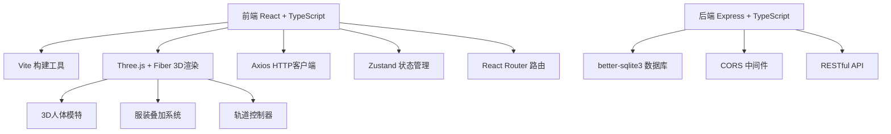
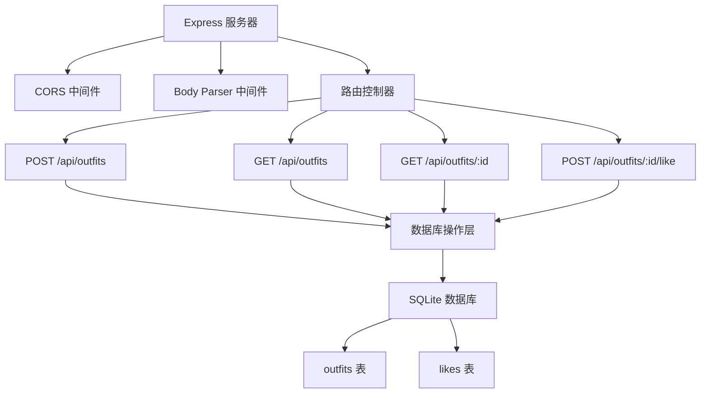
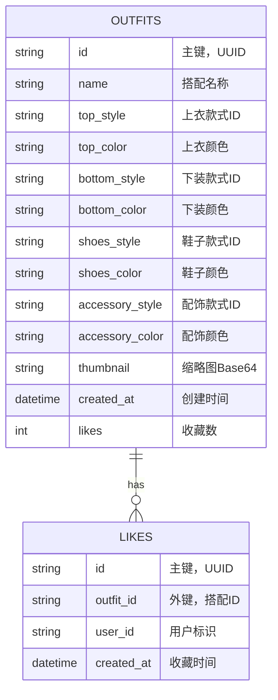

## 1. 架构设计



## 2. 技术描述

- **前端**：React 18 + TypeScript + Vite 5
- **3D渲染**：Three.js + @react-three/fiber + @react-three/drei
- **状态管理**：Zustand
- **路由**：React Router DOM 6
- **HTTP客户端**：Axios
- **后端**：Express 4 + TypeScript
- **数据库**：better-sqlite3
- **唯一标识**：uuid
- **项目初始化**：react-express-ts 模板

## 3. 路由定义

| 路由 | 用途 |
|------|------|
| / | 搭配主页面，包含模特展示、服装选择、搭配列表 |
| /favorites | 灵感收藏夹页面，瀑布流展示收藏的搭配 |
| /share/:id | 分享链接页面，查看他人分享的搭配 |

## 4. API 定义

```typescript
// 服装数据类型
interface ClothingItem {
  id: string;
  category: 'top' | 'bottom' | 'shoes' | 'accessory';
  name: string;
  style: string;
  colors: string[];
  modelUrl: string;
}

// 搭配方案类型
interface Outfit {
  id: string;
  name: string;
  createdAt: string;
  top: { styleId: string; color: string };
  bottom: { styleId: string; color: string };
  shoes: { styleId: string; color: string };
  accessory: { styleId: string; color: string };
  thumbnail: string;
  likes: number;
}

// 收藏类型
interface Like {
  id: string;
  outfitId: string;
  userId: string;
  createdAt: string;
}

// 请求/响应类型
interface SaveOutfitRequest {
  name: string;
  top: { styleId: string; color: string };
  bottom: { styleId: string; color: string };
  shoes: { styleId: string; color: string };
  accessory: { styleId: string; color: string };
  thumbnail: string;
}

interface ApiResponse<T> {
  success: boolean;
  data?: T;
  error?: string;
}
```

### API 端点

| 方法 | 端点 | 描述 |
|------|------|------|
| POST | /api/outfits | 保存搭配方案 |
| GET | /api/outfits | 获取用户搭配列表（最多20个） |
| GET | /api/outfits/:id | 获取单个搭配详情 |
| POST | /api/outfits/:id/like | 收藏搭配 |
| GET | /api/outfits/:id/likes | 获取搭配收藏数 |

## 5. 服务器架构图



## 6. 数据模型

### 6.1 数据模型定义



### 6.2 数据定义语言

```sql
-- 创建 outfits 表
CREATE TABLE IF NOT EXISTS outfits (
  id TEXT PRIMARY KEY,
  name TEXT NOT NULL,
  top_style TEXT NOT NULL,
  top_color TEXT NOT NULL,
  bottom_style TEXT NOT NULL,
  bottom_color TEXT NOT NULL,
  shoes_style TEXT NOT NULL,
  shoes_color TEXT NOT NULL,
  accessory_style TEXT,
  accessory_color TEXT,
  thumbnail TEXT,
  created_at DATETIME DEFAULT CURRENT_TIMESTAMP,
  likes INTEGER DEFAULT 0
);

-- 创建 likes 表
CREATE TABLE IF NOT EXISTS likes (
  id TEXT PRIMARY KEY,
  outfit_id TEXT NOT NULL,
  user_id TEXT NOT NULL,
  created_at DATETIME DEFAULT CURRENT_TIMESTAMP,
  FOREIGN KEY (outfit_id) REFERENCES outfits(id) ON DELETE CASCADE
);

-- 创建索引
CREATE INDEX IF NOT EXISTS idx_outfits_created_at ON outfits(created_at DESC);
CREATE INDEX IF NOT EXISTS idx_likes_outfit_id ON likes(outfit_id);
CREATE INDEX IF NOT EXISTS idx_likes_user_id ON likes(user_id);
```

## 7. 项目文件结构

```
.
├── package.json              # 根目录依赖配置
├── vite.config.js            # Vite 配置
├── tsconfig.json             # TypeScript 配置
├── index.html                # 入口HTML
├── frontend/
│   └── src/
│       ├── main.tsx          # React 入口
│       ├── App.tsx           # 主应用组件
│       ├── components/
│       │   ├── ModelViewer.tsx       # 3D模特展示组件
│       │   ├── ClothingSelector.tsx  # 服装选择面板
│       │   └── OutfitPanel.tsx       # 搭配方案面板
│       ├── api/
│       │   └── outfitApi.ts          # API封装
│       ├── store/
│       │   └── useOutfitStore.ts     # Zustand状态管理
│       ├── data/
│       │   └── wardrobe.ts           # 预设衣柜数据
│       ├── types/
│       │   └── index.ts              # TypeScript类型定义
│       └── styles/
│           └── global.css            # 全局样式
└── backend/
    ├── server.ts             # Express服务器
    ├── db.ts                 # 数据库初始化
    └── types.ts              # 后端类型定义
```
