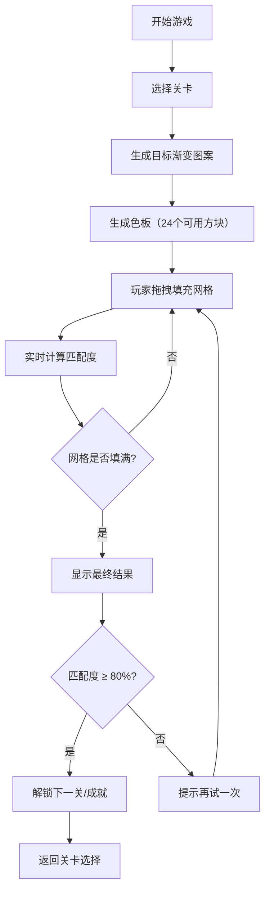

## 1. 产品概述

颜色迷宫是一款基于色彩渐变原理的休闲解谜游戏，玩家通过拖拽彩色方块填充网格，还原隐藏的渐变图案。产品旨在锻炼玩家的色彩感知能力，提供轻松有趣的益智体验。

- 主要用途：休闲娱乐、色彩感知训练
- 目标用户：喜欢解谜游戏、对色彩敏感的各年龄段用户
- 市场价值：填补色彩渐变类解谜游戏的市场空白，提供独特的视觉与智力双重挑战

## 2. 核心功能

### 2.1 用户角色

| 角色 | 注册方式 | 核心权限 |
|------|----------|----------|
| 玩家 | 无需注册 | 游戏游玩、关卡解锁、成就查看 |

### 2.2 功能模块

1. **游戏主界面**：游戏面板、色板区域、顶部状态栏
2. **游戏引擎**：渐变生成、颜色匹配计算、关卡管理
3. **交互系统**：拖拽操作、动画效果、提示功能
4. **进度系统**：计时器、匹配度计算、成就徽章

### 2.3 页面详情

| 页面名称 | 模块名称 | 功能描述 |
|----------|----------|----------|
| 游戏主页面 | 顶部状态栏 | 显示关卡编号、计时器、匹配度进度条 |
| 游戏主页面 | 游戏面板 | 6x6网格，显示用户填充的颜色，支持拖放操作 |
| 游戏主页面 | 色板区域 | 展示可用颜色方块，支持拖拽操作 |
| 游戏主页面 | 控制按钮 | 提示按钮、重新开始按钮、关卡选择 |
| 游戏主页面 | 结果弹窗 | 显示完成时间、匹配度、成就徽章 |

## 3. 核心流程

玩家进入游戏后，从色板中拖拽颜色方块到网格中填充，系统实时计算匹配度。填充完成后显示最终得分，达到80%以上解锁下一关。

## 4. 用户界面设计

### 4.1 设计风格
- **主色调**：深灰背景 (#1a1a2e)，低饱和度蓝紫和粉红系配色
- **按钮风格**：渐变背景，圆角设计，hover时亮度提高10%
- **字体**：现代无衬线字体，标题使用稍粗字重
- **布局风格**：卡片式设计，左右布局（桌面端），上下布局（移动端）
- **动效**：弹性动画、光晕效果、平滑过渡

### 4.2 页面设计概述

| 页面名称 | 模块名称 | UI元素 |
|----------|----------|----------|
| 游戏主页面 | 顶部状态栏 | 渐变进度条（红→绿）、大号计时数字、关卡标签 |
| 游戏主页面 | 游戏面板 | 6x6网格（圆角8px，阴影），65%宽度，匹配度>80%时金色闪烁辉光 |
| 游戏主页面 | 色板区域 | 35%宽度，彩色方块网格，拖拽时50%缩小+白色光晕 |
| 游戏主页面 | 控制按钮 | 渐变按钮，提示按钮带使用次数限制 |
| 游戏主页面 | 结果弹窗 | 半透明遮罩，弹性动画，徽章特效 |

### 4.3 响应式
- **桌面端**：左右布局，游戏面板65%，色板35%
- **移动端**（<768px）：上下布局，游戏面板在上，色板在下
- **触控优化**：方块尺寸适配触控，拖拽预览清晰

### 4.4 动画细节
- 拖拽时：方块缩小至50%，白色光晕
- 放置时：CSS transform: scale(1.1) 弹性弹回
- 成功时：匹配度>80%，整个面板金色柔和闪烁
- 提示时：最不匹配的5个格子高亮，旁侧显示目标颜色样本
