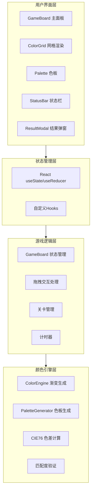

## 1. 架构设计



## 2. 技术描述

- **前端框架**：React 18 + TypeScript
- **构建工具**：Vite 5
- **语言**：TypeScript 5（严格模式）
- **样式方案**：原生 CSS + CSS 变量
- **状态管理**：React Hooks (useState, useEffect, useCallback, useRef)
- **第三方依赖**：无额外UI库，全部原生实现

### 初始化方式
使用 Vite 官方模板初始化 React + TypeScript 项目：
```bash
npm create vite@latest color-maze -- --template react-ts
```

## 3. 目录结构

```
src/
├── modules/
│   ├── GameBoard/
│   │   ├── GameBoard.tsx      # 主游戏面板，管理网格状态和方块拖拽逻辑
│   │   └── ColorGrid.tsx      # 渲染网格和方块，处理拖拽事件
│   └── ColorEngine/
│       ├── ColorEngine.ts     # 颜色算法引擎，计算目标渐变图案，验证匹配度
│       └── PaletteGenerator.ts # 生成随机色板，确保颜色和谐
├── utils/
│   └── helpers.ts             # 工具函数：颜色差值计算、随机颜色生成
├── styles/
│   └── main.css               # 全局样式，CSS变量定义主题色
├── App.tsx                    # 应用入口组件
├── main.tsx                   # React 挂载入口
└── vite-env.d.ts              # Vite 类型声明
```

## 4. 核心数据结构

### 4.1 类型定义

```typescript
// 颜色表示 - RGB
interface RGB {
  r: number;
  g: number;
  b: number;
}

// 颜色表示 - LAB (用于色差计算)
interface LAB {
  l: number;
  a: number;
  b: number;
}

// 网格格子
interface Cell {
  id: string;
  row: number;
  col: number;
  color: RGB | null;
  targetColor: RGB;
  isHighlighted: boolean;
  hintColor?: RGB;
}

// 色板方块
interface PaletteItem {
  id: string;
  color: RGB;
  isUsed: boolean;
  isDragging: boolean;
}

// 关卡配置
interface LevelConfig {
  id: number;
  name: string;
  type: 'horizontal' | 'diagonal' | 'radial';
  colors: [RGB, RGB] | [RGB, RGB, RGB];
  gridSize: number;
}

// 游戏状态
interface GameState {
  level: number;
  grid: Cell[][];
  palette: PaletteItem[];
  matchPercentage: number;
  hintsRemaining: number;
  startTime: number;
  elapsedTime: number;
  isComplete: boolean;
  isSuccess: boolean;
}
```

### 4.2 关卡配置

```typescript
const LEVELS: LevelConfig[] = [
  {
    id: 1,
    name: '水平渐变',
    type: 'horizontal',
    colors: [
      { r: 65, g: 105, b: 225 },   // 蓝
      { r: 148, g: 0, b: 211 }      // 紫
    ],
    gridSize: 6
  },
  {
    id: 2,
    name: '对角线渐变',
    type: 'diagonal',
    colors: [
      { r: 255, g: 69, b: 0 },      // 红
      { r: 255, g: 215, b: 0 },     // 黄
      { r: 34, g: 139, b: 34 }      // 绿
    ],
    gridSize: 6
  },
  {
    id: 3,
    name: '放射状渐变',
    type: 'radial',
    colors: [
      { r: 255, g: 255, b: 255 },   // 白
      { r: 0, g: 0, b: 139 }         // 深蓝
    ],
    gridSize: 6
  }
];
```

## 5. 核心算法

### 5.1 RGB 转 LAB (CIE76)
```typescript
function rgbToLab(rgb: RGB): LAB {
  // 1. RGB 转 XYZ
  // 2. XYZ 转 LAB
  // 使用标准 D65 白点
}
```

### 5.2 CIE76 色差计算
```typescript
function cie76Difference(lab1: LAB, lab2: LAB): number {
  return Math.sqrt(
    Math.pow(lab1.l - lab2.l, 2) +
    Math.pow(lab1.a - lab2.a, 2) +
    Math.pow(lab1.b - lab2.b, 2)
  );
}
```

### 5.3 渐变生成算法
- **水平渐变**：基于列索引插值
- **对角线渐变**：基于 (行+列) 索引三色插值
- **放射状渐变**：基于到中心的距离插值

### 5.4 色板生成策略
1. 生成目标渐变的所有36个颜色
2. 随机选择24个作为可用方块
3. 确保包含关键色彩节点
4. 打乱顺序呈现

### 5.5 性能优化策略
- **拖拽60fps**：使用 `requestAnimationFrame` + CSS transform
- **颜色计算异步**：使用 `setTimeout` 分帧计算，单次不超过16ms
- **批量更新**：使用 `requestIdleCallback` 处理非紧急计算
- **防抖计算**：匹配度计算使用 100ms 防抖

## 6. 关键组件接口

### 6.1 GameBoard Props
```typescript
interface GameBoardProps {
  level: LevelConfig;
  onComplete: (result: GameResult) => void;
  onBack: () => void;
}
```

### 6.2 ColorGrid Props
```typescript
interface ColorGridProps {
  cells: Cell[][];
  onCellDrop: (row: number, col: number, color: RGB) => void;
  onDragOver: (row: number, col: number) => void;
  highlightedCells: string[];
}
```

### 6.3 ColorEngine 接口
```typescript
interface IColorEngine {
  generateTargetPattern(config: LevelConfig): RGB[][];
  calculateMatchPercentage(userGrid: RGB[][], targetGrid: RGB[][]): number;
  calculateCellDifferences(userGrid: RGB[][], targetGrid: RGB[][]): number[][];
  findWorstMatchingCells(differences: number[][], count: number): [number, number][];
}
```
