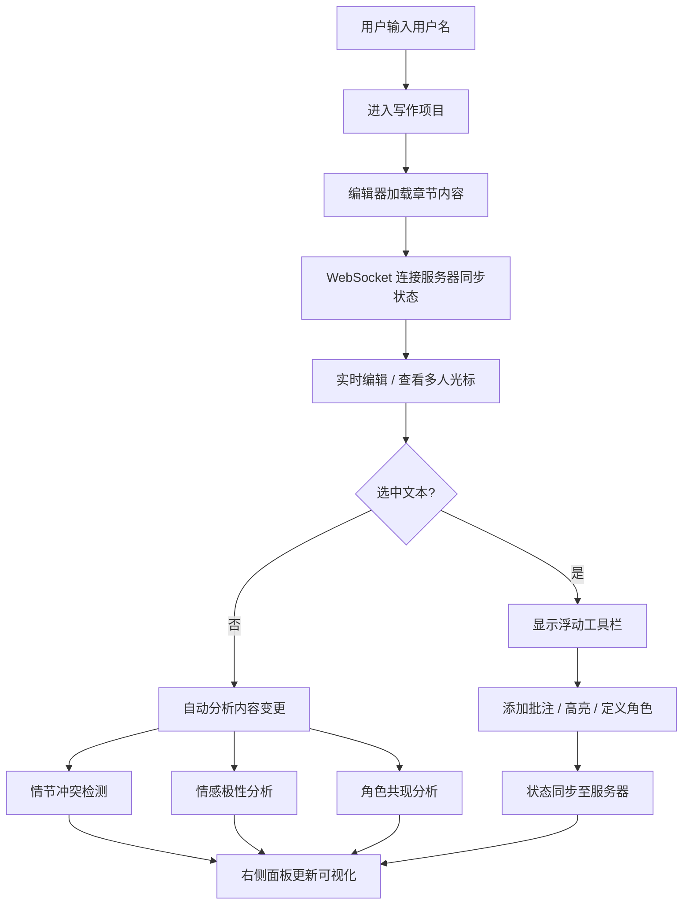

## 1. 产品概述

创意写作协作平台是一款面向小说作者、剧本创作团队的在线协作写作工具，支持多人实时编辑故事或剧本，并在编写过程中自动生成智能文学分析报告。解决集体创作中缺乏实时灵感提示、情节一致性检查和角色关系可视化的核心痛点。

- 目标用户：小说作家、编剧团队、写作爱好者
- 产品价值：提升协作效率，通过 AI 分析辅助创作质量，降低角色和情节混乱风险

---

## 2. 核心功能

### 2.1 用户角色
| 角色 | 登录方式 | 核心权限 |
|------|----------|----------|
| 协作者 | 用户名输入 | 进入项目、实时编辑、添加批注、定义角色 |

### 2.2 功能模块
1. **项目主页面**：写作编辑器、章节大纲面板、角色列表、右侧分析面板
2. **编辑器模块**：多人实时编辑、用户光标区分、文本选中工具栏
3. **分析面板模块**：情节冲突检测、情感极性折线图、角色共现力导向图
4. **章节大纲模块**：章节列表、拖拽排序、场景描述、关联角色标签
5. **批注与角色模块**：文本批注、荧光高亮、角色定义表单

### 2.3 页面详情
| 页面名称 | 模块名称 | 功能描述 |
|----------|----------|----------|
| 写作主页面 | 多人编辑器 | 支持多用户实时输入，光标和边框按用户颜色区分（A蓝色/B橙色），WebSocket实时同步延迟<150ms |
| 写作主页面 | 章节大纲面板 | 左侧章节列表，支持拖拽排序（半透明阴影跟随），展开显示场景描述和关联角色标签 |
| 写作主页面 | 分析面板容器 | 右侧占30%宽度，可拖动分隔条调节，含三个可最小化子面板 |
| 写作主页面 | 情节冲突检测 | 识别两个角色目标相反的段落，红色高亮标记原文，面板可折叠 |
| 写作主页面 | 情感极性分析 | 折线图展示当前章节每句情感倾向(-1~+1)，平滑过渡曲线，每5秒或内容变更时刷新 |
| 写作主页面 | 角色共现关系图 | D3力导向图，节点大小=出现频率，连线粗细=共现强度，节点可拖拽，弹性动画过渡 |
| 写作主页面 | 文本选中工具栏 | 选中文本弹出浮动工具栏：添加批注、高亮（荧光黄底色）、定义角色 |
| 写作主页面 | 角色定义 | 将选中文字设为角色名，弹出表单填写简介和最多5个性格标签，保存后自动更新共现图 |

---

## 3. 核心流程

### 3.1 协作编写流程
用户进入项目 → 输入用户名加入 → 编辑器加载最新内容 → 实时编辑/查看他人光标 → 选中文字触发工具栏 → 添加批注/高亮/定义角色 → 右侧面板同步更新分析结果

### 3.2 Mermaid 流程图

---

## 4. 用户界面设计

### 4.1 设计风格
- **主题风格**：深色沉浸式创作主题
- **主色**：背景 `#1a1a2e`，卡片 `#16213e`，文字 `#e0e0e0`
- **强调色**：分隔条高亮 `#e94560`（玫红）、用户A `#4da6ff`（蓝）、用户B `#ff9933`（橙）、高亮 `rgba(255,235,59,0.35)`（荧光黄半透明）
- **按钮样式**：圆角 6px，悬停 translateY(-2px) + 阴影加深，点击涟漪扩散动画
- **字体**：标题使用 'Cinzel' 装饰性衬线字体，正文使用 'Inter' 无衬线字体
- **布局风格**：三栏布局（左大纲15% / 中编辑70% / 右分析30%），可拖拽分隔条

### 4.2 页面设计概览
| 页面名称 | 模块名称 | UI 元素与交互 |
|----------|----------|---------------|
| 写作主页面 | 顶部导航栏 | 项目标题、当前用户徽章、在线用户列表（颜色标识） |
| 写作主页面 | 章节大纲面板 | 章节卡片列表，拖拽排序（半透明 ghost），展开箭头，角色标签 chip，淡入展开动画 |
| 写作主页面 | 编辑区 | 深色纸张质感背景，用户彩色光标+边框，选中文本浮动工具栏，段落级冲突红色高亮 |
| 写作主页面 | 分隔条 | 默认 2px #2a2a4e，拖动变 #e94560 加粗，0.3s 平滑宽度过渡 |
| 写作主页面 | 分析面板容器 | 三个可折叠卡片，最小化/展开按钮，弹性过渡曲线 `cubic-bezier(0.68,-0.55,0.27,1.55)` |
| 写作主页面 | 情感折线图 | 渐变面积填充，平滑曲线，悬停显示情感数值 tooltip |
| 写作主页面 | 力导向图 | 节点发光效果，连线按强度透明度，点击节点弹出角色详情浮层 |
| 写作主页面 | 批注气泡 | 侧边气泡卡片，用户颜色标记，淡入动画，支持回复删除 |
| 写作主页面 | 响应式抽屉 | <768px 时分析面板变为底部抽屉，滑入动画，可拖拽把手调节高度 |

### 4.3 响应式设计
- **桌面端（≥1024px）**：三栏固定布局，左15% / 中55% / 右30%
- **平板（768~1024px）**：折叠大纲为图标抽屉，中/右两栏
- **移动端（<768px）**：分析面板转为底部抽屉（从底部滑入，高度可拖拽调节），大纲隐藏为汉堡菜单

### 4.4 交互动效
- 面板最小化/展开：弹性贝塞尔曲线高度过渡
- 力导向图节点刷新：弹性物理动画
- 按钮悬停：translateY(-2px) + 阴影加深 + 0.2s 过渡
- 按钮点击：CSS 涟漪扩散动画
- 章节拖拽：半透明跟随阴影，目标位置插入指示线
