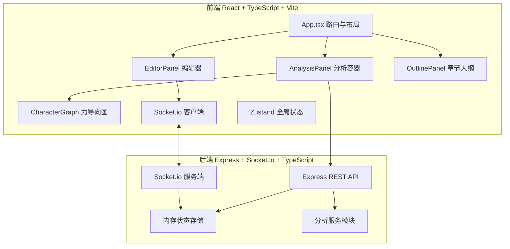
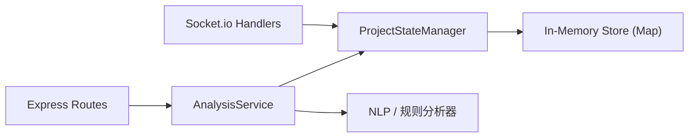

## 1. 架构设计



## 2. 技术描述

- **前端**：React 18 + TypeScript 5 + Vite 5
  - 实时通信：socket.io-client
  - 可视化：d3 + @types/d3
  - 路由：react-router-dom
  - HTTP：axios
  - 状态管理：zustand
- **初始化工具**：Vite（react-express-ts 模板）
- **后端**：Express 4 + Socket.io + TypeScript
  - CORS 跨域
  - uuid 生成 ID
  - body-parser 解析请求
- **数据存储**：内存存储（演示用，项目状态、用户、章节、批注、角色）

## 3. 路由定义

| 路由 | 用途 |
|------|------|
| `/` | 项目入口（输入用户名+选择项目） |
| `/project/:id` | 写作主页面（编辑器+大纲+分析面板） |

## 4. API 与 Socket 定义

### 4.1 REST API
```typescript
// POST /api/analyze/conflict - 情节冲突检测
interface ConflictRequest { projectId: string; chapterId: string; content: string }
interface ConflictResponse { conflicts: Array<{ start: number; end: number; characters: [string, string]; reason: string }> }

// POST /api/analyze/sentiment - 情感极性分析
interface SentimentRequest { content: string }
interface SentimentResponse { sentences: Array<{ index: number; value: number; text: string }> }

// POST /api/analyze/characters - 角色共现分析
interface CharacterCooccurRequest { projectId: string; content: string }
interface CharacterCooccurResponse {
  nodes: Array<{ id: string; name: string; frequency: number; tags: string[] }>;
  links: Array<{ source: string; target: string; strength: number }>;
}

// GET /api/projects/:id - 获取项目详情
// POST /api/projects/:id/characters - 添加角色
// POST /api/projects/:id/annotations - 添加批注
```

### 4.2 Socket.io 事件
```typescript
// 客户端 → 服务端
'join-project': { projectId: string; userId: string; userName: string }
'edit': { projectId: string; chapterId: string; content: string; cursor: CursorPosition }
'cursor-move': { projectId: string; userId: string; cursor: CursorPosition }
'leave-project': { projectId: string; userId: string }

// 服务端 → 客户端
'user-joined': { userId: string; userName: string; color: string }
'user-left': { userId: string }
'edit-broadcast': { userId: string; chapterId: string; content: string }
'cursor-broadcast': { userId: string; cursor: CursorPosition }
'project-state': ProjectState
```

### 4.3 类型定义
```typescript
interface CursorPosition { line: number; column: number; selectionStart?: number; selectionEnd?: number }
interface User { id: string; name: string; color: string }
interface Chapter { id: string; title: string; content: string; description: string; characterTags: string[]; order: number }
interface Annotation { id: string; chapterId: string; start: number; end: number; text: string; author: string; color: string; type: 'comment'|'highlight' }
interface Character { id: string; name: string; bio: string; tags: string[] }
interface Project { id: string; title: string; type: 'novel'|'script'; chapters: Chapter[]; characters: Character[]; annotations: Annotation[]; users: User[] }
```

## 5. 服务端架构



- **SocketHandlers**：处理用户加入/离开、编辑同步、光标广播
- **ProjectStateManager**：维护项目状态并广播变更
- **AnalysisService**：情节冲突检测、情感分析、角色共现统计
- **In-Memory Store**：以项目 ID 为键的内存 Map

## 6. 文件结构
```
auto22/
├── package.json
├── index.html
├── vite.config.js
├── tsconfig.json
├── frontend/
│   └── src/
│       ├── App.tsx              # 主应用/路由/布局
│       ├── main.tsx             # 入口
│       ├── EditorPanel.tsx      # 编辑器+光标+批注工具栏
│       ├── AnalysisPanel.tsx    # 分析面板容器（冲突/情感/角色图）
│       ├── CharacterGraph.tsx   # D3 力导向图组件
│       ├── OutlinePanel.tsx     # 章节大纲（拖拽排序）
│       ├── store.ts             # Zustand 状态
│       ├── types.ts             # 共享类型
│       └── styles.css           # 全局样式
└── server/
    └── src/
        └── index.ts             # Express + Socket.io 服务端
```
