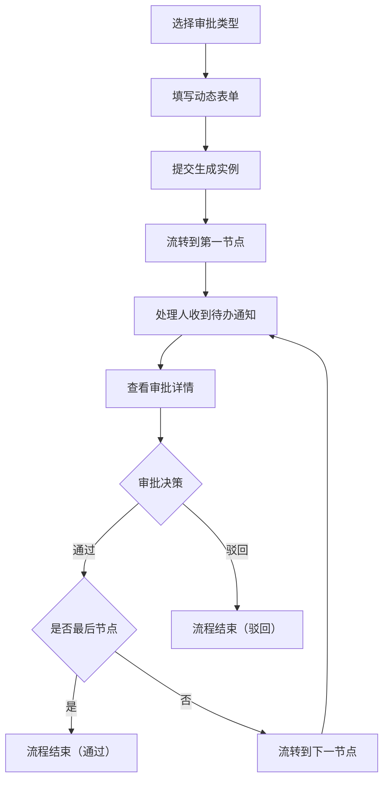

## 1. 产品概述

在线协作流程审批系统，为企业团队提供标准化的请假、报销、出差等审批流程管理。支持流程自由配置、节点自动流转、实时待办通知，提升团队协作效率。

- 解决问题：传统纸质审批流程低效、不透明、难追溯
- 目标用户：中小企业团队、部门管理者、行政人员
- 市场价值：轻量化部署、开箱即用、降低企业流程管理成本

## 2. 核心功能

### 2.1 用户角色

| 角色 | 核心权限 |
|------|----------|
| 普通员工 | 创建审批申请、查看自己的申请记录 |
| 审批人 | 处理待办审批、查看审批详情、通过/驳回申请 |
| 管理员 | 查看所有流程实例、监控审批流转状态 |

### 2.2 功能模块

1. **流程创建页**：选择审批类型、动态表单填写、提交申请
2. **待办列表页**：待办通知角标、待办/已办/我发起的列表切换
3. **审批详情页**：申请信息展示、审批时间线、通过/驳回操作、流转路径图
4. **管理员控制台**：所有流程实例概览、按状态分组卡片、流转可视化

### 2.3 页面详情

| 页面名称 | 模块名称 | 功能描述 |
|-----------|-------------|---------------------|
| 流程创建页 | 类型选择器 | 请假/报销/出差三种类型切换，带图标和描述 |
| 流程创建页 | 动态表单 | 根据类型动态切换字段，带平滑折叠展开动画 |
| 流程创建页 | 提交按钮 | 表单校验后提交，生成审批实例 |
| 待办列表页 | 顶部通知栏 | 铃铛图标、红色角标数字、下拉展示最近5条待办、闪烁圆点动画 |
| 待办列表页 | 列表区域 | 分页展示待办/已办/我发起的审批，支持状态筛选 |
| 审批详情页 | 申请信息区 | 完整展示申请单所有字段信息 |
| 审批详情页 | 审批时间线 | 时间线样式展示历史审批记录，绿/红圆点标识通过/驳回，可展开备注 |
| 审批详情页 | 操作按钮区 | 通过/驳回按钮，点击弹出确认弹窗（缩放淡入动画） |
| 审批详情页 | 流转路径图 | SVG绘制节点和箭头，高亮已流转节点 |
| 管理员控制台 | 左栏列表树 | 按状态（待审批/通过/驳回）分组的流程实例列表 |
| 管理员控制台 | 右栏详情区 | 选中实例的完整流转路径图，支持缩放和平移 |

## 3. 核心流程

用户创建审批申请，选择类型后填写动态表单，提交生成审批实例。系统按预设节点流转，节点处理人收到待办通知，打开详情查看完整信息和历史记录，做出通过或驳回决策，确认后实例移动到下一节点或结束。管理员可全局查看所有实例状态和流转路径。

## 4. 用户界面设计

### 4.1 设计风格

- 主色调：深蓝色 `#1e40af`，辅助色：浅蓝 `#3b82f6`，中性色：灰色系 `#f8fafc` ~ `#334155`
- 按钮风格：圆角 8px，主按钮蓝色填充，次按钮灰色边框
- 字体：系统无衬线字体，标题 18-20px 加粗，正文 14px
- 布局风格：卡片式布局，顶部导航 + 内容区，左右分栏（管理员页）
- 图标风格：线性简洁图标（lucide-react）

### 4.2 页面设计概览

| 页面名称 | 模块名称 | UI元素 |
|-----------|-------------|-------------|
| 流程创建页 | 类型选择器 | 三栏卡片布局，选中态蓝色边框+背景高亮，hover微动效 |
| 流程创建页 | 动态表单 | 字段组折叠展开（max-height + opacity 过渡），输入框圆角聚焦态 |
| 待办列表页 | 通知下拉 | 气泡卡片，列表项hover高亮，闪烁圆点（pulse动画） |
| 审批详情页 | 时间线 | 左侧竖线连接节点，节点圆点带发光效果 |
| 审批详情页 | 确认弹窗 | 背景蒙层淡入 + 内容scale(0.9→1)缩放动画 |
| 管理员控制台 | 状态卡片 | 不同状态不同边框色（黄/绿/红），卡片阴影分层 |

### 4.3 响应式

- Desktop-first 设计，断点 768px（平板）和 480px（手机）
- 管理员左右分栏在平板变为上下布局，手机端隐藏侧栏使用抽屉
- 表单字段在移动端单列排列
- 通知铃铛角标在手机端适配触控区域
