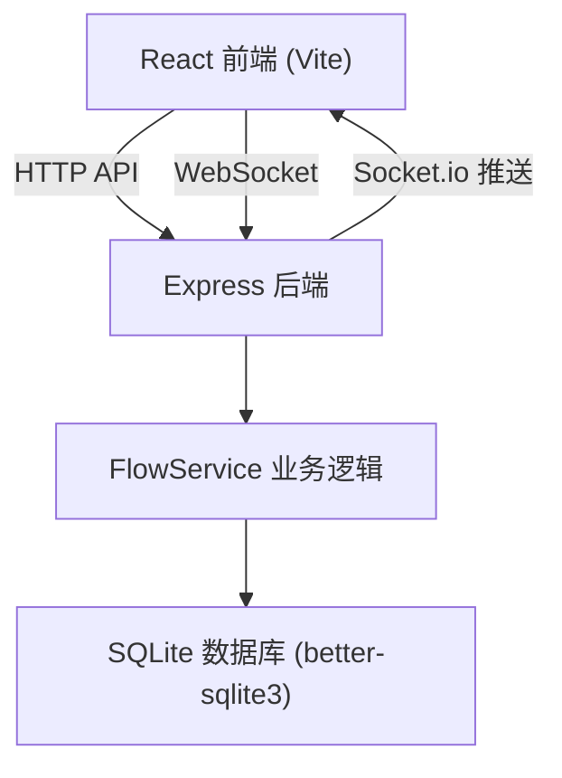
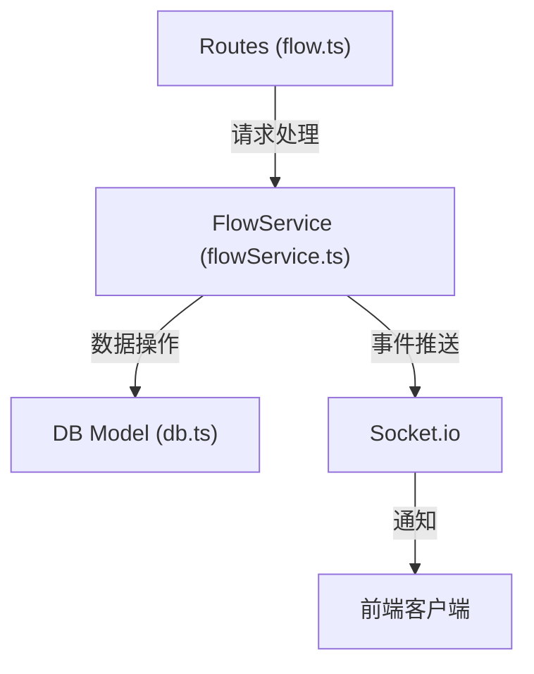
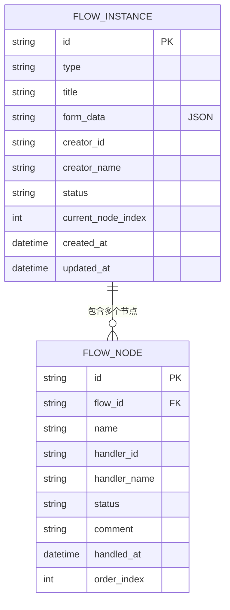

## 1. 架构设计



## 2. 技术说明

- 前端：React 18 + TypeScript + Vite + React Router DOM + Socket.io Client + Axios
- 后端：Express 4 + TypeScript + Socket.io + better-sqlite3 + uuid
- 状态管理：Zustand（前端轻量状态）
- 样式：Tailwind CSS 3
- 实时通信：Socket.io（待办通知实时推送）
- 数据库：SQLite（内嵌式，零配置部署）

## 3. 路由定义

| 前端路由 | 页面组件 | 用途 |
|----------|----------|------|
| `/` | 重定向到 `/flows/create` | 首页入口 |
| `/flows/create` | FlowEditor | 创建审批流程 |
| `/approvals` | ApprovalList | 待办与历史列表 |
| `/approvals/:id` | ApprovalDetail | 审批详情页 |
| `/admin` | AdminDashboard | 管理员控制台 |

| 后端路由 | 方法 | 用途 |
|----------|------|------|
| `/api/flows` | POST | 创建审批实例 |
| `/api/flows` | GET | 获取所有流程实例（管理员） |
| `/api/flows/:id` | GET | 获取单个流程详情 |
| `/api/flows/:id/approve` | POST | 审批通过 |
| `/api/flows/:id/reject` | POST | 审批驳回 |
| `/api/todos/:userId` | GET | 获取用户待办列表 |
| `/api/me/flows` | GET | 获取我发起的流程 |

## 4. API 定义

```typescript
// 审批类型
type FlowType = 'leave' | 'expense' | 'business';

// 审批状态
type FlowStatus = 'pending' | 'approved' | 'rejected';

// 节点状态
type NodeStatus = 'pending' | 'approved' | 'rejected' | 'skipped';

// 申请表单数据
interface LeaveForm {
  startDate: string;
  endDate: string;
  days: number;
  reason: string;
}

interface ExpenseForm {
  amount: number;
  category: string;
  description: string;
}

interface BusinessForm {
  location: string;
  days: number;
  budget: number;
}

type FormData = LeaveForm | ExpenseForm | BusinessForm;

// 审批节点
interface FlowNode {
  id: string;
  name: string;
  handlerId: string;
  handlerName: string;
  status: NodeStatus;
  comment?: string;
  handledAt?: string;
  order: number;
}

// 审批实例
interface FlowInstance {
  id: string;
  type: FlowType;
  title: string;
  formData: FormData;
  creatorId: string;
  creatorName: string;
  status: FlowStatus;
  currentNodeIndex: number;
  nodes: FlowNode[];
  createdAt: string;
  updatedAt: string;
}

// API 响应
interface ApiResponse<T> {
  success: boolean;
  data?: T;
  error?: string;
}
```

## 5. 服务端架构图



## 6. 数据模型

### 6.1 数据模型定义



### 6.2 数据定义语言

```sql
-- 审批实例表
CREATE TABLE IF NOT EXISTS flow_instances (
    id TEXT PRIMARY KEY,
    type TEXT NOT NULL,
    title TEXT NOT NULL,
    form_data TEXT NOT NULL,
    creator_id TEXT NOT NULL,
    creator_name TEXT NOT NULL,
    status TEXT NOT NULL DEFAULT 'pending',
    current_node_index INTEGER NOT NULL DEFAULT 0,
    created_at TEXT NOT NULL,
    updated_at TEXT NOT NULL
);

-- 审批节点表
CREATE TABLE IF NOT EXISTS flow_nodes (
    id TEXT PRIMARY KEY,
    flow_id TEXT NOT NULL,
    name TEXT NOT NULL,
    handler_id TEXT NOT NULL,
    handler_name TEXT NOT NULL,
    status TEXT NOT NULL DEFAULT 'pending',
    comment TEXT,
    handled_at TEXT,
    order_index INTEGER NOT NULL,
    FOREIGN KEY (flow_id) REFERENCES flow_instances(id)
);

-- 索引
CREATE INDEX IF NOT EXISTS idx_flow_nodes_flow_id ON flow_nodes(flow_id);
CREATE INDEX IF NOT EXISTS idx_flow_instances_status ON flow_instances(status);
CREATE INDEX IF NOT EXISTS idx_flow_nodes_handler ON flow_nodes(handler_id, status);
```
