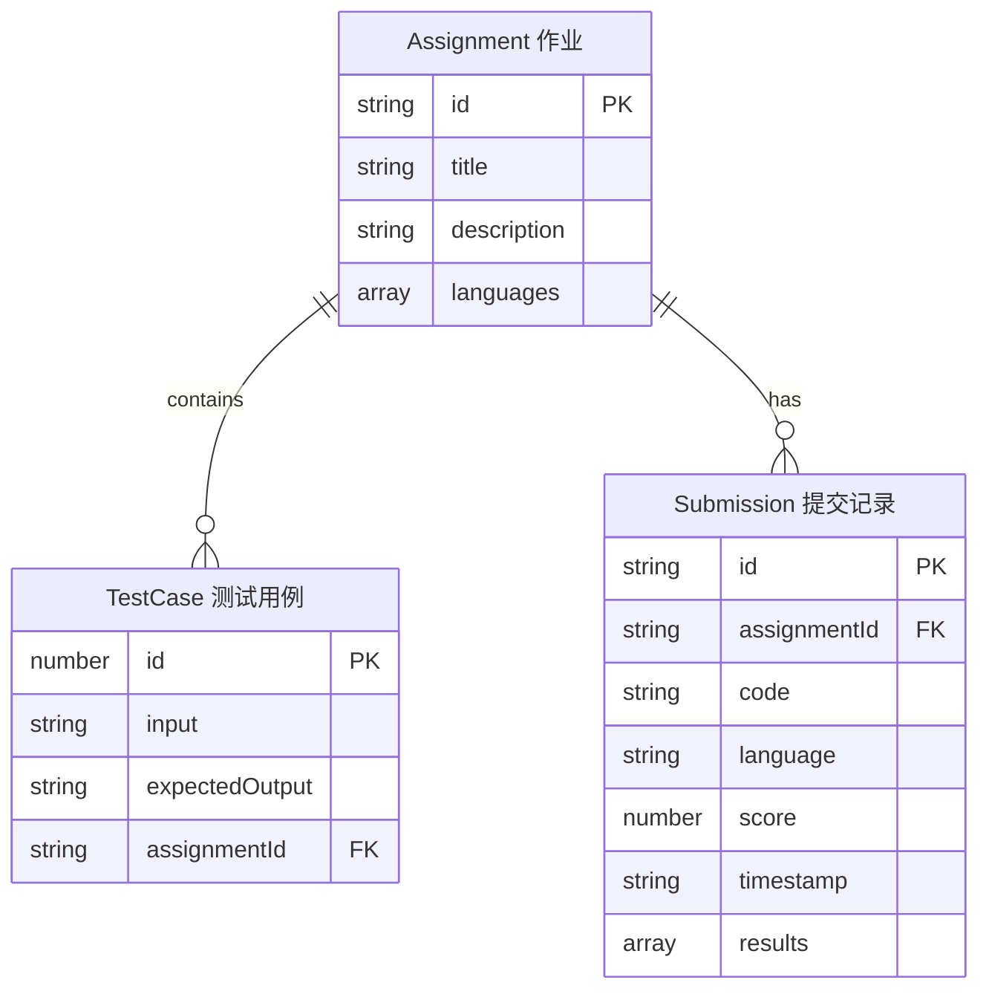

## 1. 架构设计

```mermaid
flowchart TB
    subgraph "前端 (React + Vite)"
        "App.tsx 主组件" --> "CodeEditor.tsx 代码编辑器"
        "App.tsx 主组件" --> "ResultsPanel.tsx 结果面板"
        "App.tsx 主组件" --> "HistorySidebar 历史侧边栏"
        "CodeEditor.tsx" --> "Monaco Editor"
        "App.tsx 主组件" --> "localStorage 持久化"
    end

    subgraph "后端 (Express)"
        "POST /api/submit" --> "代码验证"
        "代码验证" --> "沙箱执行器"
        "沙箱执行器" --> "JavaScript执行"
        "沙箱执行器" --> "Python执行"
        "沙箱执行器" --> "C++编译与执行"
        "JavaScript执行" --> "测试用例运行器"
        "Python执行" --> "测试用例运行器"
        "C++编译与执行" --> "测试用例运行器"
        "测试用例运行器" --> "结果比较器"
        "结果比较器" --> "评测报告"
    end

    "前端 (React + Vite)" -->|"HTTP POST"| "后端 (Express)"
    "后端 (Express)" -->|"JSON 评测报告"| "前端 (React + Vite)"
```

## 2. 技术说明

- 前端：React@18 + TypeScript + Vite + TailwindCSS + Monaco Editor + Zustand
- 初始化工具：vite-init (react-express-ts模板)
- 后端：Express@4 + TypeScript (ESM)
- 数据库：无（使用localStorage存储历史记录，内存中存储作业与测试用例数据）
- 通信：REST API (JSON)

## 3. 路由定义

| 路由 | 用途 |
|------|------|
| / | 编程评测主页面（代码编辑器+结果面板+历史记录） |

## 4. API定义

### POST /api/submit

提交代码进行评测

**请求体：**
```typescript
interface SubmitRequest {
  code: string;
  language: "javascript" | "python" | "cpp";
  assignmentId: string;
}
```

**响应体：**
```typescript
interface SubmitResponse {
  submissionId: string;
  assignmentId: string;
  results: TestCaseResult[];
  totalScore: number;
  maxScore: number;
  timestamp: string;
}

interface TestCaseResult {
  caseId: number;
  status: "passed" | "failed" | "timeout" | "error";
  input: string;
  expectedOutput: string;
  actualOutput: string;
  executionTime: number;
  errorMessage?: string;
}
```

### GET /api/assignments

获取作业列表

**响应体：**
```typescript
interface Assignment {
  id: string;
  title: string;
  description: string;
  language: ("javascript" | "python" | "cpp")[];
  testCases: TestCase[];
}

interface TestCase {
  id: number;
  input: string;
  expectedOutput: string;
}
```

## 5. 服务器架构图

```mermaid
flowchart LR
    "Router 路由层" --> "Controller 控制器"
    "Controller 控制器" --> "SandboxService 沙箱服务"
    "SandboxService 沙箱服务" --> "Executor 执行器"
    "Executor 执行器" --> "child_process"
    "Controller 控制器" --> "Comparator 比较器"
    "Comparator 比较器" --> "ReportGenerator 报告生成器"
```

## 6. 数据模型

### 6.1 数据模型定义



### 6.2 数据定义

前端localStorage存储提交历史（最近20条），后端内存中预置3个示例作业及测试用例数据。

**预置作业数据：**
1. 两数之和（JavaScript/Python/C++，6个测试用例）
2. 回文判断（JavaScript/Python/C++，5个测试用例）
3. 斐波那契数列（JavaScript/Python/C++，7个测试用例）
