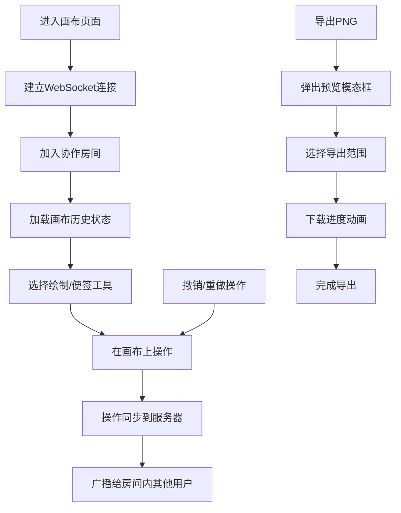

## 1. 产品概述
团队创意画布协作白板应用，解决远程团队在头脑风暴和设计讨论时缺乏轻量级、支持实时绘制和标注的共享画布工具的问题。
- 面向远程协作团队、设计师、产品经理等需要创意头脑风暴的用户群体
- 提供无限画布、多工具绘制、便签协作、实时同步、导出分享等核心能力

## 2. 核心功能

### 2.1 用户角色
| 角色 | 加入方式 | 核心权限 |
|------|----------|----------|
| 协作用户 | 链接加入房间 | 绘制、添加便签、导出、撤销/重做 |

### 2.2 功能模块
1. **主画布页面**：无限画布、工具栏、协作状态显示
2. **绘制工具模块**：铅笔、直线、矩形、圆形四种绘制工具，压力感应效果
3. **便签模块**：文本输入、多色背景、动画效果、边界吸附
4. **实时协作模块**：WebSocket同步、光标显示、绘制预览
5. **导出模块**：PNG导出、模态预览、下载动画
6. **历史模块**：撤销/重做、50步历史记录

### 2.3 页面详情
| 页面名称 | 模块名称 | 功能描述 |
|----------|----------|----------|
| 主画布页面 | 工具栏 | 工具选择（铅笔、直线、矩形、圆形、便签、选择）、撤销/重做、导出 |
| 主画布页面 | 无限画布 | 缩放平移、图元渲染、选择交互、控制点缩放旋转 |
| 主画布页面 | 便签管理 | 添加便签、文本编辑、拖动吸附、删除 |
| 主画布页面 | 协作状态 | 用户列表、连接状态、光标显示 |
| 导出模态框 | 导出功能 | 预览图、导出范围选择、下载进度动画 |

## 3. 核心流程
用户进入画布后，选择绘制工具或便签工具进行创作，所有操作通过WebSocket实时同步给其他协作者。可随时撤销/重做操作，也可导出画布为PNG图片。

## 4. 用户界面设计
### 4.1 设计风格
- 主色：主题蓝色 #4A90D9
- 背景：浅灰 #F5F5F5，极简白色画布
- 便签色：明黄 #FFE066、薄荷绿 #7BE495、淡蓝 #74C0FC、浅粉 #FAA2C1、柔白 #FFFFFF、橙黄 #FFA94D
- 按钮样式：圆角32x32图标按钮，选中时蓝色高亮背景
- 字体：使用精美衬线+无衬线字体组合
- 交互效果：按钮按压缩放至0.95，工具切换平滑滑动指示，微动画反馈

### 4.2 页面设计概述
| 页面名称 | 模块名称 | UI元素 |
|----------|----------|----------|
| 主画布页面 | 左侧工具栏 | 半透明磨砂玻璃效果，悬停变实心，圆角图标按钮，选中蓝色高亮 |
| 主画布页面 | 中央画布 | 浅灰背景，无限画布网格，图元选中时8个控制点 |
| 主画布页面 | 便签卡片 | 弹性缩放入场动画，拖动边界吸附，释放弹动效果 |
| 主画布页面 | 协作光标 | 彩色圆点+名字标签，不同用户不同颜色 |
| 导出模态框 | 预览区域 | 画布预览图、导出范围选项、进度条动画 |

### 4.3 响应式
- 桌面端：工具栏固定左侧，画布自适应
- 移动端（<768px）：工具栏折叠为底部浮动栏，画布自动适配剩余区域高度
- 触摸优化：支持触摸绘制、双指缩放

## 5. 非功能性需求
- 性能：画布渲染帧率稳定30fps以上，WebSocket同步延迟<200ms，支持10人同时编辑不卡顿
- 历史记录：最多保留50步撤销/重做历史
- 便签字数限制：最多200字
- 吸附范围：15px边界吸附
