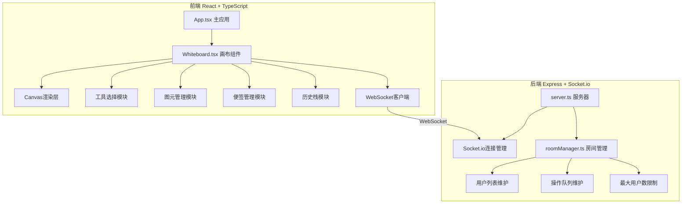
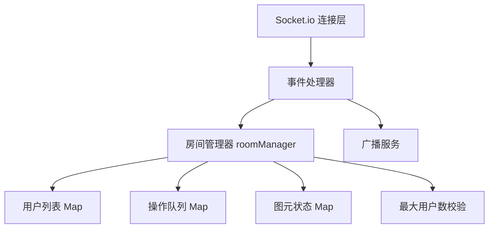

## 1. 架构设计



## 2. 技术描述
- 前端：React@18 + TypeScript + Vite + socket.io-client + react-router-dom
- 后端：Express@4 + Socket.io + uuid + cors + body-parser
- 构建工具：Vite（@vitejs/plugin-react）
- 状态管理：React useState/useReducer 本地状态管理
- 画布渲染：HTML5 Canvas 2D API

## 3. 目录结构
```
.
├── package.json
├── vite.config.js
├── tsconfig.json
├── index.html
├── src/
│   ├── client/
│   │   ├── App.tsx
│   │   ├── Whiteboard.tsx
│   │   ├── types.ts
│   │   └── utils/
│   │       ├── canvasUtils.ts
│   │       ├── geometry.ts
│   │       └── history.ts
│   └── server/
│       ├── server.ts
│       └── roomManager.ts
```

## 4. 路由定义
| 路由 | 用途 |
|------|------|
| / | 主画布页面（房间参数可选） |
| /room/:roomId | 指定房间的画布页面 |

## 5. WebSocket事件定义

### 客户端发送事件
| 事件名 | 数据结构 | 描述 |
|--------|----------|------|
| join-room | { roomId, userName } | 加入房间 |
| draw-action | { action, elementId, userId } | 绘制操作 |
| cursor-move | { x, y, userId, userName } | 光标移动 |
| preview-draw | { element, userId } | 绘制中预览 |
| undo | { userId } | 撤销操作 |
| redo | { userId } | 重做操作 |

### 服务端发送事件
| 事件名 | 数据结构 | 描述 |
|--------|----------|------|
| room-state | { users, elements, history } | 房间初始状态 |
| user-joined | { user } | 用户加入通知 |
| user-left | { userId } | 用户离开通知 |
| action-broadcast | { action, userId } | 操作广播 |
| cursor-update | { x, y, userId, userName, color } | 光标位置更新 |
| preview-broadcast | { element, userId } | 绘制预览广播 |
| connection-status | { connected, latency } | 连接状态 |

## 6. 数据模型

### 图元类型定义
```typescript
interface BaseElement {
  id: string;
  type: 'pencil' | 'line' | 'rectangle' | 'circle' | 'sticky';
  x: number;
  y: number;
  rotation: number;
  scaleX: number;
  scaleY: number;
  userId: string;
  color: string;
  opacity: number;
  createdAt: number;
  updatedAt: number;
}

interface PencilElement extends BaseElement {
  type: 'pencil';
  points: { x: number; y: number; pressure: number }[];
  strokeWidth: number;
}

interface LineElement extends BaseElement {
  type: 'line';
  x2: number;
  y2: number;
  strokeWidth: number;
}

interface RectangleElement extends BaseElement {
  type: 'rectangle';
  width: number;
  height: number;
  strokeWidth: number;
  fill?: string;
}

interface CircleElement extends BaseElement {
  type: 'circle';
  radiusX: number;
  radiusY: number;
  strokeWidth: number;
  fill?: string;
}

interface StickyElement extends BaseElement {
  type: 'sticky';
  text: string;
  backgroundColor: string;
  width: number;
  height: number;
}

interface User {
  id: string;
  name: string;
  color: string;
  cursor?: { x: number; y: number };
  isDrawing?: boolean;
}

interface HistoryAction {
  type: 'add' | 'update' | 'delete';
  elementId: string;
  before?: any;
  after?: any;
  timestamp: number;
}
```

### 7. 服务端架构



### 8. 核心技术要点
1. **Canvas渲染优化**：使用分层渲染、脏矩形区域重绘、requestAnimationFrame调度
2. **压力感应算法**：根据同一位置绘制次数叠加颜色透明度模拟压力效果
3. **矩阵变换**：支持图元缩放旋转的仿射变换计算
4. **边界吸附算法**：计算便签与周边图元边界距离，15px范围内自动吸附
5. **历史栈管理**：双向链表实现50步撤销/重做，支持批量操作合并
6. **WebSocket优化**：操作节流、增量同步、房间隔离
