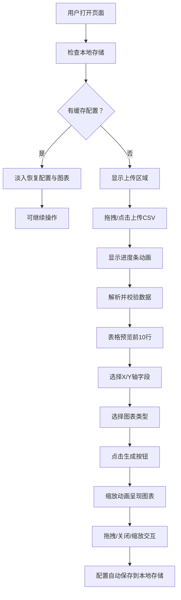

## 1. 产品概述
在线数据分析看板应用，允许用户上传CSV数据文件并通过可视化图表进行数据探索与分析。
- 主要解决非技术用户快速将结构化数据转换为可交互可视化图表的需求，降低数据分析门槛。
- 目标用户为数据分析师、业务人员、学生等需要快速探索数据的人群。

## 2. 核心特性

### 2.1 用户角色
无需注册登录，所有功能面向所有访问用户开放。

### 2.2 功能模块
1. **文件上传模块**：拖拽/点击上传CSV、进度动画、数据校验
2. **数据预览模块**：表格预览、排序、分页浏览
3. **图表配置模块**：字段选择、图表类型选择
4. **图表展示模块**：多图表网格、拖拽调整、缩放交互
5. **状态持久化模块**：本地存储配置、恢复动画

### 2.3 页面详情
| 页面名称 | 模块名称 | 功能描述 |
|-----------|-------------|---------------------|
| 主页面 | 文件上传区 | 支持拖拽/点击上传CSV，显示进度条，最大20MB，校验格式 |
| 主页面 | 数据预览表 | 显示前10行，列头点击排序，分页滑动过渡，斑马纹，固定表头 |
| 主页面 | 图表配置区 | 选择X/Y轴字段，选择图表类型（折线/柱状/散点），生成按钮 |
| 主页面 | 图表网格区 | 最多4个图表2x2网格，拖拽排序，关闭动画，缩放交互，hover tooltip |

## 3. 核心流程
用户打开页面 → 上传CSV文件 → 查看数据预览 → 选择字段和图表类型 → 生成图表 → 拖拽调整 → 刷新页面自动恢复配置

## 4. 用户界面设计

### 4.1 设计风格
- 暗色主题
  - 背景色：深灰 `#1a1a2e`
  - 主色调：藏蓝 `#16213e`
  - 强调色：金色 `#e94560`
- 卡片圆角：12px
- 阴影：`box-shadow: 0 4px 15px rgba(0,0,0,0.3)`
- 字体：现代无衬线字体，标题粗体，正文常规
- 动效：图表缩放0.5s过渡，弹性动画，淡入效果

### 4.2 页面设计概述
| 页面名称 | 模块名称 | UI元素 |
|-----------|-------------|-------------|
| 主页面 | 文件上传区 | 虚线边框、拖拽高亮、进度条、圆角卡片 |
| 主页面 | 数据预览表 | 斑马纹、固定表头、排序箭头、分页滑动 |
| 主页面 | 图表配置区 | 下拉选择器、强调色按钮 |
| 主页面 | 图表网格区 | 2x2网格、拖拽手柄、关闭按钮、tooltip |

### 4.3 响应式设计
桌面端2x2网格布局，移动端（<768px）单列堆叠布局，touch优化。
