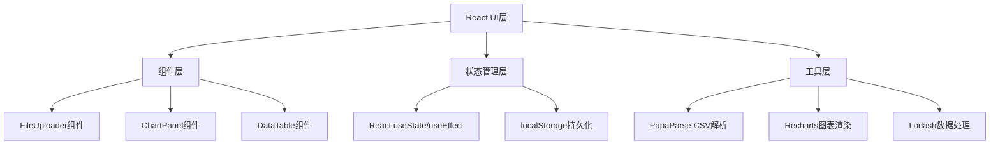

## 1. 架构设计


## 2. 技术栈说明
- 前端框架：React@18 + TypeScript
- 构建工具：Vite@5
- 状态管理：React Hooks (useState, useEffect, useCallback, useMemo)
- CSV解析：papaparse@5
- 图表库：recharts@2
- 工具库：lodash@4
- Vite插件：@vitejs/plugin-react

## 3. 文件结构
```
auto27/
├── package.json          # 依赖与脚本配置
├── vite.config.js      # Vite构建配置
├── tsconfig.json       # TypeScript配置
├── index.html          # HTML入口
└── src/
    ├── main.tsx       # React入口
    ├── App.tsx         # 主组件，全局状态管理
    ├── types.ts        # TypeScript类型定义
    ├── components/
    │   ├── FileUploader.tsx  # CSV上传组件
    │   └── ChartPanel.tsx    # 图表展示组件
    └── styles/
        └── index.css   # 全局样式
```

## 4. 路由定义
| Route | Purpose |
|-------|---------|
| / | 主应用页面，包含所有功能模块 |

## 5. 类型定义
```typescript
interface DataRow {
  [key: string]: string | number;
}

interface ChartConfig {
  id: string;
  xField: string;
  yField: string;
  chartType: 'line' | 'bar' | 'scatter';
}

interface AppState {
  data: DataRow[];
  columns: string[];
  charts: ChartConfig[];
}
```

## 6. 性能优化策略
- CSV解析：使用PapaParse流式解析，避免大文件阻塞主线程
- 图表渲染：Recharts内部优化，requestAnimationFrame
- 状态更新：使用useMemo缓存计算结果
- 动画：CSS transform/opacity动画，保证60fps
- 文件限制：20MB上限，3秒超时检测
