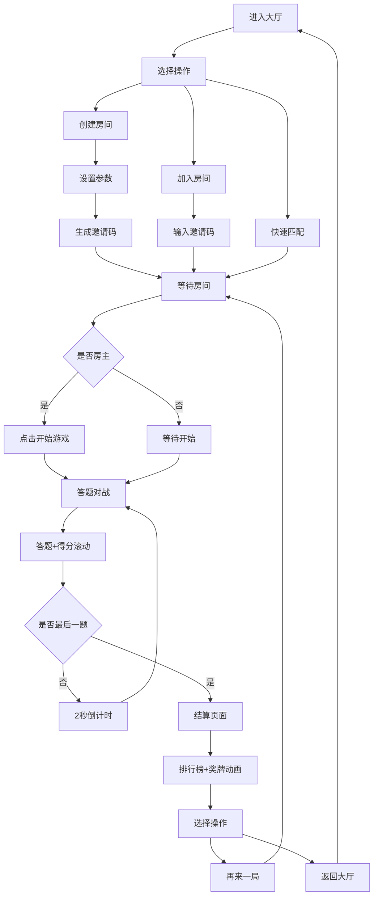

## 1. 产品概述

在线竞赛答题对战平台是一款实时多人知识竞技产品，用户可以创建或加入答题房间，与其他玩家实时比拼知识储备，并直观看到排名动态变化。通过Socket.io实现毫秒级实时通信，结合精美的动画效果和流畅的界面切换，为用户带来沉浸式竞技体验。

- 核心价值：让知识竞技变得有趣、社交化、实时可见
- 目标用户：喜欢知识问答、休闲竞技的年轻用户群体

## 2. 核心功能

### 2.1 用户角色

| 角色 | 注册方式 | 核心权限 |
|------|----------|----------|
| 普通用户 | 昵称自动生成登录 | 创建房间、加入房间、参与答题、查看排行榜 |
| 房主 | 创建房间自动成为 | 开始游戏、管理房间设置 |

### 2.2 功能模块

1. **大厅页面**：创建房间表单、快速匹配、房间列表
2. **等待房间页面**：玩家头像列表、房间信息展示、开始游戏按钮
3. **答题对战页面**：题目展示、选项选择、实时得分、倒计时
4. **结算页面**：排行榜展示、奖牌动画、进度条、再来一局

### 2.3 页面详情

| 页面名称 | 模块名称 | 功能描述 |
|-----------|-------------|---------------------|
| 大厅页面 | 创建房间表单 | 设置房间名称、题目类型、每轮题目数、答题时间 |
| 大厅页面 | 快速匹配 | 随机加入一个已有房间 |
| 大厅页面 | 加入房间 | 输入邀请码加入指定房间 |
| 等待房间 | 玩家头像列表 | 显示已加入玩家头像和昵称，浮动入场动画 |
| 等待房间 | 开始游戏按钮 | 脉冲呼吸动画，房主可点击 |
| 等待房间 | 邀请码展示 | 6位邀请码，便于分享 |
| 答题对战 | 题目展示区 | 中央显示当前题目和题号 |
| 答题对战 | 选项按钮 | 4个选项，点击后绿/红反馈 |
| 答题对战 | 玩家得分条 | 顶部实时显示每人得分，数字滚动动画 |
| 答题对战 | 倒计时 | 显示答题剩余时间，题间2秒倒计时放大淡出 |
| 结算页面 | 排行榜 | 按得分从高到低展示，前三名奖牌卡片翻转动画 |
| 结算页面 | 得分进度条 | 从左到右增长动画，持续1.5秒 |
| 结算页面 | 操作按钮 | 再来一局、返回大厅 |

## 3. 核心流程

用户进入大厅后，可选择创建房间或加入房间。创建房间时填写参数，系统生成6位邀请码后跳转等待页；加入房间通过邀请码进入。等待期间所有玩家头像浮动入场，房主点击脉冲呼吸的开始按钮后进入答题。每道题有时间限制，玩家选择后获得即时反馈，顶部得分实时滚动更新，每题间隔2秒倒计时放大淡出。全部题目结束后进入结算页，前三名奖牌卡片翻转展示，所有玩家得分进度条动画增长，用户可选择再来一局或返回大厅。

## 4. 用户界面设计

### 4.1 设计风格

- **主色调**：深蓝色 (#0a1628)、紫罗兰 (#7c3aed)
- **辅助色**：亮绿 (#22c55e) 用于正确反馈，红色 (#ef4444) 用于错误反馈
- **卡片效果**：毛玻璃效果 (backdrop-filter: blur(12px))，半透明背景
- **按钮样式**：圆角8px，悬停时边框发光 (box-shadow glow)，过渡动画150ms
- **字体**：主标题使用Orbitron增强科技感，正文使用Inter确保可读性
- **布局风格**：卡片式布局，居中对称，大量留白

### 4.2 页面设计概述

| 页面名称 | 模块名称 | UI元素 |
|-----------|-------------|-------------|
| 大厅页面 | 创建房间表单 | 玻璃拟态卡片、渐变输入框、发光下拉选择器、悬停发光按钮 |
| 大厅页面 | 快速匹配/加入 | 左右分栏布局、输入框聚焦发光效果、渐变分隔线 |
| 等待房间 | 玩家头像区 | 圆形头像+浮动动画 (float 3s ease-in-out)、昵称卡片、房主皇冠标识 |
| 等待房间 | 开始按钮 | 脉冲呼吸动画 (pulse-green 2s infinite)、从#16a34a到#4ade80循环过渡 |
| 答题对战 | 题目区 | 大号字体居中、题号进度条、渐变背景光晕 |
| 答题对战 | 选项按钮 | 2x2网格、玻璃卡片、正确绿色脉冲/错误红色震动反馈 |
| 答题对战 | 得分条 | 横向排列玩家卡片、数字滚动动画 (number-roll)、排序平滑过渡 |
| 答题对战 | 倒计时 | 圆形进度环、题间放大淡出动画 (countdown-fadeout) |
| 结算页面 | 排行榜 | 金银铜渐变奖牌、3D卡片翻转入场 (flip-in)、延迟错峰触发 |
| 结算页面 | 得分进度条 | 背景轨道+渐变填充、width从0到实际值1.5秒过渡 |
| 结算页面 | 操作按钮 | 主按钮渐变填充、次按钮玻璃边框、发光悬停效果 |

### 4.3 响应式设计

采用桌面优先设计，同时适配移动端：
- 桌面端：选项按钮2x2网格，玩家得分条横向排列
- 平板端：保持2x2网格，玩家得分条可滚动
- 移动端：选项按钮改为垂直排列，玩家得分条紧凑显示
- 触摸优化：按钮最小点击区域44px，增加触摸反馈

### 4.4 动画性能要求

- 页面切换延迟：< 100ms（使用CSS transition而非JS动画）
- 动画帧率：≥ 60fps（优先使用transform和opacity属性）
- 实时通信延迟：Socket.io事件广播 < 50ms
