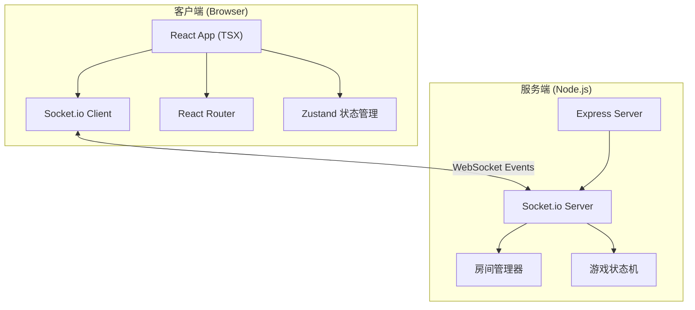
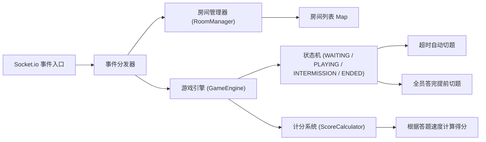
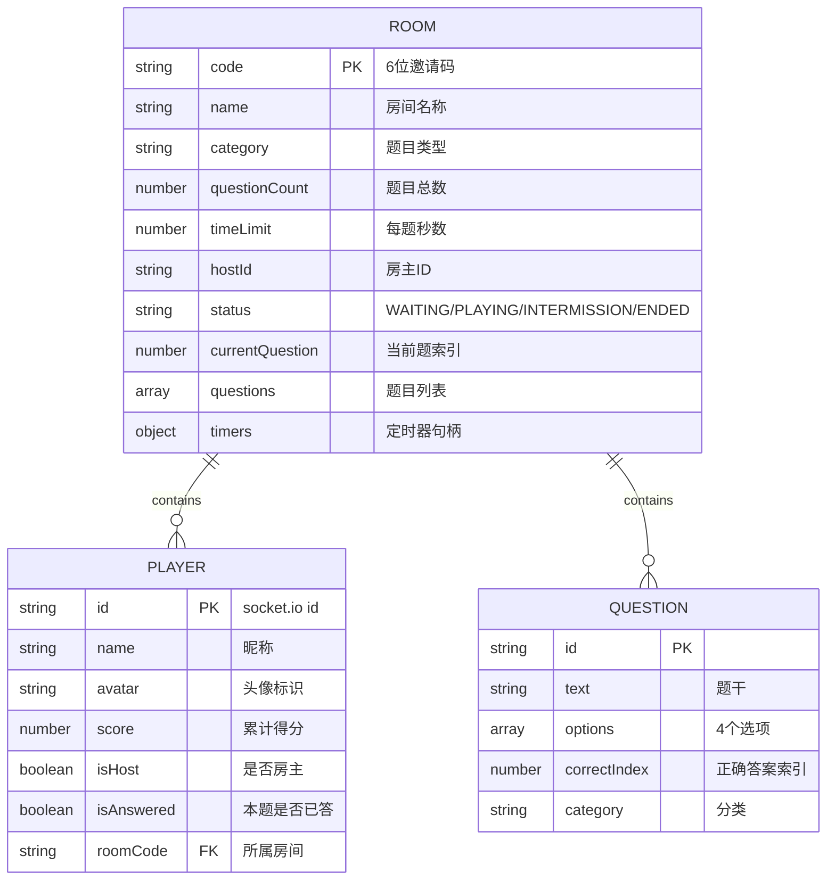

## 1. 架构设计



## 2. 技术说明

- **前端框架**：React 18 + TypeScript
- **构建工具**：Vite 5 + @vitejs/plugin-react
- **状态管理**：Zustand (轻量全局状态) + React Hooks (组件级状态)
- **实时通信**：Socket.io Client
- **HTTP请求**：Axios
- **路由管理**：React Router DOM v6
- **样式方案**：纯CSS + CSS Variables + CSS Modules (内联styled component模式)
- **后端框架**：Express 4 + TypeScript
- **实时服务**：Socket.io Server
- **唯一ID**：uuid v4
- **跨域处理**：cors

## 3. 路由定义

| 路由路径 | 页面组件 | 用途 |
|----------|----------|------|
| `/` | `Lobby` | 大厅页面，创建/加入/快速匹配房间 |
| `/room/:code` | `GameRoom` | 答题房间页面，包含等待/答题/结算三个阶段 |

## 4. API / Socket 事件定义

### 4.1 客户端 → 服务端 事件

```typescript
// 创建房间
interface CreateRoomPayload {
  roomName: string;
  category: 'tech' | 'history' | 'entertainment';
  questionCount: 5 | 10 | 15;
  timeLimit: 10 | 15 | 20;
  playerName: string;
  avatar: string;
}
socket.emit('create-room', payload, (response: { code: string }) => void);

// 加入房间
interface JoinRoomPayload {
  code: string;
  playerName: string;
  avatar: string;
}
socket.emit('join-room', payload, (response: { success: boolean; message?: string }) => void);

// 快速匹配
interface QuickMatchPayload {
  playerName: string;
  avatar: string;
}
socket.emit('quick-match', payload, (response: { code: string }) => void);

// 开始游戏
socket.emit('start-game', { code: string });

// 提交答案
interface SubmitAnswerPayload {
  code: string;
  questionIndex: number;
  answer: number;
  timeSpent: number;
}
socket.emit('submit-answer', payload);

// 再来一局
socket.emit('play-again', { code: string });

// 离开房间
socket.emit('leave-room', { code: string });
```

### 4.2 服务端 → 客户端 事件

```typescript
// 玩家加入房间
interface PlayerJoinedPayload {
  players: Player[];
}
socket.on('player-joined', payload);

// 玩家离开房间
interface PlayerLeftPayload {
  players: Player[];
}
socket.on('player-left', payload);

// 游戏开始
interface GameStartedPayload {
  questions: Question[];
}
socket.on('game-started', payload);

// 收到下一题
interface NextQuestionPayload {
  questionIndex: number;
  question: Question;
}
socket.on('next-question', payload);

// 玩家得分更新
interface ScoreUpdatePayload {
  scores: { [playerId: string]: number };
  ranking: RankingEntry[];
}
socket.on('score-update', payload);

// 题目答案揭晓
interface AnswerRevealedPayload {
  correctAnswer: number;
  questionIndex: number;
}
socket.on('answer-revealed', payload);

// 进入题间倒计时
interface IntermissionPayload {
  nextIndex: number;
}
socket.on('intermission', payload);

// 游戏结束
interface GameEndedPayload {
  finalRanking: RankingEntry[];
}
socket.on('game-ended', payload);

// 错误提示
interface ErrorPayload {
  message: string;
}
socket.on('error-message', payload);
```

### 4.3 类型定义

```typescript
interface Player {
  id: string;
  name: string;
  avatar: string;
  score: number;
  isHost: boolean;
  isAnswered: boolean;
  lastAnswerCorrect: boolean | null;
}

interface Question {
  id: string;
  text: string;
  options: string[];
  correctIndex: number;
  category: string;
}

interface RankingEntry {
  playerId: string;
  playerName: string;
  avatar: string;
  score: number;
  rank: number;
}
```

## 5. 服务端架构图



### 核心服务端类

**RoomManager**：
- `createRoom(config): Room` - 创建房间并生成6位邀请码
- `joinRoom(code, player): Room | null` - 玩家加入房间
- `leaveRoom(code, playerId): void` - 玩家离开房间
- `getRoom(code): Room | undefined` - 获取房间
- `getAvailableRooms(): Room[]` - 获取可快速匹配的房间

**GameEngine**：
- `startGame(roomCode): void` - 初始化题目，进入第一题
- `submitAnswer(roomCode, playerId, answer, timeSpent): void` - 记录答案、计算得分、广播更新
- `checkAllAnswered(roomCode): boolean` - 检查是否全员答完
- `nextQuestion(roomCode): void` - 进入下一题或结算
- `endGame(roomCode): void` - 结算并广播最终排名
- `startIntermission(roomCode, nextIndex): void` - 2秒题间倒计时

**ScoreCalculator**：
- 基础分100分，答对得基础分
- 速度加成：剩余时间比例 × 50分
- 最高得分：150分/题
- 答错得0分

## 6. 数据模型

### 6.1 数据模型定义 (内存)



### 6.2 题库种子数据

服务端内置题库，按分类组织，每类至少30题，确保重复率低：

- **科技类**：编程、互联网、硬件、科学常识
- **历史类**：中国历史、世界历史、重大事件
- **娱乐类**：影视、音乐、游戏、综艺

题目示例采用硬编码方式存储在 `src/server/questions.ts` 文件中，服务启动时加载，房间创建时按类别随机抽取指定数量。

## 7. 性能优化策略

1. **动画性能**：所有动画使用CSS transform和opacity属性，避免触发layout
2. **Socket事件节流**：得分更新批量广播，非每条都发
3. **题目预加载**：游戏开始时一次性发送所有题目，避免每题请求
4. **React优化**：使用memo包裹子组件，避免不必要重渲染
5. **状态最小化**：Zustand只存全局共享状态，组件级状态用useState
6. **定时器管理**：服务端统一管理所有房间定时器，断开时清理
