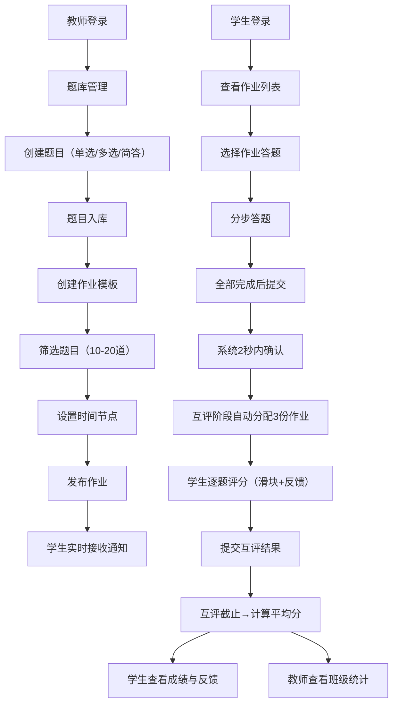

## 1. 产品概述

在线作业分配与评阅系统，为师生提供高效的题库管理、作业自动生成、在线答题、同伴互评及成绩统计功能，解决教师手动出题、批改、统计成绩耗时的问题。

- 目标用户：教师与学生
- 核心价值：自动化作业流程，降低教师工作量，通过同伴互评培养学生批判性思维

## 2. 核心功能

### 2.1 用户角色

| 角色 | 注册方式 | 核心权限 |
|------|----------|----------|
| 教师 | 系统创建 | 题库管理、作业创建与发布、查看成绩统计、导出CSV |
| 学生 | 系统创建 | 查看作业、在线答题、参与同伴互评、查看成绩与反馈 |

### 2.2 功能模块

1. **登录页**：角色选择、身份认证、登录状态保持
2. **教师后台**：题库管理、作业列表、成绩统计
3. **学生端**：作业列表、答题页面、互评页面、成绩查看

### 2.3 页面详情

| 页面名称 | 模块名称 | 功能描述 |
|----------|----------|----------|
| 登录页 | 登录表单 | 用户名密码登录、角色选择（教师/学生） |
| 教师后台-题库 | 题目列表 | 分页展示（每页20条）、按难度/知识点筛选、卡片折叠展开、编辑高亮过渡 |
| 教师后台-题库 | 题目创建/编辑 | 支持单选（4选项）、多选（≥2正确选项）、简答题；设置难度标签、知识点分类 |
| 教师后台-作业 | 作业列表 | 展示已发布作业、状态、截止时间 |
| 教师后台-作业 | 作业创建 | 从题库按标签筛选组合题目（10-20道）、设置截止时间、互评开始/截止时间 |
| 教师后台-统计 | 成绩统计 | 班级平均分、分数分布柱状图、每题正确率、CSV导出 |
| 学生端-作业列表 | 作业列表 | 展示可用作业、提交状态、截止时间 |
| 学生端-答题 | 分步答题 | 中央大卡片展示单题、右侧进度条、提交按钮脉动动画 |
| 学生端-互评 | 互评评分 | 每题独立卡片、1-5分评分滑块、简答题文本反馈、提交时卡片逐个淡出 |
| 学生端-成绩 | 成绩查看 | 最终平均分、每位评阅人详细反馈 |

## 3. 核心流程

### 主要用户流程

1. **教师出题流程**：登录 → 进入题库管理 → 创建题目（单选/多选/简答） → 保存到题库
2. **教师布置作业流程**：登录 → 进入作业管理 → 从题库筛选题目 → 设置时间节点 → 发布作业 → 学生端实时接收通知
3. **学生答题流程**：登录 → 查看作业列表 → 选择作业 → 分步答题 → 全部完成后提交 → 系统确认
4. **同伴互评流程**：互评开始 → 系统自动分配3份同学作业 → 逐题评分（滑块+文本） → 提交互评
5. **成绩查看流程**：互评截止 → 系统计算平均分 → 学生查看成绩与详细反馈 → 教师查看班级统计

## 4. 用户界面设计

### 4.1 设计风格

- **主色**：#4A90D9（蓝色，信任与专业）
- **强调色**：#F5A623（橙色，活力与提醒）
- **背景色**：#FAFBFC（浅色主题）
- **按钮风格**：圆角8px，主色填充，悬停轻微加深，点击有按压反馈
- **字体**：标题使用系统加粗字体，正文使用系统默认字体，行高1.5
- **布局风格**：教师端左侧导航栏+右侧内容区；学生端中央卡片式布局
- **图标风格**：使用 lucide-react 线性图标

### 4.2 页面设计概览

| 页面名称 | 模块名称 | UI元素 |
|----------|----------|--------|
| 登录页 | 登录表单 | 居中卡片、角色切换Tabs、输入框聚焦动效、登录按钮渐变色 |
| 教师后台-题库 | 题目列表 | 左侧筛选面板、右侧题目卡片网格、卡片悬停上浮阴影、折叠展开平滑过渡(0.3s ease)、编辑高亮边框 |
| 教师后台-统计 | 成绩统计 | Recharts柱状图展示分数分布、统计数据卡片网格、CSV导出按钮 |
| 学生端-答题 | 答题卡片 | 中央大卡片、题目序号、选项单选/多选框、简答题文本域、右侧垂直进度条 |
| 学生端-互评 | 评分卡片 | 每题独立卡片、1-5分滑块带刻度、简答题评论文本框、提交时卡片淡出动画 |
| 学生端-成绩 | 成绩展示 | 大字号平均分展示、评阅人反馈卡片列表、逐项评分明细 |

### 4.3 响应式设计

- 采用桌面优先设计，移动端自适应
- 教师后台在移动端：侧边栏自动收起为汉堡菜单，点击滑出
- 学生答题页在移动端：进度条移至顶部水平展示，卡片宽度100%
- 所有列表支持骨架屏加载状态
- 列表项悬停有轻微上浮阴影（translateY(-2px) + box-shadow增强）

### 4.4 动效细节

- 题目卡片折叠/展开：max-height + opacity 过渡 0.3s ease
- 编辑模式高亮：边框颜色过渡 0.3s ease，背景色轻微变化
- 提交按钮脉动动画：全部答完后按钮启用，scale 1→1.05→1 循环动画
- 互评卡片淡出：逐个延迟淡出，opacity 1→0，transform translateY(-10px)
- 页面加载：骨架屏 pulse 动画
- 列表项悬停：box-shadow 过渡 0.2s ease，translateY(-2px)
