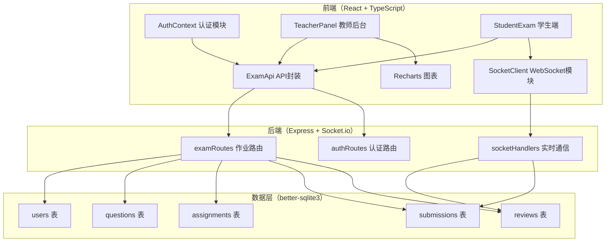
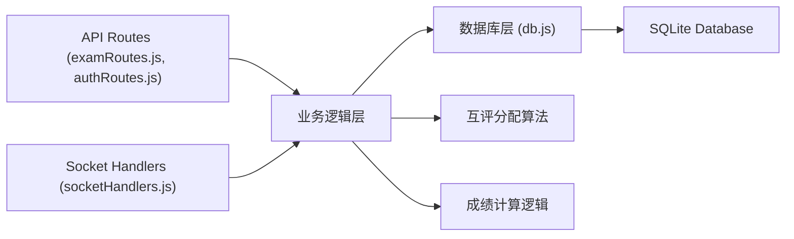
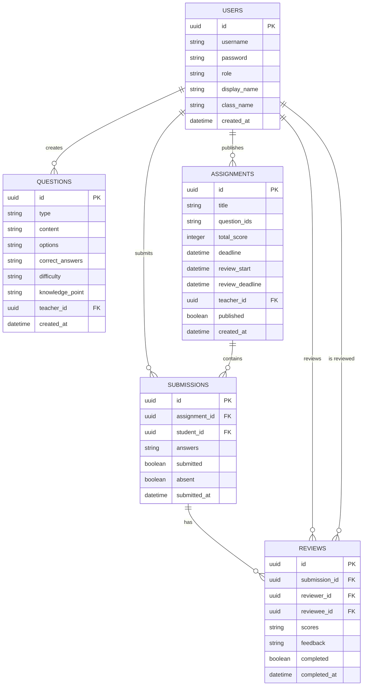

## 1. 架构设计



## 2. 技术说明

- **前端**：React@18 + TypeScript + Vite + React Router DOM
- **UI 框架**：Tailwind CSS 3
- **状态管理**：React Context（认证）+ Zustand（可选）
- **HTTP 客户端**：axios
- **实时通信**：socket.io-client
- **图表库**：recharts
- **图标库**：lucide-react
- **后端**：Express@4 + TypeScript
- **WebSocket**：socket.io
- **数据库**：better-sqlite3（本地SQLite）
- **唯一ID**：uuid

## 3. 路由定义

### 前端路由

| 路由 | 用途 |
|------|------|
| /login | 登录页面 |
| /teacher/dashboard | 教师后台首页（重定向到题库） |
| /teacher/questions | 题库管理 |
| /teacher/assignments | 作业列表 |
| /teacher/assignments/create | 创建作业 |
| /teacher/statistics | 成绩统计 |
| /student/dashboard | 学生作业列表 |
| /student/exam/:assignmentId | 学生答题页 |
| /student/review/:reviewId | 学生互评页 |
| /student/result/:assignmentId | 学生成绩查看页 |

### 后端 API 路由

| 方法 | 路由 | 用途 |
|------|------|------|
| POST | /api/auth/login | 用户登录 |
| GET | /api/auth/me | 获取当前用户信息 |
| GET | /api/questions | 获取题目列表（分页、筛选） |
| POST | /api/questions | 创建题目 |
| PUT | /api/questions/:id | 更新题目 |
| DELETE | /api/questions/:id | 删除题目 |
| GET | /api/assignments | 获取作业列表 |
| POST | /api/assignments | 创建作业 |
| GET | /api/assignments/:id | 获取作业详情 |
| POST | /api/assignments/:id/submit | 学生提交作业 |
| GET | /api/assignments/:id/submissions | 获取作业提交列表 |
| GET | /api/assignments/:id/statistics | 获取作业统计数据 |
| GET | /api/reviews/pending | 获取待互评列表 |
| POST | /api/reviews/:id/submit | 提交互评结果 |
| PUT | /api/reviews/:id | 修改互评结果 |
| GET | /api/results/:assignmentId | 获取学生成绩详情 |

## 4. WebSocket 事件定义

| 事件名 | 方向 | 用途 |
|--------|------|------|
| connection | 客户端→服务端 | 建立连接，携带用户ID |
| assignment:published | 服务端→客户端（学生） | 作业发布通知 |
| submission:confirmed | 服务端→客户端（学生） | 作业提交确认（2秒内） |
| review:assigned | 服务端→客户端（学生） | 互评分配通知（30秒内） |
| review:completed | 服务端→客户端（教师） | 互评完成进度通知 |

## 5. 服务端架构图



## 6. 数据模型

### 6.1 ER 图



### 6.2 DDL 语句

```sql
CREATE TABLE IF NOT EXISTS users (
    id TEXT PRIMARY KEY,
    username TEXT UNIQUE NOT NULL,
    password TEXT NOT NULL,
    role TEXT NOT NULL CHECK (role IN ('teacher', 'student')),
    display_name TEXT NOT NULL,
    class_name TEXT,
    created_at DATETIME DEFAULT CURRENT_TIMESTAMP
);

CREATE TABLE IF NOT EXISTS questions (
    id TEXT PRIMARY KEY,
    type TEXT NOT NULL CHECK (type IN ('single', 'multiple', 'essay')),
    content TEXT NOT NULL,
    options TEXT,
    correct_answers TEXT NOT NULL,
    difficulty TEXT NOT NULL CHECK (difficulty IN ('easy', 'medium', 'hard')),
    knowledge_point TEXT NOT NULL,
    teacher_id TEXT NOT NULL,
    created_at DATETIME DEFAULT CURRENT_TIMESTAMP,
    FOREIGN KEY (teacher_id) REFERENCES users(id)
);

CREATE TABLE IF NOT EXISTS assignments (
    id TEXT PRIMARY KEY,
    title TEXT NOT NULL,
    question_ids TEXT NOT NULL,
    total_score INTEGER NOT NULL DEFAULT 100,
    deadline DATETIME NOT NULL,
    review_start DATETIME NOT NULL,
    review_deadline DATETIME NOT NULL,
    teacher_id TEXT NOT NULL,
    published INTEGER NOT NULL DEFAULT 0,
    created_at DATETIME DEFAULT CURRENT_TIMESTAMP,
    FOREIGN KEY (teacher_id) REFERENCES users(id)
);

CREATE TABLE IF NOT EXISTS submissions (
    id TEXT PRIMARY KEY,
    assignment_id TEXT NOT NULL,
    student_id TEXT NOT NULL,
    answers TEXT,
    submitted INTEGER NOT NULL DEFAULT 0,
    absent INTEGER NOT NULL DEFAULT 0,
    submitted_at DATETIME,
    UNIQUE (assignment_id, student_id),
    FOREIGN KEY (assignment_id) REFERENCES assignments(id),
    FOREIGN KEY (student_id) REFERENCES users(id)
);

CREATE TABLE IF NOT EXISTS reviews (
    id TEXT PRIMARY KEY,
    submission_id TEXT NOT NULL,
    reviewer_id TEXT NOT NULL,
    reviewee_id TEXT NOT NULL,
    scores TEXT,
    feedback TEXT,
    completed INTEGER NOT NULL DEFAULT 0,
    completed_at DATETIME,
    UNIQUE (submission_id, reviewer_id),
    FOREIGN KEY (submission_id) REFERENCES submissions(id),
    FOREIGN KEY (reviewer_id) REFERENCES users(id),
    FOREIGN KEY (reviewee_id) REFERENCES users(id)
);

CREATE INDEX IF NOT EXISTS idx_questions_teacher ON questions(teacher_id);
CREATE INDEX IF NOT EXISTS idx_questions_difficulty ON questions(difficulty);
CREATE INDEX IF NOT EXISTS idx_questions_knowledge ON questions(knowledge_point);
CREATE INDEX IF NOT EXISTS idx_assignments_teacher ON assignments(teacher_id);
CREATE INDEX IF NOT EXISTS idx_submissions_assignment ON submissions(assignment_id);
CREATE INDEX IF NOT EXISTS idx_submissions_student ON submissions(student_id);
CREATE INDEX IF NOT EXISTS idx_reviews_submission ON reviews(submission_id);
CREATE INDEX IF NOT EXISTS idx_reviews_reviewer ON reviews(reviewer_id);
```

### 6.3 初始测试数据

系统将预置以下测试账号：

| 用户名 | 密码 | 角色 | 姓名 | 班级 |
|--------|------|------|------|------|
| teacher1 | 123456 | 教师 | 张老师 | - |
| student1 | 123456 | 学生 | 学生甲 | 计科1班 |
| student2 | 123456 | 学生 | 学生乙 | 计科1班 |
| student3 | 123456 | 学生 | 学生丙 | 计科1班 |
| student4 | 123456 | 学生 | 学生丁 | 计科1班 |
| student5 | 123456 | 学生 | 学生戊 | 计科1班 |
