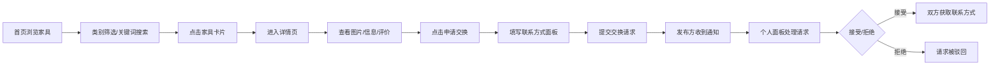

## 1. 产品概述
社区家具共享与交换平台，解决家庭闲置家具占用空间且难以找到合适接收方的问题，通过信息发布、浏览筛选和交换请求三大核心功能，实现家具资源的循环利用。
- 主要用途：发布闲置家具信息、浏览筛选家具、发起和管理交换请求
- 目标用户：有闲置家具需要处理或寻找二手家具的城市居民
- 市场价值：减少资源浪费，降低家庭家具流通成本

## 2. 核心功能

### 2.1 用户角色
| 角色 | 注册方式 | 核心权限 |
|------|----------|----------|
| 普通用户 | 默认内置（无需真实注册） | 发布家具、浏览家具、发起/接收交换请求、管理个人面板 |

### 2.2 功能模块
1. **首页**：瀑布流家具列表、类别筛选、关键词搜索、顶部导航栏、通知铃铛
2. **家具详情页**：图片轮播、家具信息展示、用户评价列表、申请交换侧滑面板
3. **个人管理面板**：我发布的家具（状态管理）、交换请求（接受/拒绝处理）

### 2.3 页面详情
| 页面名称 | 模块名称 | 功能描述 |
|----------|----------|----------|
| 首页 | 顶部导航栏 | 半透明磨砂背景固定导航，Logo、搜索框、发布按钮、通知铃铛、个人中心入口 |
| 首页 | 类别筛选栏 | 沙发/桌子/椅子/柜子/床 五个类别标签，选中高亮 |
| 首页 | 关键词搜索 | 支持按家具名称、城市模糊搜索 |
| 首页 | 瀑布流家具卡片 | 缩略图、名称、状态标签，悬停阴影加深上移 |
| 首页 | 状态标签动画 | 切换时颜色0.6秒渐变（绿→橙→灰） |
| 家具详情页 | 图片轮播 | 左右箭头切换，横向滑动过渡，箭头悬停透明度+缩放0.3秒动画 |
| 家具详情页 | 家具信息区 | 尺寸、使用年限、所在城市、可交换时间、详细描述 |
| 家具详情页 | 用户评价 | 星星评分、文字评论列表 |
| 家具详情页 | 申请交换按钮 | 点击弹出侧滑面板，填写联系方式和期望交换时间 |
| 个人管理面板 | 标签页切换 | 我发布的家具 / 交换请求，淡入淡出切换0.4秒 |
| 个人管理面板 | 我发布的家具 | 缩略图、名称、当前状态，可手动标记"已交换" |
| 个人管理面板 | 交换请求 | 对方头像昵称、家具名称、相对时间、接受/拒绝按钮动画 |
| 通知铃铛 | 红色角标 | 未读请求数量显示，弹跳缩放动画0.3秒 |
| 通知铃铛 | 下拉列表 | 点击展开未读通知列表 |

## 3. 核心流程
用户浏览首页的家具瀑布流，通过类别筛选或关键词搜索找到感兴趣的家具，点击进入详情页查看完整信息和评价，确认后点击"申请交换"按钮，填写联系方式和期望时间并提交。家具发布方在个人面板的"交换请求"中收到请求，可选择接受或拒绝，接受后双方可查看对方的联系方式。

## 4. 用户界面设计

### 4.1 设计风格
- 主背景色：暖白色 #F5F0EB
- 卡片边框：淡木色 #D4B895
- 卡片阴影：box-shadow: 0 2px 8px rgba(0,0,0,0.08)，悬停时加深并上移3px
- 导航栏：固定顶部，半透明磨砂 backdrop-filter: blur(10px)
- 按钮：圆角 border-radius: 8px，active 时 scale 0.95 点击缩放效果
- 状态标签：闲置中（绿色渐变）→ 已预约（橙色渐变）→ 已交换（灰色渐变），0.6秒动画
- 状态颜色：闲置 #4CAF50，已预约 #FF9800，已交换 #9E9E9E

### 4.2 页面设计概述
| 页面名称 | 模块名称 | UI 元素 |
|----------|----------|----------|
| 首页 | 顶部导航 | 磨砂玻璃背景，左侧Logo文字，中间搜索框，右侧发布/通知/头像 |
| 首页 | 筛选标签 | 圆角胶囊标签，选中填充淡木色 |
| 首页 | 瀑布流网格 | 桌面多列，平板2列，手机单列，卡片间距16px |
| 家具详情 | 轮播容器 | 大尺寸图片展示，左右悬浮箭头，底部小圆点指示器 |
| 家具详情 | 信息面板 | 白底圆角卡片，图标+文字展示各字段 |
| 家具详情 | 评价列表 | 头像+昵称+星星+评论内容，时间戳 |
| 家具详情 | 侧滑面板 | 右侧滑入，遮罩半透明，表单布局 |
| 个人面板 | 标签页 | 顶部两个Tab，底部横线指示器 |
| 个人面板 | 请求卡片 | 白底阴影卡片，左右布局：头像信息+操作按钮 |

### 4.3 响应式设计
- 桌面端（≥1024px）：瀑布流3-4列布局
- 平板端（768-1023px）：自适应2列布局
- 手机端（<768px）：单列布局，顶部导航精简，搜索框折叠
- 所有触控交互区域最小44x44px，适配触摸操作

### 4.4 动效设计
- 页面加载：卡片级联淡入（staggered animation）
- 卡片悬停：上移3px + 阴影加深，0.25秒过渡
- 轮播切换：横向滑动0.4秒 ease
- 侧滑面板：translateX + opacity 0.3秒
- 列表滚动：顶部渐进式阴影提示
