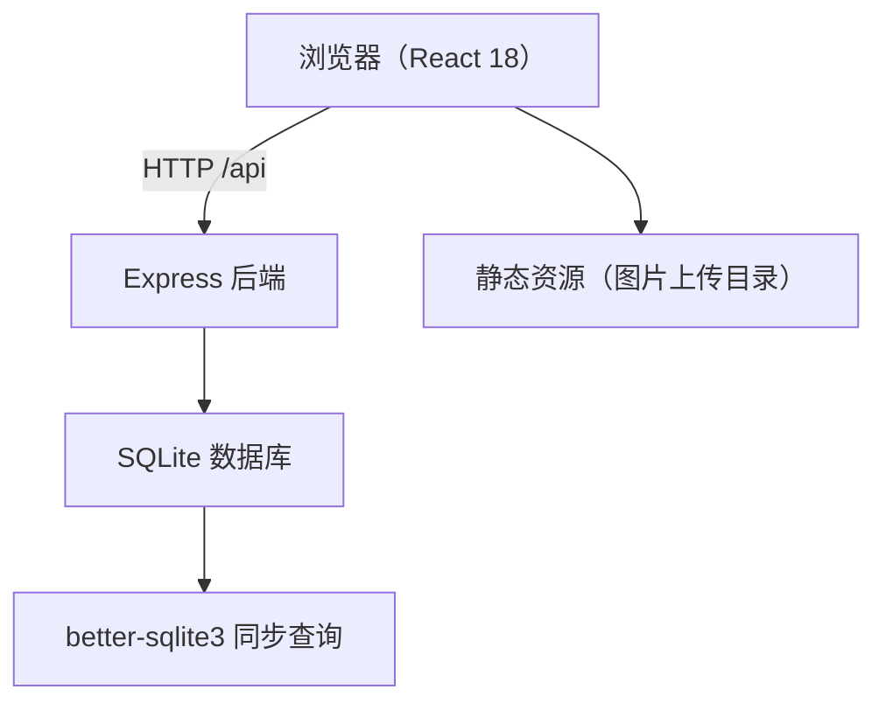
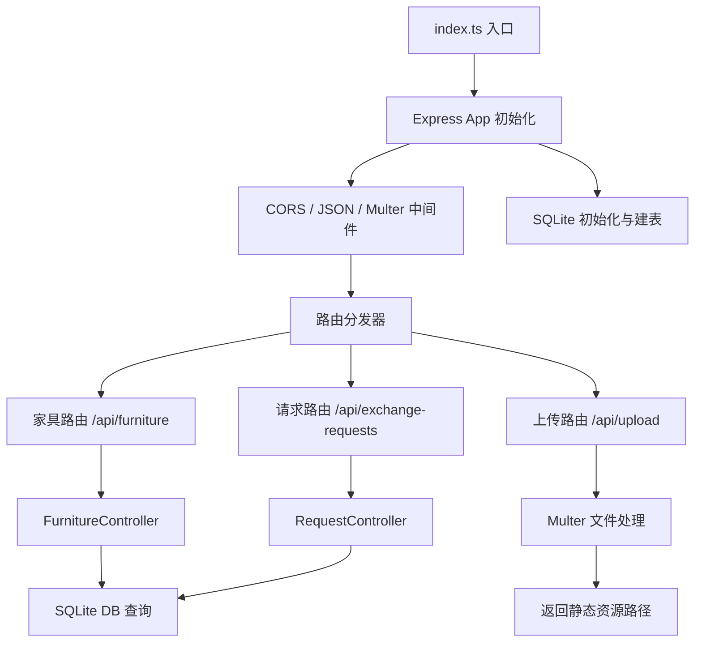
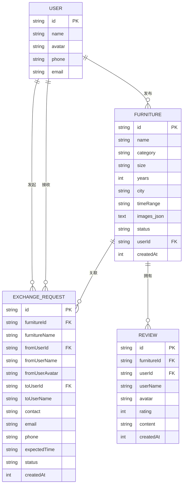

## 1. 架构设计


## 2. 技术说明
- **前端框架**：React@18 + TypeScript + Vite@5
- **路由管理**：react-router-dom@6
- **状态管理**：React Context + useState（轻量应用）
- **样式方案**：原生 CSS + CSS Modules（避免 tailwind，按用户要求）
- **HTTP 客户端**：axios@1
- **文件上传**：react-dropzone@14
- **图标库**：lucide-react
- **后端框架**：Express@4 + TypeScript
- **数据库**：SQLite（better-sqlite3）
- **文件处理**：multer@1
- **ID 生成**：uuid@9
- **启动工具**：concurrently（前后端并发启动）

## 3. 路由定义
| 路由路径 | 页面组件 | 用途 |
|----------|----------|------|
| / | HomePage | 首页瀑布流家具列表 |
| /furniture/:id | FurnitureDetail | 家具详情页 |
| /dashboard | Dashboard | 个人管理面板 |
| * | HomePage | 404 回退到首页 |

## 4. API 定义

### 4.1 家具 CRUD
| 方法 | 路径 | 请求 | 响应 | 功能 |
|------|------|------|------|------|
| GET | /api/furniture | Query: category?, keyword?, page? | Furniture[] | 获取家具列表（支持筛选搜索） |
| GET | /api/furniture/:id |  | Furniture | 获取单件家具详情 |
| POST | /api/furniture | FormData(name,category,size,years,city,timeRange,images[]) | Furniture | 发布新家具 |
| PATCH | /api/furniture/:id/status | { status: 'idle' \| 'reserved' \| 'exchanged' } | Furniture | 更新家具状态 |

### 4.2 图片上传
| 方法 | 路径 | 请求 | 响应 | 功能 |
|------|------|------|------|------|
| POST | /api/upload | multipart/form-data(file) | { url: string } | 上传单张图片（返回 URL） |

### 4.3 交换请求
| 方法 | 路径 | 请求 | 响应 | 功能 |
|------|------|------|------|------|
| GET | /api/exchange-requests | Query: userId | ExchangeRequest[] | 获取用户的交换请求 |
| POST | /api/exchange-requests | { furnitureId, fromUserId, contact, email, phone, expectedTime } | ExchangeRequest | 发起交换请求 |
| PATCH | /api/exchange-requests/:id | { status: 'accepted' \| 'rejected' } | ExchangeRequest | 处理交换请求 |

### 4.4 TypeScript 类型定义
```typescript
interface Furniture {
  id: string;
  name: string;
  category: 'sofa' | 'table' | 'chair' | 'cabinet' | 'bed';
  size: string;
  years: number;
  city: string;
  timeRange: string;
  images: string[];
  status: 'idle' | 'reserved' | 'exchanged';
  userId: string;
  createdAt: number;
}

interface Review {
  id: string;
  furnitureId: string;
  userId: string;
  userName: string;
  avatar: string;
  rating: number; // 1-5
  content: string;
  createdAt: number;
}

interface ExchangeRequest {
  id: string;
  furnitureId: string;
  furnitureName: string;
  fromUserId: string;
  fromUserName: string;
  fromUserAvatar: string;
  toUserId: string;
  toUserName: string;
  contact: string;
  email: string;
  phone: string;
  expectedTime: string;
  status: 'pending' | 'accepted' | 'rejected';
  createdAt: number;
}
```

## 5. 后端架构图


## 6. 数据模型

### 6.1 ER 图


### 6.2 DDL
```sql
CREATE TABLE IF NOT EXISTS users (
  id TEXT PRIMARY KEY,
  name TEXT NOT NULL,
  avatar TEXT,
  phone TEXT,
  email TEXT
);

CREATE TABLE IF NOT EXISTS furniture (
  id TEXT PRIMARY KEY,
  name TEXT NOT NULL,
  category TEXT NOT NULL,
  size TEXT NOT NULL,
  years INTEGER NOT NULL,
  city TEXT NOT NULL,
  timeRange TEXT NOT NULL,
  images_json TEXT NOT NULL,
  status TEXT NOT NULL DEFAULT 'idle',
  userId TEXT NOT NULL,
  createdAt INTEGER NOT NULL,
  FOREIGN KEY(userId) REFERENCES users(id)
);

CREATE TABLE IF NOT EXISTS exchange_requests (
  id TEXT PRIMARY KEY,
  furnitureId TEXT NOT NULL,
  furnitureName TEXT NOT NULL,
  fromUserId TEXT NOT NULL,
  fromUserName TEXT NOT NULL,
  fromUserAvatar TEXT,
  toUserId TEXT NOT NULL,
  toUserName TEXT NOT NULL,
  contact TEXT,
  email TEXT,
  phone TEXT,
  expectedTime TEXT,
  status TEXT NOT NULL DEFAULT 'pending',
  createdAt INTEGER NOT NULL,
  FOREIGN KEY(furnitureId) REFERENCES furniture(id)
);

CREATE TABLE IF NOT EXISTS reviews (
  id TEXT PRIMARY KEY,
  furnitureId TEXT NOT NULL,
  userId TEXT NOT NULL,
  userName TEXT NOT NULL,
  avatar TEXT,
  rating INTEGER NOT NULL,
  content TEXT,
  createdAt INTEGER NOT NULL,
  FOREIGN KEY(furnitureId) REFERENCES furniture(id)
);

CREATE INDEX idx_furniture_category ON furniture(category);
CREATE INDEX idx_furniture_status ON furniture(status);
CREATE INDEX idx_furniture_city ON furniture(city);
CREATE INDEX idx_requests_to ON exchange_requests(toUserId);
CREATE INDEX idx_requests_from ON exchange_requests(fromUserId);
CREATE INDEX idx_reviews_furniture ON reviews(furnitureId);
```

### 6.3 种子数据（初始 mock）
- 2 个测试用户（id: user_1, user_2）
- 8-10 件家具（覆盖所有类别，不同城市和状态）
- 3-5 条评价数据
- 2-3 条交换请求（pending 状态）
