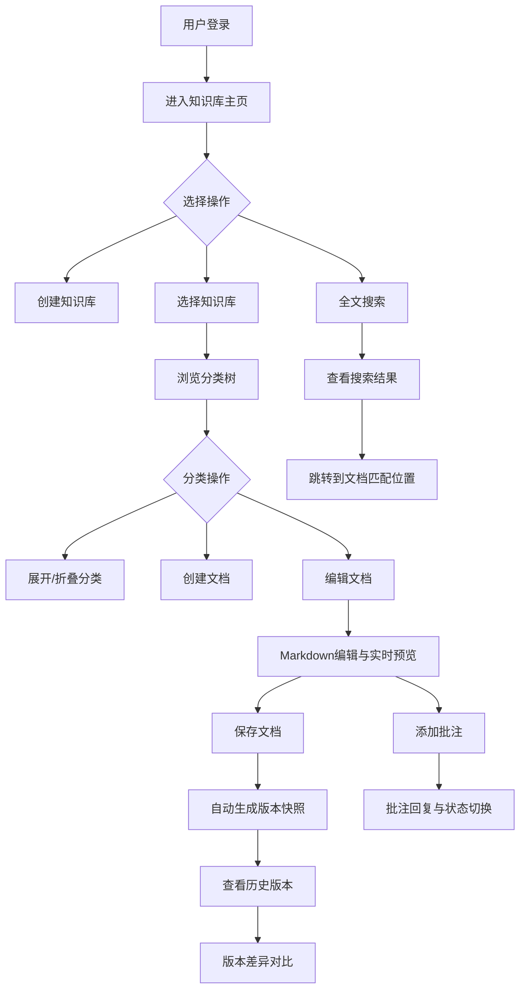

## 1. 产品概述

团队知识库管理与文档协作平台，旨在解决团队成员间知识分散、文档版本混乱、难以快速找到相关资料的问题。通过结构化的知识库组织、实时Markdown编辑与预览、版本对比、全文搜索和文档批注功能，提升团队知识管理效率。

- 目标用户：需要协同管理技术文档、设计文档和项目规范的研发团队
- 核心价值：统一知识管理、版本可追溯、快速检索、协作批注

## 2. 核心功能

### 2.1 用户角色

| 角色 | 注册方式 | 核心权限 |
|------|----------|----------|
| 团队成员 | 默认用户 | 创建/编辑/删除文档、添加批注、搜索 |
| 管理员 | 系统指定 | 知识库管理、分类管理、成员管理 |

### 2.2 功能模块

1. **知识库主页**：知识库列表、分类树（可折叠）、文档列表管理
2. **文档编辑页**：Markdown编辑器、实时预览、版本管理、差异对比、批注系统
3. **搜索功能**：顶部搜索栏、实时搜索结果、关键词高亮、跳转定位

### 2.3 页面详情

| 页面名称 | 模块名称 | 功能描述 |
|----------|----------|----------|
| 知识库主页 | 知识库列表 | 展示所有知识库，支持创建、切换知识库 |
| 知识库主页 | 分类树 | 分类折叠/展开（0.3s动画），分类内文档CRUD |
| 知识库主页 | 文档列表 | 显示分类下所有文档，支持创建、编辑、删除 |
| 文档编辑页 | Markdown编辑器 | 左右分栏编辑与实时预览，预览区同步滚动，高亮当前编辑位置 |
| 文档编辑页 | 版本管理 | 保存自动生成版本快照，侧边栏历史版本列表（时间倒序） |
| 文档编辑页 | 版本对比 | 左右分栏/统一视图切换（滑动过渡动画），绿色新增/红色删除差异显示 |
| 文档编辑页 | 批注系统 | 段落旁侧边气泡批注（浅黄背景、深灰文字、阴影），支持回复、未读/已读状态 |
| 全局 | 搜索栏 | 顶部搜索框，实时搜索（延迟<200ms），结果按匹配度排序，关键词黄色高亮，点击跳转定位 |
| 全局 | 通知提示 | 保存成功绿色提示条，3秒淡出 |

## 3. 核心流程

1. **知识库创建与文档管理流程**：用户创建知识库 → 添加分类 → 在分类内创建文档 → 使用Markdown编辑器编写 → 保存自动生成版本快照
2. **文档搜索与定位流程**：用户在搜索框输入关键词 → 实时显示搜索结果 → 点击结果跳转到对应文档 → 自动滚动至匹配位置
3. **版本对比流程**：用户打开文档 → 查看历史版本列表 → 选择历史版本 → 对比差异（左右分栏/统一视图切换）
4. **批注协作流程**：用户在文档段落旁添加批注 → 其他用户查看批注 → 回复批注 → 标记已读/未读

## 4. 用户界面设计

### 4.1 设计风格

- 主色：蓝色 #2563EB
- 辅助色：浅灰 #F8FAFC（背景）、深灰 #334155（文字）
- 差异色：新增 #DCFCE7、删除 #FEE2E2
- 批注气泡：浅黄背景、深灰文字、轻微阴影
- 按钮风格：圆角按钮，主色填充，hover加深
- 字体：文档标题24px粗体、正文16px常规、行高1.8
- 布局：左侧导航240px + 顶部导航56px + 主内容区灰白渐变背景
- 图标：使用 lucide-react 图标库

### 4.2 页面设计概览

| 页面名称 | 模块名称 | UI元素 |
|----------|----------|--------|
| 知识库主页 | 左侧导航栏 | 白底深灰文字，240px宽，蓝色左侧边框指示条，分类树折叠动画0.3s |
| 知识库主页 | 顶部导航栏 | 56px高，搜索框居中，用户头像下拉菜单右侧 |
| 知识库主页 | 主内容区 | 灰白渐变背景，知识库信息卡片，分类列表 |
| 文档编辑页 | 编辑器区域 | 左右分栏，左侧Markdown编辑，右侧实时预览，同步滚动 |
| 文档编辑页 | 版本侧边栏 | 右侧滑出，版本列表时间倒序，版本对比切换按钮 |
| 文档编辑页 | 批注气泡 | 段落旁侧边显示，浅黄背景，深灰文字，阴影，未读红色圆点 |
| 搜索结果 | 结果下拉 | 实时显示，关键词黄色高亮，按匹配度排序 |

### 4.3 响应式设计

- 桌面优先设计，1024px以下宽度时左侧导航自动折叠为汉堡菜单
- 编辑器区域在小屏幕下切换为上下分栏（编辑在上，预览在下）
- 搜索结果在移动端适配为全屏搜索模式

### 4.4 动画效果

- 分类折叠/展开：平滑高度动画，持续0.3秒
- 版本对比视图切换：滑动过渡动画
- 保存提示：底部浮现，3秒淡出
- 批注未读/已读状态切换动画
- 导航栏折叠/展开过渡动画
