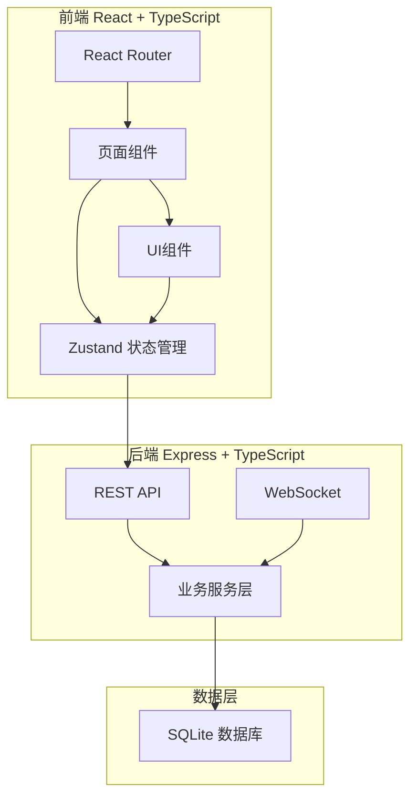
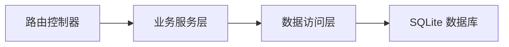
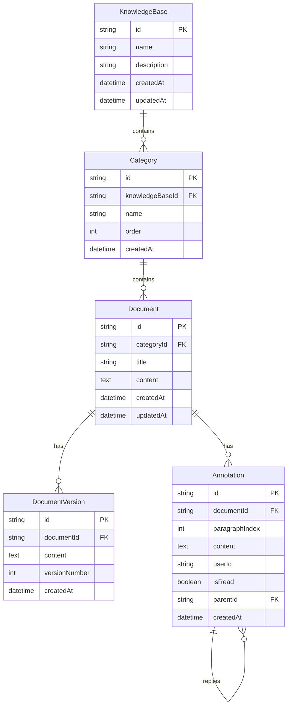

## 1. 架构设计



## 2. 技术说明

- 前端：React@18 + TypeScript + TailwindCSS@3 + Vite
- 初始化工具：vite-init（react-express-ts 模板）
- 后端：Express@4 + TypeScript
- 数据库：SQLite（better-sqlite3）
- 状态管理：Zustand
- 路由：react-router-dom
- Markdown：react-markdown + 代码高亮
- 差异对比：diff 库
- HTTP客户端：axios
- 唯一标识：uuid

## 3. 路由定义

| 路由 | 用途 |
|------|------|
| / | 知识库主页，展示知识库列表和分类树 |
| /kb/:kbId | 指定知识库主页，展示分类和文档列表 |
| /doc/:docId | 文档编辑页面，Markdown编辑、预览、版本对比、批注 |
| /doc/:docId?version=:versionId | 文档特定版本查看 |

## 4. API定义

### 知识库 API

```typescript
interface KnowledgeBase {
  id: string;
  name: string;
  description: string;
  createdAt: string;
  updatedAt: string;
}

// GET /api/knowledge-bases - 获取所有知识库
// POST /api/knowledge-bases - 创建知识库
// PUT /api/knowledge-bases/:id - 更新知识库
// DELETE /api/knowledge-bases/:id - 删除知识库
```

### 分类 API

```typescript
interface Category {
  id: string;
  knowledgeBaseId: string;
  name: string;
  order: number;
  createdAt: string;
}

// GET /api/knowledge-bases/:kbId/categories - 获取知识库分类
// POST /api/knowledge-bases/:kbId/categories - 创建分类
// PUT /api/categories/:id - 更新分类
// DELETE /api/categories/:id - 删除分类
```

### 文档 API

```typescript
interface Document {
  id: string;
  categoryId: string;
  title: string;
  content: string;
  createdAt: string;
  updatedAt: string;
}

interface DocumentVersion {
  id: string;
  documentId: string;
  content: string;
  versionNumber: number;
  createdAt: string;
}

// GET /api/categories/:catId/documents - 获取分类下文档
// POST /api/categories/:catId/documents - 创建文档
// GET /api/documents/:id - 获取文档详情（含最新内容）
// PUT /api/documents/:id - 更新文档（自动生成版本快照）
// DELETE /api/documents/:id - 删除文档
// GET /api/documents/:id/versions - 获取文档版本列表
// GET /api/documents/:id/versions/:versionId - 获取特定版本
```

### 搜索 API

```typescript
interface SearchResult {
  documentId: string;
  title: string;
  content: string;
  matchType: 'title' | 'content';
  score: number;
  highlights: { start: number; end: number }[];
}

// GET /api/search?q=keyword&kbId=xxx - 全文搜索
```

### 批注 API

```typescript
interface Annotation {
  id: string;
  documentId: string;
  paragraphIndex: number;
  content: string;
  userId: string;
  createdAt: string;
  isRead: boolean;
  parentId: string | null;
  replies: Annotation[];
}

// GET /api/documents/:docId/annotations - 获取文档批注
// POST /api/documents/:docId/annotations - 添加批注
// PUT /api/annotations/:id - 更新批注（含已读状态）
// DELETE /api/annotations/:id - 删除批注
// POST /api/annotations/:id/reply - 回复批注
```

## 5. 服务器架构图



## 6. 数据模型

### 6.1 数据模型定义



### 6.2 数据定义语言

```sql
CREATE TABLE knowledge_bases (
  id TEXT PRIMARY KEY,
  name TEXT NOT NULL,
  description TEXT DEFAULT '',
  created_at TEXT DEFAULT (datetime('now')),
  updated_at TEXT DEFAULT (datetime('now'))
);

CREATE TABLE categories (
  id TEXT PRIMARY KEY,
  knowledge_base_id TEXT NOT NULL REFERENCES knowledge_bases(id) ON DELETE CASCADE,
  name TEXT NOT NULL,
  "order" INTEGER NOT NULL DEFAULT 0,
  created_at TEXT DEFAULT (datetime('now'))
);

CREATE TABLE documents (
  id TEXT PRIMARY KEY,
  category_id TEXT NOT NULL REFERENCES categories(id) ON DELETE CASCADE,
  title TEXT NOT NULL,
  content TEXT DEFAULT '',
  created_at TEXT DEFAULT (datetime('now')),
  updated_at TEXT DEFAULT (datetime('now'))
);

CREATE TABLE document_versions (
  id TEXT PRIMARY KEY,
  document_id TEXT NOT NULL REFERENCES documents(id) ON DELETE CASCADE,
  content TEXT NOT NULL,
  version_number INTEGER NOT NULL,
  created_at TEXT DEFAULT (datetime('now'))
);

CREATE TABLE annotations (
  id TEXT PRIMARY KEY,
  document_id TEXT NOT NULL REFERENCES documents(id) ON DELETE CASCADE,
  paragraph_index INTEGER NOT NULL,
  content TEXT NOT NULL,
  user_id TEXT NOT NULL DEFAULT 'default_user',
  is_read INTEGER NOT NULL DEFAULT 0,
  parent_id TEXT REFERENCES annotations(id) ON DELETE CASCADE,
  created_at TEXT DEFAULT (datetime('now'))
);

CREATE INDEX idx_categories_kb ON categories(knowledge_base_id);
CREATE INDEX idx_documents_cat ON documents(category_id);
CREATE INDEX idx_versions_doc ON document_versions(document_id);
CREATE INDEX idx_versions_doc_num ON document_versions(document_id, version_number);
CREATE INDEX idx_annotations_doc ON annotations(document_id);
CREATE INDEX idx_annotations_parent ON annotations(parent_id);
CREATE INDEX idx_documents_content ON documents(content);
CREATE INDEX idx_documents_title ON documents(title);
```
