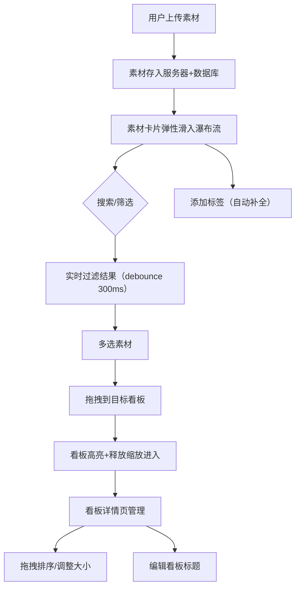

## 1. 产品概述

灵感素材收集与看板展示应用——为创意团队提供高效的素材收集、分类和检索工具，解决聊天软件和云盘管理灵感素材时查找和整理效率低下的问题。
- 目标用户：设计师、创意团队、内容创作者
- 核心价值：将散落的灵感素材集中管理，通过看板归类和标签检索实现快速定位与整理

## 2. 核心功能

### 2.1 用户角色

| 角色 | 注册方式 | 核心权限 |
|------|----------|----------|
| 创意团队成员 | 直接使用 | 上传素材、创建/编辑看板、标签管理、搜索筛选 |

### 2.2 功能模块

1. **素材库页面**：素材上传（带进度条）、瀑布流浏览、多选批量操作、拖拽归类、标签管理、关键词搜索与标签筛选
2. **看板详情页面**：看板创建与编辑、拖拽排序、看板内素材展示、看板卡片悬停效果

### 2.3 页面详情

| 页面名称 | 模块名称 | 功能描述 |
|----------|----------|----------|
| 素材库 | 导航栏 | Logo、上传按钮、用户头像，深色背景#2c3e50 |
| 素材库 | 搜索筛选栏 | 关键词搜索（debounce 300ms）、标签筛选器、实时过滤 |
| 素材库 | 上传模态框 | 选择文件（图片/视频）、进度条显示上传进度、上传完成关闭 |
| 素材库 | 瀑布流网格 | 自适应列数（桌面4列/平板3列/手机2列）、每张卡片显示缩略图+标题+标签、滚动加载每次20个 |
| 素材库 | 素材卡片 | 白色背景、圆角12px、轻微阴影、悬停阴影增强+显示操作图标（收藏/删除）、弹性滑入动画 |
| 素材库 | 批量拖拽区 | 多选素材、拖拽时半透明跟随副本、目标看板高亮边框、释放后缩放进入动画 |
| 看板详情 | 看板网格 | react-grid-layout自由布局、看板容器#e9ecef背景+虚线边框、可调整大小和位置 |
| 看板详情 | 看板卡片 | 标题可编辑、悬停阴影从sm到lg过渡0.2s、内部素材紧凑网格展示 |
| 看板详情 | 拖拽交互 | 看板排序拖拽、素材拖入看板平滑过渡动画 |

## 3. 核心流程

1. 用户上传素材（图片/视频），系统存储文件并生成缩略图，素材卡片以弹性滑入动画进入瀑布流
2. 用户在素材库浏览素材，可通过关键词搜索和标签筛选快速定位
3. 用户选中素材拖拽到目标看板，素材归类到看板中
4. 用户在看板详情页管理看板布局，拖拽排序和调整大小
5. 用户为素材添加标签（最多5个），输入时自动补全已有标签

## 4. 用户界面设计

### 4.1 设计风格

- 主色：品牌蓝色 #3498db，hover加深至 #2980b9
- 辅色：深灰 #2c3e50（导航栏）、浅灰 #e9ecef（看板背景）、白色 #fff（卡片背景）
- 整体背景：#f8f9fa
- 按钮风格：圆角8px、品牌蓝色填充、hover加深、柔和阴影
- 字体：标题使用 Outfit（粗体600-700），正文使用 DM Sans（常规400-500）
- 布局风格：顶部导航+左侧内容区、卡片式布局
- 图标风格：线性图标（lucide-react），尺寸16-20px
- 动画：弹性滑入（cubic-bezier）、淡入过渡、阴影渐变0.2s

### 4.2 页面设计概览

| 页面名称 | 模块名称 | UI元素 |
|----------|----------|--------|
| 素材库 | 导航栏 | 深色#2c3e50背景、左侧Logo白色文字、右侧上传按钮品牌蓝+头像圆形 |
| 素材库 | 搜索筛选栏 | 搜索框圆角+图标前缀、标签筛选圆角胶囊按钮、浅灰背景 |
| 素材库 | 上传模态框 | 居中模态、白色背景圆角16px、文件拖拽区虚线边框、进度条品牌蓝渐变 |
| 素材库 | 瀑布流网格 | 自适应列数、间距16px、卡片白色#fff圆角12px+shadow-sm |
| 素材库 | 素材卡片 | 缩略图区域、标题14px DM Sans、标签圆角圆点浅色背景、hover:shadow-lg+操作图标 |
| 素材库 | 标签 | 圆角圆点样式、随机浅色背景、12px字体、最多5个 |
| 看板详情 | 看板网格 | #e9ecef背景+虚线边框、可拖拽调整、react-grid-layout |
| 看板详情 | 看板卡片 | 标题可编辑input、hover:shadow-sm→shadow-lg 0.2s、内部素材紧凑网格 |

### 4.3 响应式设计

- 桌面优先设计，断点：手机<768px、平板768-1024px、桌面>1024px
- 瀑布流：桌面4列、平板3列、手机2列
- 导航栏：桌面水平展开，手机折叠菜单
- 触摸优化：拖拽区域加大触摸目标(44px最小)

### 4.4 动画规范

- 素材卡片入场：从下往上弹性滑入（translateY 20px→0, opacity 0→1, cubic-bezier(0.34, 1.56, 0.64, 1)）
- 搜索结果更新：淡入动画（opacity 0→1, 300ms ease）
- 拖拽释放：缩放进入（scale 0.8→1, 200ms ease-out）
- 看板卡片悬停：阴影过渡0.2s
- 模态框：淡入+轻微缩放
