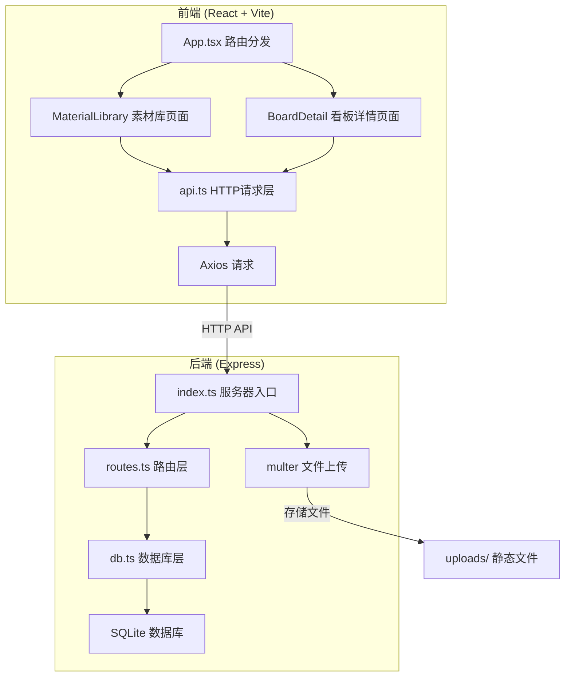
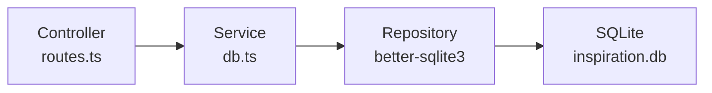
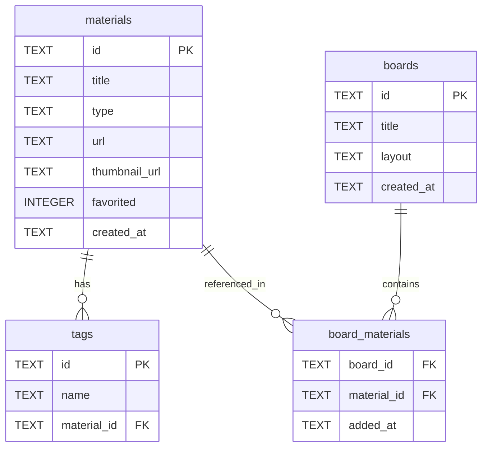

## 1. 架构设计



## 2. 技术说明

- 前端：React@18 + TypeScript + Tailwind CSS + Vite
- 初始化工具：vite-init（react-express-ts模板）
- 后端：Express@4 + TypeScript（ESM格式）
- 数据库：SQLite（better-sqlite3）
- 状态管理：Zustand
- 拖拽：react-beautiful-dnd（素材拖拽归类）+ react-grid-layout（看板布局）
- HTTP客户端：Axios
- 图标：lucide-react

## 3. 路由定义

| 路由 | 用途 |
|------|------|
| / | 素材库页面——瀑布流浏览所有素材，上传、搜索、筛选、拖拽归类 |
| /board | 看板详情页面——看板网格布局，拖拽排序，看板内素材展示 |

## 4. API定义

### 4.1 素材相关

```typescript
interface Material {
  id: string;
  title: string;
  type: 'image' | 'video';
  url: string;
  thumbnail_url: string;
  tags: string[];
  created_at: string;
  favorited: boolean;
}

// GET /api/materials?page=1&limit=20&keyword=&tag=
// Response: { materials: Material[], total: number, hasMore: boolean }

// POST /api/materials (multipart/form-data)
// Body: { file: File, title: string, tags?: string[] }
// Response: Material

// DELETE /api/materials/:id
// Response: { success: boolean }

// PATCH /api/materials/:id
// Body: { title?: string, tags?: string[], favorited?: boolean }
// Response: Material
```

### 4.2 看板相关

```typescript
interface Board {
  id: string;
  title: string;
  layout: { i: string; x: number; y: number; w: number; h: number }[];
  created_at: string;
}

interface BoardMaterial {
  board_id: string;
  material_id: string;
  added_at: string;
}

// GET /api/boards
// Response: Board[]

// POST /api/boards
// Body: { title: string }
// Response: Board

// PATCH /api/boards/:id
// Body: { title?: string, layout?: object[] }
// Response: Board

// DELETE /api/boards/:id
// Response: { success: boolean }

// POST /api/boards/:id/materials
// Body: { material_ids: string[] }
// Response: { success: boolean, added: number }

// DELETE /api/boards/:id/materials/:materialId
// Response: { success: boolean }

// GET /api/boards/:id/materials
// Response: Material[]

// GET /api/tags
// Response: string[]
```

## 5. 服务器架构图



## 6. 数据模型

### 6.1 数据模型定义



### 6.2 数据定义语言

```sql
CREATE TABLE IF NOT EXISTS materials (
  id TEXT PRIMARY KEY,
  title TEXT NOT NULL,
  type TEXT NOT NULL CHECK(type IN ('image', 'video')),
  url TEXT NOT NULL,
  thumbnail_url TEXT,
  favorited INTEGER DEFAULT 0,
  created_at TEXT DEFAULT (datetime('now'))
);

CREATE TABLE IF NOT EXISTS boards (
  id TEXT PRIMARY KEY,
  title TEXT NOT NULL,
  layout TEXT DEFAULT '[]',
  created_at TEXT DEFAULT (datetime('now'))
);

CREATE TABLE IF NOT EXISTS board_materials (
  board_id TEXT NOT NULL REFERENCES boards(id) ON DELETE CASCADE,
  material_id TEXT NOT NULL REFERENCES materials(id) ON DELETE CASCADE,
  added_at TEXT DEFAULT (datetime('now')),
  PRIMARY KEY (board_id, material_id)
);

CREATE TABLE IF NOT EXISTS tags (
  id TEXT PRIMARY KEY,
  name TEXT NOT NULL,
  material_id TEXT NOT NULL REFERENCES materials(id) ON DELETE CASCADE
);

CREATE INDEX IF NOT EXISTS idx_tags_name ON tags(name);
CREATE INDEX IF NOT EXISTS idx_tags_material_id ON tags(material_id);
CREATE INDEX IF NOT EXISTS idx_materials_type ON materials(type);
CREATE INDEX IF NOT EXISTS idx_materials_created_at ON materials(created_at);
```
