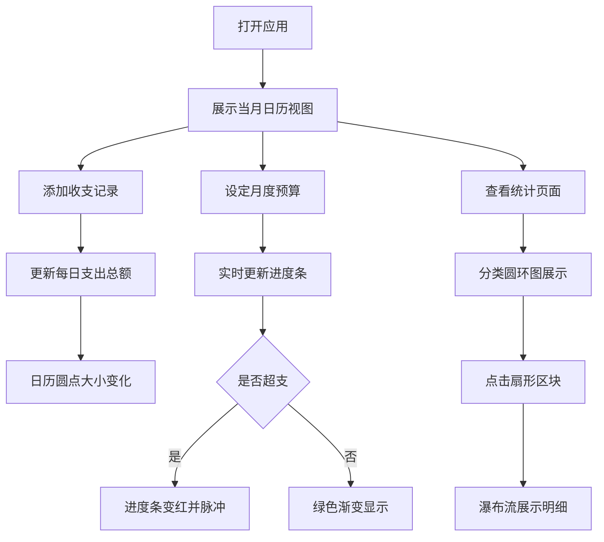

## 1. 产品概述
个人财务流水记录与预算管理应用，解决日常收支零散、月底对账困难、难以发现消费超支的问题。
- 面向需要管理个人财务的普通用户，提供收支记录、预算设定、消费统计等核心功能
- 帮助用户直观了解消费习惯，控制支出，实现合理理财

## 2. 核心功能

### 2.1 用户角色
| 角色 | 注册方式 | 核心权限 |
|------|----------|----------|
| 普通用户 | 无需注册，本地存储 | 添加/删除收支记录、设定预算、查看统计数据 |

### 2.2 功能模块
1. **主页日历视图**：月度日历展示每日支出总额，点击查看当日流水详情
2. **预算设定页面**：设置月度预算上限，实时显示当前支出进度
3. **统计页面**：按分类展示支出圆环图，支持钻取查看明细

### 2.3 页面详情
| 页面名称 | 模块名称 | 功能描述 |
|---------|----------|----------|
| 主页日历 | 月份网格 | 展示当月每日支出，金额越大圆点越大（8px-40px渐变红色圆点） |
| 主页日历 | 流水弹窗 | 点击日期从底部滑入当日流水列表，支持左右滑动删除 |
| 预算设定 | 预算进度条 | 绿色渐变显示支出占比，超出预算变红色并脉冲跳动 |
| 统计页面 | 圆环图 | 按分类展示支出占比，预设6种柔和色卡 |
| 统计页面 | 瀑布流明细 | 点击扇形区块钻取展示该分类下的流水明细 |
| 记录表单 | 添加记录 | 按日期、分类、金额添加收支，支持备注（100字以内） |

## 3. 核心流程
用户打开应用后，默认展示当月日历视图，可通过添加记录表单录入收支数据。系统自动计算每日支出总额并在日历上以不同大小的圆点展示。用户可设定月度预算，进度条实时更新显示消费情况。在统计页面，用户可查看各分类支出占比，并点击分类查看详细流水记录。

## 4. 用户界面设计

### 4.1 设计风格
- 主色调：沉稳蓝 #3B82F6，辅色调：活力橙 #F59E0B
- 整体风格：浅灰底 + 白色卡片设计，圆角12px，轻透阴影
- 按钮设计：圆角8px，点击有涟漪扩散反馈
- 字体：使用现代无衬线字体，标题加粗，正文清晰可读
- 动画：记录添加弹性抖动（0.4s，5px回弹）、弹窗底部滑入、删除缩小消失

### 4.2 页面设计概述
| 页面名称 | 模块名称 | UI元素 |
|---------|----------|--------|
| 主页日历 | 顶部导航 | 月份切换按钮、当前月份标题、页面切换Tabs |
| 主页日历 | 日历网格 | 7列布局，每日格子显示日期和支出圆点 |
| 主页日历 | 流水弹窗 | 半透明模糊背景，列表项左滑删除按钮 |
| 预算设定 | 预算输入 | 数字输入框，设置按钮 |
| 预算设定 | 进度条组件 | 渐变背景，平滑填充动画（0.6s） |
| 统计页面 | 圆环图 | 6种柔和色卡，hover高亮效果 |
| 统计页面 | 瀑布流 | 两列布局，卡片错落排列 |
| 记录表单 | 表单组件 | 日期选择器、分类下拉、金额输入、备注文本框 |

### 4.3 响应式设计
- 桌面端：日历7列，瀑布流3列
- 平板端：日历7列，瀑布流2列
- 手机端：日历单列，瀑布流单列
- 所有组件支持触摸滑动操作

### 4.4 性能要求
- 日历视图切换月份渲染耗时 ≤ 100ms
- 圆环图在500条数据以内更新保持 60FPS
- 列表滚动流畅，无明显卡顿
