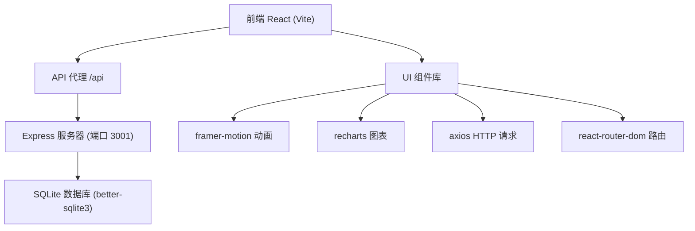
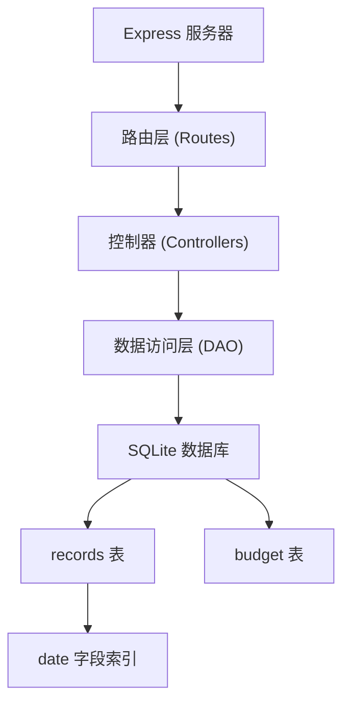
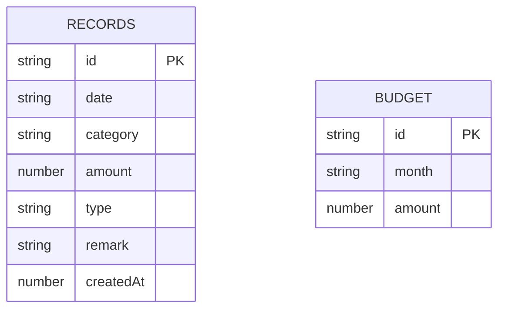

## 1. 架构设计



## 2. 技术描述
- 前端：React@18 + TypeScript + Vite
- 初始化工具：Vite + @vitejs/plugin-react
- 后端：Express@4 + TypeScript
- 数据库：SQLite (better-sqlite3)
- 状态管理：React useState/useEffect + 自定义Hooks
- 动画：framer-motion
- 图表：recharts
- 样式：CSS Modules + 内联样式
- HTTP请求：axios

## 3. 路由定义
| 路由 | 页面 | 功能 |
|------|------|------|
| / | 主页日历 | 展示月度日历视图，添加收支记录 |
| /budget | 预算设定 | 设置月度预算，查看支出进度 |
| /stats | 统计页面 | 分类支出圆环图，瀑布流明细 |

## 4. API 定义

### 4.1 TypeScript 类型定义
```typescript
interface Record {
  id: string;
  date: string;      // YYYY-MM-DD
  category: '餐饮' | '交通' | '购物' | '娱乐' | '其他';
  amount: number;
  type: 'income' | 'expense';
  remark: string;    // 最多100字
  createdAt: number;
}

interface Budget {
  id: string;
  month: string;     // YYYY-MM
  amount: number;
}

interface DailyStats {
  date: string;
  totalExpense: number;
}

interface CategoryStats {
  category: string;
  amount: number;
  color: string;
}
```

### 4.2 API 接口
| 方法 | 路径 | 描述 | 请求 | 响应 |
|------|------|------|------|------|
| GET | /api/records | 获取流水列表 | Query: month?, date?, category? | Record[] |
| POST | /api/records | 添加流水记录 | Body: { date, category, amount, type, remark } | { id: string } |
| DELETE | /api/records/:id | 删除流水记录 | Params: id | { success: boolean } |
| GET | /api/budget | 获取月度预算 | Query: month | Budget |
| POST | /api/budget | 设置月度预算 | Body: { month, amount } | { success: boolean } |
| GET | /api/stats | 获取统计数据 | Query: month | { daily: DailyStats[], categories: CategoryStats[] } |

## 5. 服务器架构图



## 6. 数据模型

### 6.1 数据模型定义



### 6.2 DDL 语句

```sql
CREATE TABLE IF NOT EXISTS records (
  id TEXT PRIMARY KEY,
  date TEXT NOT NULL,
  category TEXT NOT NULL,
  amount REAL NOT NULL,
  type TEXT NOT NULL DEFAULT 'expense',
  remark TEXT DEFAULT '',
  createdAt INTEGER NOT NULL
);

CREATE INDEX IF NOT EXISTS idx_records_date ON records(date);

CREATE TABLE IF NOT EXISTS budget (
  id TEXT PRIMARY KEY,
  month TEXT NOT NULL UNIQUE,
  amount REAL NOT NULL
);
```

### 6.3 初始数据
应用启动时自动插入测试数据（可选），包含最近3个月的流水记录用于演示。
