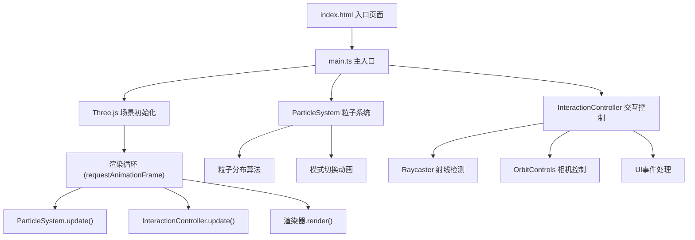

## 1. 架构设计



## 2. 技术描述
- **前端框架**：TypeScript + Three.js + Vite
- **构建工具**：Vite 5.x，配合 vite-plugin-glsl 插件支持GLSL
- **3D渲染**：Three.js r160+，使用WebGLRenderer渲染
- **依赖包**：
  - three: ^0.160.0
  - @types/three: ^0.160.0
  - typescript: ^5.3.0
  - vite: ^5.0.0
  - vite-plugin-glsl: ^1.2.0

## 3. 项目文件结构
| 文件路径 | 作用 |
|---------|------|
| `package.json` | 项目依赖和脚本配置 |
| `vite.config.js` | Vite构建配置，GLSL插件 |
| `tsconfig.json` | TypeScript严格模式配置 |
| `index.html` | 入口HTML页面，canvas容器 |
| `src/main.ts` | 主入口，场景初始化和渲染循环 |
| `src/ParticleSystem.ts` | 粒子系统类，分布算法和动画 |
| `src/InteractionController.ts` | 交互控制类，鼠标事件和UI |
| `src/style.css` | 全局样式和UI组件样式 |

## 4. 核心类设计

### 4.1 ParticleSystem 类
```typescript
class ParticleSystem {
  constructor(count: number)
  get points(): THREE.Points
  get count(): number
  update(delta: number): void
  switchMode(mode: 'spiral' | 'sphere' | 'explosion' | 'random'): void
  highlightParticle(index: number): void
  resetHighlight(): void
}
```

**核心方法：**
- `generateSpiral()`: 螺旋星系分布算法，核心密集旋臂稀疏
- `generateSphere()`: 球状星团分布算法
- `generateExplosion()`: 爆炸效果分布算法
- `generateRandom()`: 随机分布算法
- `animateTransition()`: 波浪式过渡动画，正弦波缓动

### 4.2 InteractionController 类
```typescript
class InteractionController {
  constructor(camera: THREE.Camera, renderer: THREE.WebGLRenderer, particleSystem: ParticleSystem)
  update(delta: number): void
  resize(): void
  dispose(): void
}
```

**核心功能：**
- 射线检测(Raycaster)：鼠标悬停和点击粒子检测
- OrbitControls：相机轨道控制，阻尼0.95
- 粒子高亮：放大1.5倍，白色发光
- 排斥力动画：20单位内粒子偏移
- 信息浮窗：滑入滑出动画
- 性能监控：FPS计算和显示

## 5. 性能优化策略
1. **BufferGeometry**：使用BufferGeometry存储粒子数据，减少内存占用
2. **PointsMaterial**：使用加法混合(AdditiveBlending)减少绘制调用
3. **矩阵自动更新**：关闭粒子的matrixAutoUpdate，手动控制
4. **Frustum Culling**：启用视锥体剔除
5. **自适应粒子大小**：根据相机距离动态调整粒子大小
6. **requestAnimationFrame**：使用delta时间控制动画速度，与帧率解耦
7. **事件节流**：鼠标移动事件使用节流，减少计算频率
