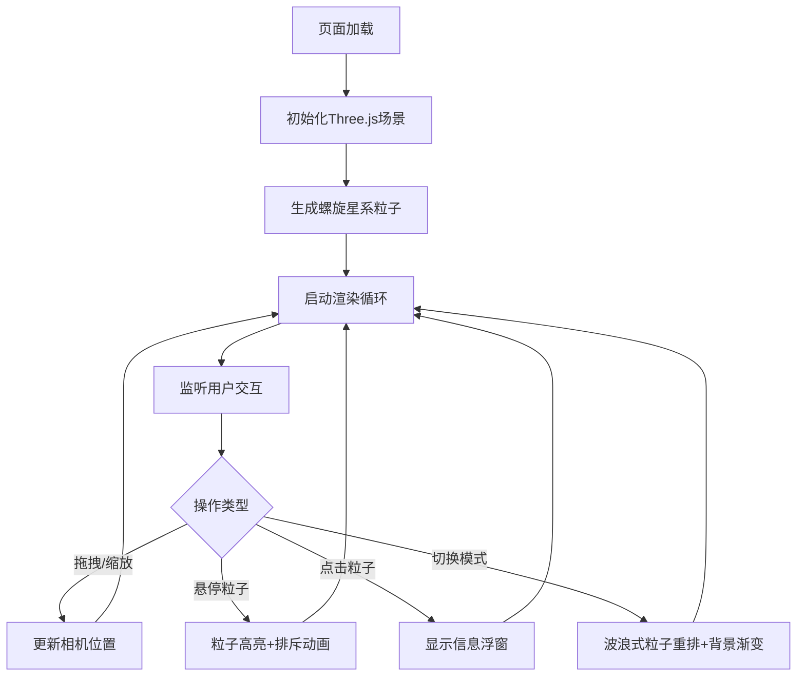

## 1. 产品概述
交互式3D粒子宇宙是一个基于WebGL的沉浸式粒子可视化体验，用户可以在浏览器中探索动态生成的粒子星系，通过鼠标交互切换不同的宇宙场景。
- 主要用途：科学可视化、艺术展示、交互演示
- 目标用户：对3D可视化、宇宙科学感兴趣的用户，以及需要展示WebGL性能的开发者

## 2. 核心功能

### 2.1 功能模块
1. **3D粒子系统**：支持2000-5000个粒子的实时渲染，实现螺旋星系、球状星团、爆炸效果三种分布模式
2. **交互控制**：鼠标拖拽旋转视角、滚轮缩放、粒子悬停高亮、点击查看属性
3. **模式切换**：四种预设模式（螺旋、球团、爆炸、随机），带平滑过渡动画
4. **性能监控**：实时帧率显示、粒子计数器，低帧率警告

### 2.2 页面详情
| 页面名称 | 模块名称 | 功能描述 |
|-----------|-------------|---------------------|
| 主页面 | 3D场景 | 全屏粒子宇宙渲染，Three.js WebGL渲染器，包含星空背景和光晕效果 |
| 主页面 | 信息浮窗 | 右上角滑入式面板，显示选中粒子的编号、坐标和速度向量长度 |
| 主页面 | 控制面板 | 底部居中，四个模式切换按钮，带选中状态动画和悬停效果 |
| 主页面 | 性能监控 | 左上角帧率显示（绿色正常，红色闪烁警告）和粒子计数器 |

## 3. 核心流程
用户进入页面后，自动生成螺旋星系模式的2000个粒子。用户可以：
1. 拖拽鼠标旋转视角，滚轮缩放场景
2. 悬停粒子查看高亮效果和排斥动画
3. 点击粒子查看详细属性信息
4. 点击底部按钮切换不同的粒子分布模式
5. 观察背景色随模式变化的渐变效果

## 4. 用户界面设计

### 4.1 设计风格
- **主色调**：深蓝(#0a0a1a) → 暗紫(#1a0a2e) → 深红(#2e0a1a) 循环渐变背景
- **粒子颜色**：从暖黄(#ffcc00)到冷蓝(#0066ff)渐变
- **按钮风格**：圆角8px，半透明毛玻璃效果(backdrop-filter: blur(10px))，选中时底部下划线动画
- **字体**：现代无衬线字体，数字使用等宽字体
- **整体风格**：科幻、沉浸式、深色主题配合蓝紫渐变

### 4.2 页面设计概述
| 页面名称 | 模块名称 | UI元素 |
|-----------|-------------|-------------|
| 主页面 | 3D场景 | 全屏WebGL画布，黑色背景，200个闪烁星空点，光晕后处理 |
| 主页面 | 信息浮窗 | 右上角，半透明毛玻璃，圆角12px，滑入动画0.3秒缓出 |
| 主页面 | 控制面板 | 底部居中，横向排列4个按钮，间距12px，悬停上浮2px |
| 主页面 | 性能监控 | 左上角，绿色等宽字体14px，低于30fps红色闪烁 |

### 4.3 响应性
- 桌面端：全屏显示，支持鼠标拖拽、悬停、滚轮缩放
- 移动端：自适应屏幕尺寸，支持触摸拖拽和双指缩放
- 窗口resize时自动调整渲染器尺寸和相机宽高比

### 4.4 3D场景指导
- **环境**：深空宇宙氛围，黑色背景配合星空点
- **光照**：柔和环境光 + 中心点光源，营造粒子发光效果
- **相机设置**：PerspectiveCamera，45度俯视，位置(0, 30, 50)，lookAt(0, 0, 0)
- **相机运动**：OrbitControls，阻尼系数0.95，缩放范围10-100
- **粒子材质**：PointsMaterial，带透明度和加法混合，柔和光晕
- **后处理**：UnrealBloomPass实现发光效果
- **性能预算**：5000个粒子时保持50fps以上
