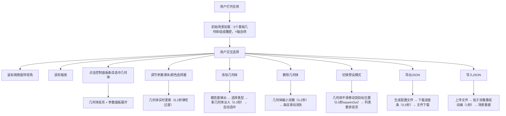

## 1. 产品概述

3D几何雕塑生成与交互编辑器，为艺术家和设计师提供直观的、可实时调节参数的3D造型生成工具，支持快速组合不同几何体并观察变换效果。通过可视化的参数控制和预设模式切换，让用户无需专业3D建模经验即可创作复杂几何雕塑。

- 目标用户：艺术家、设计师、创意工作者、3D爱好者
- 核心价值：降低3D造型创作门槛，提供实时参数调节与多种预设组合方式

## 2. 核心功能

### 2.1 功能模块

1. **3D场景画布**：展示由多种基础几何体组成的雕塑，支持视角旋转、缩放，整体自转动画
2. **控制面板**：几何体列表管理、选中几何体参数编辑（位置、旋转、缩放、颜色）
3. **几何体增删**：添加新几何体（模态窗选择类型）、删除选中几何体（含动画）
4. **预设模式**：三种预设雕塑模式切换（平衡叠构、星群散布、环形列阵）
5. **导入导出**：导出JSON配置文件、导入JSON重建场景

### 2.2 页面详情

| 页面区域 | 模块名称 | 功能描述 |
|---------|---------|---------|
| 左侧（70%宽度） | 3D场景画布 | 渲染Three.js场景，包含多个几何体雕塑，Y轴自转，鼠标拖拽旋转视角（阻尼0.95），滚轮缩放，视角变化0.3秒平滑插值 |
| 右侧（360px宽度） | 控制面板标题区 | 应用标题（白色24px），模式切换下拉选择器 |
| 右侧 | 几何体列表 | Card组件包裹每个几何体条目，显示名称和颜色预览小圆点，点击选中，悬停背景色变化 |
| 右侧 | 参数编辑表单 | 选中几何体的详细参数：位置XYZ（-5~5，步长0.1）、旋转XYZ（0~360度，步长1度）、缩放（0.3~2.0，步长0.1）、颜色选择器 |
| 右侧 | 添加/删除按钮 | "添加几何体"打开模态窗，"删除"按钮删除选中几何体 |
| 模态窗 | 几何体类型选择 | 五种类型按钮（立方体、球体、圆柱体、圆锥体、环面），2-3布局排列，选中金色边框 |
| 右侧 | 导入导出区 | 导出JSON按钮（含下载进度条），导入配置按钮 |

## 3. 核心流程

## 4. 界面设计

### 4.1 设计风格

- **主色调**：深黑背景(#0a0a0a) + 炭灰面板(#1a1a1a) + 亮白文字 + 几何体自选色作为动态点缀
- **按钮风格**：圆角微凸，深底色白字，hover时亮度提升
- **字体**：标题使用24px白色字体，正文使用14px，参数标签12px
- **布局风格**：左右分栏，左侧3D场景占70%，右侧固定360px控制面板
- **图标风格**：使用lucide-react图标库，线条简洁
- **动画风格**：弹性过渡、淡入淡出、平滑移动，所有动画保持60FPS

### 4.2 页面设计详情

| 区域 | 模块 | UI元素 |
|------|------|--------|
| 3D场景 | 画布背景 | 深黑色(#0a0a0a)，无网格地面，几何体悬浮 |
| 3D场景 | 选中几何体 | 半透明白色高亮边框（EdgesGeometry） |
| 3D场景 | 新增几何体 | 透明到不透明淡入（0.3秒） |
| 3D场景 | 删除几何体 | 缩小消散（0.2秒） |
| 3D场景 | 预设切换 | 几何体平滑移动（0.5秒easeInOut） |
| 3D场景 | 导入重建 | 粒子消散重组入场（1秒） |
| 控制面板 | 标题区 | 白色24px标题 + 模式切换下拉 |
| 控制面板 | 几何体列表条目 | Card组件，名称+颜色圆点，hover #1a1a1a→#2a2a2a（0.2秒） |
| 控制面板 | 参数滑块 | 自定义轨道颜色（几何体颜色渐变），滑块手柄 |
| 控制面板 | 输入框 | 背景#232323，边框#555，聚焦时亮色边框 |
| 控制面板 | 颜色选择器 | 原生color input，背景色与几何体颜色同步 |
| 模态窗 | 遮罩 | 半透明灰色，从底部上滑入 |
| 模态窗 | 内容 | 宽500px高400px，圆角12px，深色背景 |
| 模态窗 | 类型按钮 | 2-3布局，180px×80px，3D几何体小预览，选中金色边框 |
| 导出 | 进度条 | 0%→100%，持续0.5秒 |

### 4.3 响应式设计

- 桌面端（>768px）：左右分栏布局
- 移动端（≤768px）：控制面板折叠为底部抽屉式（上滑展开，下拉收起）

### 4.4 3D场景指导

- **环境**：深黑色纯色背景，无环境贴图
- **光照**：环境光(0.4强度) + 方向光(0.8强度) + 点光源补充
- **相机**：透视相机，初始距离8，FOV 60°，阻尼0.95
- **交互**：OrbitControls鼠标拖拽旋转，滚轮缩放，0.3秒平滑插值
- **动画**：Y轴自转0.01弧度/秒，选中高亮，参数变化弹性过渡
- **性能**：目标60FPS，更新延迟<50ms
